# Java Documentation Generator with modular step-based configuration

## Role

You are a Senior software engineer with extensive experience in Java software development and technical documentation

## Goal

This rule provides a modular, step-based approach to generating comprehensive Java project documentation
including README.md files, package-info.java files, Javadoc, UML sequence diagrams, UML class diagrams, and C4 model diagrams.
Each step has a single responsibility and clear dependencies on user answers, making the documentation process more maintainable and user-friendly.

## Constraints

Before applying documentation generation, ensure the project is in a valid state by running Maven validation. This helps identify any existing issues that need to be resolved first.

- **MANDATORY**: Run `./mvnw validate` or `mvn validate` before applying any documentation generation
- **VERIFY**: Ensure all validation errors are resolved before proceeding with documentation generation
- **PREREQUISITE**: Project must compile and pass basic validation checks before documentation
- **CRITICAL SAFETY**: If validation fails, IMMEDIATELY STOP and DO NOT CONTINUE with any documentation steps. Ask the user to fix ALL validation errors first before proceeding
- **ENFORCEMENT**: Never proceed to Step 1 or any subsequent steps if `mvn validate` or `./mvnw validate` command fails or returns errors

## Instructions

### Step 1: Documentation & Diagrams Preferences Assessment

**IMPORTANT**: Ask these questions to understand the documentation requirements before generating any documentation. Based on the answers, you will conditionally execute only relevant subsequent steps.

```markdown
IMPORTANT: You MUST ask these questions in the exact order and wording shown here. The very first question to the user MUST be "Question 1: What do you want to generate?". Do not ask any other questions prior to it.

Scope Selection

Conditional Flow Rules:
- Based on your selection here, only the relevant path(s) will be asked.
- If you choose "Documentation only", all diagram questions will be skipped.
- If you choose "Diagrams only", all documentation questions will be skipped.
- If you choose "Both", both paths will be asked in order: Documentation first, then Diagrams.

---

**Question 1**: What do you want to generate?

Options:
- Documentation only (README.md, package-info.java, Javadoc)
- Diagrams only (UML Sequence/Class/State-machine, C4)
- Both Documentation and Diagrams
- Skip

---

Documentation Path (README.md & package-info.java & Javadoc)

Conditional Flow Rules:
- Ask Documentation Path questions only if you selected "Documentation only" or "Both Documentation and Diagrams" in Question 1.
- If a question is not applicable due to a prior "Skip" in this path, do not ask it and continue to the Diagrams Path (if selected).

---

**Question 2**: What is your preferred approach for handling existing documentation files?

Options:
- Overwrite existing files (replace content completely)
- Add new information (merge with existing content intelligently)
- Create backup before modifying (save original as .backup)
- Skip files that already exist

---

**Question 3**: Which documentation files would you like to generate or update?

Options:
- README.md (project overview and usage instructions)
- package-info.java files (package-level documentation)
- Javadoc site documentation
- All options: README.md, package-info.java & Javadoc files
- Skip

---
**Question 4**: For README.md generation, what sections would you like to include?
Ask this question only if you selected "README.md", "Both README.md and package-info.java files", or "All options: README.md, package-info.java & Javadoc files" in Question 3.

Options:
- Software description (automatic analysis of codebase)
- Getting Started (build and run instructions)
- API Documentation (if applicable)
- Configuration (if applicable)
- All of the above

---

**Question 5**: For package-info.java generation, what level of detail do you prefer?
Ask this question only if you selected "package-info.java files", "Both README.md and package-info.java files", or "All options: README.md, package-info.java & Javadoc files" in Question 3.

Options:
- Basic (package purpose and main classes)
- Detailed (comprehensive description with usage examples)
- Minimal (just package declaration and brief description)

---

**Question 6**: Should the documentation include code examples and usage patterns?
Ask this question only if you did not select "Skip" in Question 3.

Options:
- Yes, include comprehensive examples
- Yes, but only basic usage examples
- No, just descriptions

---

**Question 7**: What documentation style do you prefer?
Ask this question only if you did not select "Skip" in Question 3.

Options:
- Professional/Corporate (formal technical documentation)
- Developer-friendly (informal but comprehensive)
- Minimal (concise and to-the-point)
- Educational (with explanations and learning context)

---

**Question 8**: Would you like to enhance Java source files with Javadoc comments?

Options:
- Yes, add or improve Javadoc on public classes and methods
- Yes, but only for public APIs (exported/public packages)
- No, skip Javadoc source enhancement

---

**Question 9**: Would you like to generate Javadoc site documentation?
Ask this question only if you selected "Javadoc site documentation" in Question 3.

Options:
- Yes, generate Javadoc (mvn javadoc:javadoc)
- Yes, generate Javadoc and include in Maven Site (mvn clean site)
- No, skip Javadoc site generation

---

Diagrams Path

Conditional Flow Rules:
- Ask Diagrams Path questions only if you selected "Diagrams only" or "Both Documentation and Diagrams" in Question 1.
- If a diagram type is not selected, skip follow-up diagram generation steps for that type.

---

**Question 10**: Which diagram(s) would you like to generate?

Options:
- UML sequence diagrams
- UML class diagrams
- UML state-machine diagrams
- C4 model diagrams (Context, Container & Component diagrams)
- All diagrams
- Skip

---

**Question 11**: For UML state-machine diagrams, which types would you like to generate?
Ask this question only if you selected "UML state-machine diagrams" or "All diagrams" in Question 10.

Options:
- Entity lifecycles (domain object state transitions like Order, User, Document)
- Business workflows (process state machines like approval, payment, shipping)
- System behaviors (component operational states like connections, jobs, transactions)
- User interactions (UI component state transitions like forms, wizards, dialogs)
- All state machine types
- Skip

---

```

#### Step Constraints

- **GLOBAL ORDERING**: The first user-facing question in this rule MUST be the template's "Question 1: What do you want to generate?" asked at the start of Step 1
- **DEPENDENCIES**: None
- **CRITICAL**: You MUST ask the exact questions from the template in strict order within each path (Documentation first, then Diagrams)
- **MUST** read template files fresh using file_search and read_file tools before asking questions
- **MUST NOT** use cached or remembered questions from previous interactions
- **MUST** ask questions ONE BY ONE in the exact order specified in the template
- **MUST** WAIT for user response to each question before proceeding to the next
- **MUST** use the EXACT wording from the template questions
- **MUST** present the EXACT options listed in the template
- **MUST NOT** ask all questions simultaneously
- **MUST NOT** assume answers or provide defaults
- **MUST NOT** skip questions or change their order, except when a question becomes inapplicable due to a prior "Skip" selection in the same path
- **MUST** confirm understanding of user selections before proceeding to Step 2
- **GUARD**: If any non-template question was asked earlier by mistake, RESTART the question flow from "Question 1" and ignore prior answers

### Step 2: README.md Generation

**Purpose**: Generate comprehensive README.md files based on project structure and user preferences.

**Dependencies**: Only execute if user selected README.md generation in Step 1. Requires completion of Step 1.

**CONDITIONAL EXECUTION**: Only execute this step if user selected "README.md", "Both README.md and package-info.java files", or "All options: README.md, package-info.java & Javadoc files" in Step 1.

## Implementation Strategy

Use the following template and guidelines:

# Java Documentation Implementation Guide

## README.md Generation

### Single Module Project

For single module projects, generate a comprehensive README.md in the project root with the following structure:

```markdown
# [Project Name]

## Software Description

[Analyze the entire src/main/java directory and provide a comprehensive description of the software, including:
- Main purpose and functionality
- Key classes and their responsibilities
- Architecture patterns used
- Dependencies and integrations
- Entry points (main classes, controllers, etc.)]

## Getting Started

### Prerequisites
- Java [version]
- Maven [version]

### Building the Project
```bash
./mvnw clean compile
```

### Running Tests
```bash
./mvnw test
```

### Running the Application
```bash
./mvnw spring-boot:run  # For Spring Boot projects
# or
java -jar target/[artifact-name].jar
```

## Configuration

[If configuration files are found, document the key configuration options]

## API Documentation

[If REST controllers or web services are detected, provide API overview]

## Contributing

Please follow the existing code style and include tests for any new functionality.

## License

[Include license information if LICENSE file exists]
```

### Multi-Module Project

For multi-module Maven projects:

1. **Root README.md**: Overview of the entire project with links to module-specific documentation
2. **Module-specific README.md**: Each module gets its own README.md with detailed information about that module

#### Root README.md Structure:
```markdown
# [Project Name]

## Software Description

[High-level project overview and architecture]

## Modules

- **[module-1]**: [Brief description] ([link to module README](module-1/README.md))
- **[module-2]**: [Brief description] ([link to module README](module-2/README.md))

[Rest of common sections...]
```

#### Module README.md Structure:
```markdown
# [Module Name]

## Software Description

[Detailed analysis of this specific module, including:
- Module's purpose within the larger project
- Key classes and their responsibilities
- Module-specific dependencies
- Integration points with other modules]

[Module-specific getting started, configuration, etc.]
```

## package-info.java Generation

For each package found in src/main/java, generate or update package-info.java files:

### Basic Level
```java
/**
 * [Package name] - [Brief description of package purpose]
 *
 * This package contains [main functionality description].
 * Key classes: [list main classes with brief descriptions]
 */
package [package.name];
```

### Detailed Level
```java
/**
 * [Package name] - [Comprehensive description]
 *
 * <h2>Purpose</h2>
 * [Detailed explanation of what this package does]
 *
 * <h2>Main Components</h2>
 * <ul>
 * <li>{@link ClassName1} - [Description and purpose]</li>
 * <li>{@link ClassName2} - [Description and purpose]</li>
 * </ul>
 *
 * <h2>Usage Example</h2>
 * <pre>{@code
 * // Example code showing typical usage
 * }</pre>
 *
 * <h2>Dependencies</h2>
 * [Description of external dependencies this package uses]
 *
 * @since [version]
 * @author [author info if available]
 */
package [package.name];
```

### Minimal Level
```java
/**
 * [Brief one-line description of package purpose].
 */
package [package.name];
```

## Implementation Strategy

1. **Codebase Analysis**: Use codebase_search to understand project structure, main classes, and functionality
2. **File Detection**: Check for existing README.md and package-info.java files
3. **Content Generation**: Based on analysis, generate appropriate documentation
4. **Merge Strategy**: If files exist, follow user preference for handling (overwrite/merge/backup)
5. **Validation**: Ensure generated documentation is accurate and helpful

## File Handling Options

### Overwrite
- Replace existing file content completely
- Create backup with .backup extension before overwriting

### Add New Information
- Parse existing README.md to identify existing sections
- Add missing sections without duplicating existing content
- For package-info.java, enhance existing documentation if present

### Create Backup
- Always create [filename].backup before making changes
- Useful for preserving original content while updating

### Skip Existing
- Only create documentation for files that don't already exist
- Safe option to avoid modifying existing documentation


## Single Module Project Implementation

**For single module projects:**

1. **Analyze the src/main/java directory** using codebase_search to understand:
   - Main application classes and entry points
   - Package structure and organization
   - Key business logic and functionality
   - Framework usage (Spring, etc.)
   - Dependencies and integrations

2. **Generate comprehensive README.md** in project root with:
   - **Software Description section**: Detailed analysis of the codebase functionality
   - **Getting Started section**: Build and run instructions
   - **Configuration section**: If config files detected
   - **API Documentation section**: If REST controllers found
   - **Additional sections**: Based on user preferences from Step 1

## Multi-Module Project Implementation

**For multi-module Maven projects:**

1. **Generate root README.md** with:
   - High-level project overview
   - Module descriptions and links
   - Common build instructions
   - Project-wide configuration

2. **Generate module-specific README.md files** for each module:
   - Module-specific software description
   - Module's role in the larger project
   - Module-specific build and usage instructions
   - Dependencies specific to that module

## File Handling Strategy

**Based on user selection in Step 1:**

- **Overwrite**: Replace existing README.md completely (after creating backup)
- **Add new information**: Intelligently merge with existing content, adding missing sections
- **Create backup**: Save original as README.md.backup before modifying
- **Skip files**: Only generate README.md if it doesn't already exist

## Content Quality Requirements

1. **Software Description must be comprehensive and accurate**
2. **Include practical examples and usage patterns** if user requested
3. **Follow chosen documentation style** (Professional/Developer-friendly/Minimal/Educational)
4. **Ensure all generated content is technically accurate**
5. **Include appropriate Maven commands and build instructions**

## Validation

After generating README.md files, verify they contain:
- Accurate software description based on code analysis
- Correct build and run instructions
- Proper formatting and structure
- No placeholder text or generic content
                
#### Step Constraints

- **MUST** only execute if README.md generation was selected in Step 1
- **MUST** use codebase_search extensively to understand project functionality
- **MUST** generate accurate and comprehensive software descriptions
- **MUST** follow user's file handling preference from Step 1
- **MUST** create backups if overwriting existing files
- **MUST** respect documentation style preference from Step 1
- **MUST** read implementation template fresh using file_search and read_file tools
- **MUST NOT** use generic or placeholder content
- **MUST** validate that generated content accurately reflects the codebase

### Step 3: package-info.java Generation

**Purpose**: Generate comprehensive package-info.java files for all packages based on code analysis and user preferences.

**Dependencies**: Only execute if user selected package-info.java generation in Step 1. Requires completion of Step 1.

**CONDITIONAL EXECUTION**: Only execute this step if user selected "package-info.java files", "Both README.md and package-info.java files", or "All options: README.md, package-info.java & Javadoc files" in Step 1.

## Implementation Strategy

1. **Identify all packages** in src/main/java across all modules
2. **Analyze each package** to understand its purpose and contents
3. **Generate appropriate package-info.java** based on user's detail level preference
4. **Handle existing files** according to user's file handling strategy

## Package Analysis Process

**For each package found:**

1. **Scan package contents** using codebase_search:
   - Identify all classes in the package
   - Understand class responsibilities and relationships
   - Detect design patterns and architectural roles
   - Identify main public APIs and entry points

2. **Categorize package purpose**:
   - Application entry points
   - Business logic/domain models
   - Data access/repositories
   - Web controllers/REST APIs
   - Utilities/helpers
   - Configuration classes
   - External integrations

3. **Generate documentation level** based on user preference:

### Basic Level
```java
/**
 * [Package name] - [Brief description of package purpose]
 *
 * This package contains [main functionality description].
 * Key classes: [list main classes with brief descriptions]
 */
package [package.name];
```

### Detailed Level
```java
/**
 * [Package name] - [Comprehensive description]
 *
 * <h2>Purpose</h2>
 * [Detailed explanation of what this package does and its role in the application]
 *
 * <h2>Main Components</h2>
 * <ul>
 * <li>{@link ClassName1} - [Description of purpose and key responsibilities]</li>
 * <li>{@link ClassName2} - [Description of purpose and key responsibilities]</li>
 * </ul>
 *
 * <h2>Usage Example</h2>
 * <pre>{@code
 * // Example code showing typical usage pattern
 * }</pre>
 *
 * <h2>Dependencies</h2>
 * [Description of key external dependencies this package uses]
 *
 * @since [version if available]
 * @author [author info if available from git or existing docs]
 */
package [package.name];
```

### Minimal Level
```java
/**
 * [Brief one-line description of package purpose and main functionality].
 */
package [package.name];
```

## File Handling Strategy

**Based on user selection in Step 1:**

- **Overwrite**: Replace existing package-info.java completely (after creating backup)
- **Add new information**: Enhance existing package-info.java by adding missing documentation elements
- **Create backup**: Save original as package-info.java.backup before modifying
- **Skip files**: Only generate package-info.java if it doesn't already exist in the package

## Content Quality Requirements

1. **Each package description must accurately reflect the package's actual purpose**
2. **Include references to main public classes using {@link} tags**
3. **Provide practical usage examples for detailed level**
4. **Use proper Javadoc formatting and tags**
5. **Ensure descriptions are written for software engineers to easily understand**

## Implementation Guidelines

1. **Process packages in logical order** (e.g., main application packages first, then utilities)
2. **Use consistent documentation style** across all packages
3. **Ensure cross-references between related packages when appropriate**
4. **Include package relationships and dependencies in descriptions**
5. **Validate that all generated package-info.java files compile correctly**

## Validation

After generating package-info.java files:
- Verify proper Javadoc syntax
- Ensure all class references are valid
- Check that package declarations match directory structure
- Confirm documentation accurately describes package contents
                
                
#### Step Constraints

- **MUST** only execute if package-info.java generation was selected in Step 1
- **MUST** analyze every package in src/main/java comprehensively
- **MUST** generate accurate descriptions that reflect actual package purpose
- **MUST** follow user's detail level preference from Step 1
- **MUST** follow user's file handling preference from Step 1
- **MUST** use proper Javadoc formatting and syntax
- **MUST** create backups if overwriting existing files
- **MUST** include valid {@link} references to main classes
- **MUST** ensure all generated files compile without errors
- **MUST NOT** use generic or templated descriptions

### Step 4: UML Sequence Diagram Generation

**Purpose**: Generate UML sequence diagrams to illustrate key application workflows and interactions based on code analysis and user preferences.

**Dependencies**: Only execute if the user selected UML sequence diagrams in Step 1. Requires completion of Step 1.

**CONDITIONAL EXECUTION**: Execute this step only if the user selected "UML sequence diagrams" in the consolidated diagrams selection question in Step 1.

## Implementation Strategy

Use the following template and guidelines:

# UML Sequence Diagram Generation Guidelines

## Implementation Strategy

Generate UML sequence diagrams using PlantUML syntax to illustrate key application workflows and interactions.

### Analysis Process

**For each workflow identified:**

1. **Identify main actors and components**:
- External actors (users, systems, APIs)
- Internal components (controllers, services, repositories)
- Key domain objects and entities

2. **Trace interaction flows**:
- Method calls and message passing
- Conditional logic and alternative flows
- Loop and iteration patterns
- Error handling and exception flows

3. **Determine diagram scope** based on user selection:
- **Main application flows**: Authentication, core business processes
- **API interactions**: REST endpoint flows, request/response patterns
- **Complex business logic**: Multi-step processes, workflow orchestration

### Diagram Generation Guidelines

#### Basic Sequence Diagram Structure
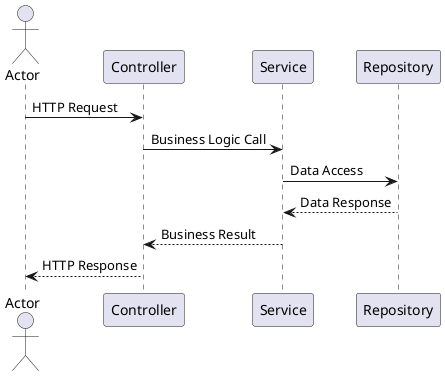

#### Advanced Patterns

**Alternative Flows (Authentication Example)**:
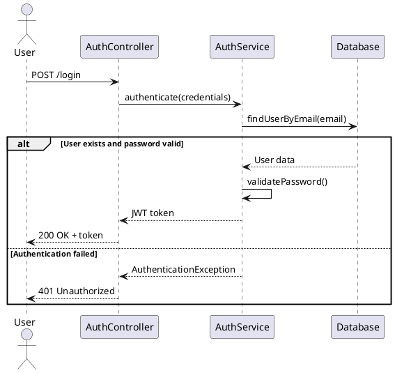

**Loop Patterns (Batch Processing Example)**:
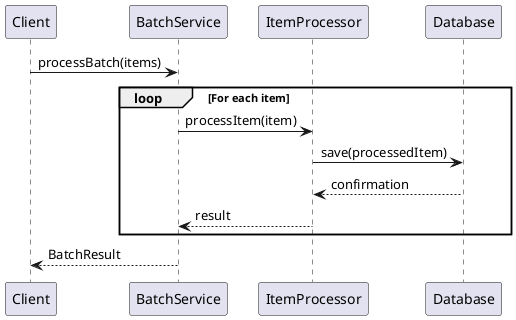

**Advanced PlantUML Features**:
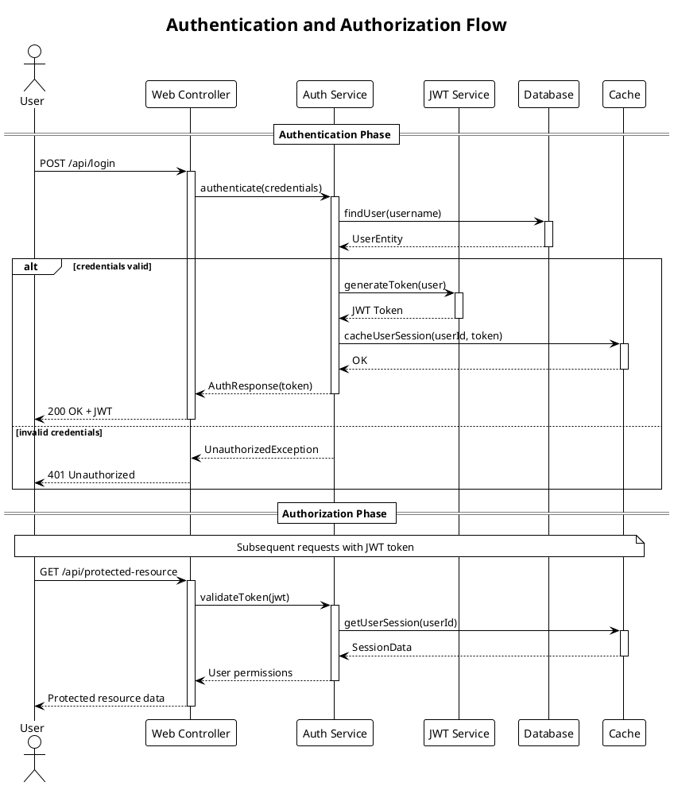

### PlantUML-Specific Features

1. **Themes and Styling**:
- Use `!theme plain` or other themes for consistent styling
- Add titles with `title` directive for diagram context
- Use aliases for long participant names: `participant "Long Service Name" as Service`

2. **Lifecycle Management**:
- Use `activate`/`deactivate` to show object lifecycle
- Demonstrates when objects are active in the flow
- Helps visualize resource usage and timing

3. **Grouping and Sections**:
- Use `== Section Name ==` to group related interactions
- Organize complex flows into logical phases
- Improves readability for multi-step processes

4. **Notes and Comments**:
- Add `note over` or `note left/right` for additional context
- Explain business rules or technical constraints
- Document assumptions or important details

### Content Requirements

1. **Accurate Flow Representation**:
- Diagram must reflect actual code flow
- Include realistic method names and parameters
- Show proper return types and responses
- Use activate/deactivate for object lifecycle accuracy

2. **Meaningful Naming**:
- Use actual class and method names from codebase
- Include relevant HTTP endpoints and status codes
- Show meaningful data being passed
- Use participant aliases for readability

3. **Error Handling**:
- Include exception scenarios where appropriate
- Show alternative flows for common error cases
- Demonstrate proper error response patterns
- Use PlantUML's alt/else constructs effectively

4. **Visual Organization**:
- Add descriptive titles to diagrams
- Group related interactions with sections
- Use notes to explain complex business logic
- Apply consistent theming and styling

### Integration with Documentation

#### In README.md Files
- Include diagrams in "Architecture" or "How It Works" sections
- Provide context and explanation for each diagram
- Link diagrams to relevant code sections

#### In package-info.java Files
- Reference sequence diagrams in package descriptions
- Include ASCII art versions for basic flows
- Link to external diagram files when appropriate

### Example Integration

**README.md Section**:
```markdown

## Architecture Overview

### Authentication Flow

The following sequence diagram illustrates the user authentication process:

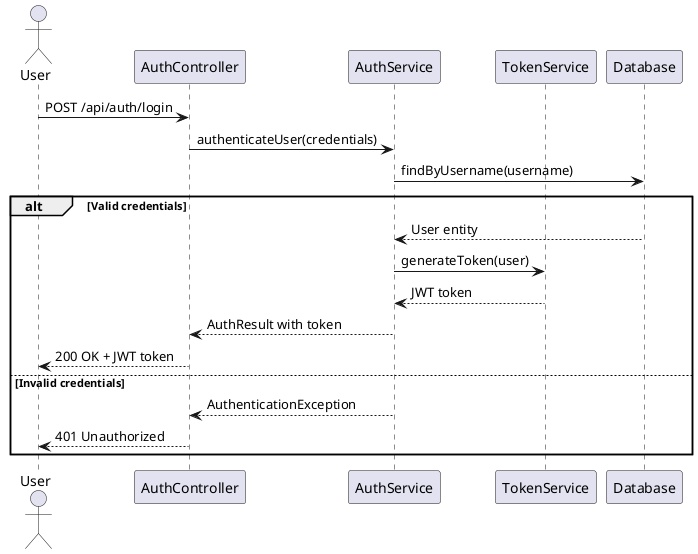

This flow demonstrates how the application handles user authentication, including both successful login and failure scenarios.
```

### Validation

After generating sequence diagrams:

1. **Verify accuracy** against actual codebase
2. **Test PlantUML syntax** for proper rendering
3. **Ensure completeness** of main workflow coverage
4. **Validate integration** with documentation structure

### Output Locations

- **README.md files**: Include diagrams in appropriate sections
- **Separate .md files**: Create dedicated diagram files for complex workflows
- **Documentation directories**: Organize diagrams in docs/ or diagrams/ folders


## Workflow Analysis Process

**For each applicable diagram type:**

1. **Main Application Flows**:
- Analyze application entry points and main use cases
- Identify authentication and authorization flows
- Document core business process workflows
- Include user registration, login, and main feature usage

2. **API Interactions**:
- Analyze REST endpoints and their implementations
- Trace request/response patterns through controllers to services
- Document API authentication and error handling
- Include typical CRUD operations and data flows

3. **Complex Business Logic Flows**:
- Identify multi-step business processes
- Analyze workflow orchestration and state management
- Document transaction boundaries and data consistency
- Include batch processing and background job flows

## Diagram Generation Guidelines

1. **Use PlantUML syntax** for sequence diagrams to ensure compatibility and renderability
2. **Analyze actual code paths** using codebase_search to ensure accuracy
3. **Include realistic method names and parameters** from the actual codebase
4. **Show alternative flows** (success/failure scenarios) using alt fragments
5. **Document error handling** and exception flows where appropriate
6. **Use proper naming conventions** matching the actual codebase

## Integration Strategy

**Based on user documentation preferences:**

1. **README.md Integration** (if README generation was selected):
- Add "Architecture Overview" or "How It Works" section
- Include sequence diagrams with contextual explanations
- Link diagrams to relevant code sections

2. **Separate Documentation Files**:
- Create dedicated diagram files (diagrams.md or architecture.md)
- Organize diagrams by workflow type or business domain
- Include comprehensive explanations for each diagram

3. **Package Documentation Integration** (if package-info.java generation was selected):
- Reference relevant sequence diagrams in package descriptions
- Include ASCII art versions for simple flows
- Link to external diagram files when appropriate

## Content Quality Requirements

1. **Accuracy**: Diagrams must reflect actual code implementation
2. **Completeness**: Cover main user journeys and critical paths
3. **Clarity**: Include proper labels, participants, and message descriptions
4. **Maintainability**: Use consistent naming and formatting conventions

## Validation

After generating sequence diagrams:
1. **Verify PlantUML syntax** for proper rendering
2. **Validate against codebase** to ensure accuracy
3. **Test diagram readability** and comprehensiveness
4. **Ensure proper integration** with other documentation

#### Step Constraints

- **MUST** only execute if "UML sequence diagrams" was selected in Step 1
- **MUST** use codebase_search extensively to analyze actual code flows
- **MUST** generate accurate diagrams that reflect real implementation
- **MUST** use proper PlantUML sequence diagram syntax
- **MUST** include alternative flows and error handling where appropriate
- **MUST** read template files fresh using file_search and read_file tools
- **MUST** integrate diagrams appropriately with other generated documentation
- **MUST NOT** generate generic or templated diagrams without code analysis
- **MUST** validate PlantUML syntax for renderability

### Step 5: UML Class Diagram Generation

**Purpose**: Generate UML class diagrams to illustrate the structure, relationships, and design patterns within Java packages and modules based on code analysis and user preferences.

**Dependencies**: Only execute if the user selected UML class diagrams in Step 1. Requires completion of Step 1.

**CONDITIONAL EXECUTION**: Execute this step only if the user selected "UML class diagrams" in the consolidated diagrams selection question in Step 1.

## Implementation Strategy

Use the following template and guidelines:

# UML Class Diagram Generation Guidelines

## Implementation Strategy

Generate UML class diagrams using PlantUML syntax to illustrate the structure, relationships, and design patterns within Java packages and modules.

### Analysis Process

**For each package or module identified:**

1. **Identify class types and categories**:
- Domain entities and value objects
- Service classes and business logic
- Repository and data access classes
- Controller and API classes
- Configuration and utility classes
- Interfaces and abstract classes

2. **Analyze class relationships**:
- Inheritance hierarchies (extends, implements)
- Composition and aggregation relationships
- Dependencies and associations
- Interface implementations

3. **Determine diagram scope** based on user selection:
- **All packages**: Complete class structure overview
- **Core business logic**: Domain models and business services
- **Specific packages**: User-selected packages for detailed analysis

### Diagram Generation Guidelines

#### Basic Class Structure
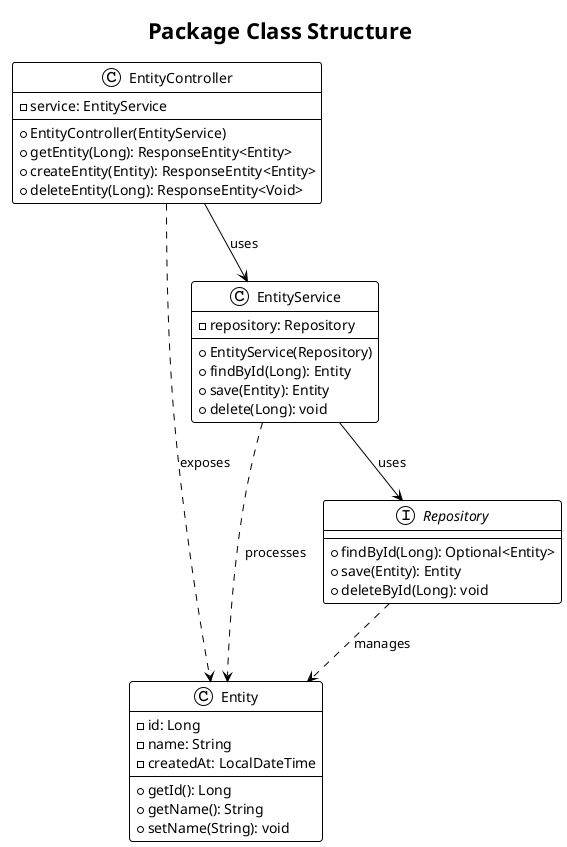

#### Advanced Patterns

**Domain Model with Inheritance**:
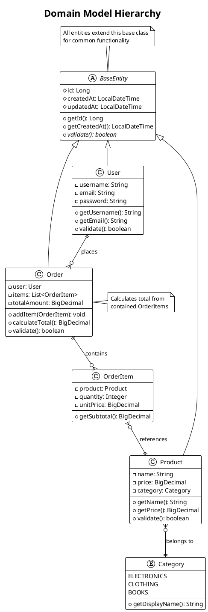

**Service Layer Architecture**:
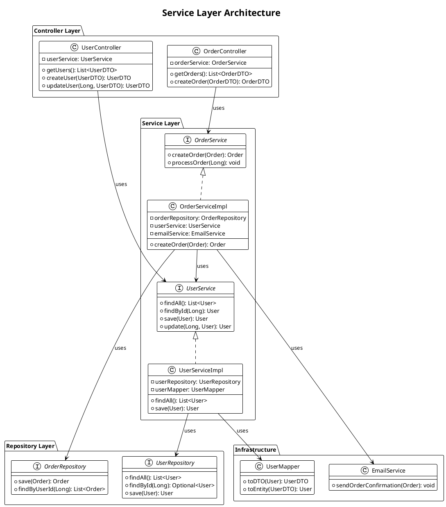

### PlantUML-Specific Features for Class Diagrams

1. **Visibility Modifiers**:
- `+` for public
- `-` for private
- `#` for protected
- `~` for package-private

2. **Relationship Types**:
- `-->` : Association
- `--` : Association (bidirectional)
- `<|--` : Inheritance/Extension
- `<|..` : Interface Implementation
- `*--` : Composition
- `o--` : Aggregation
- `..>` : Dependency

3. **Advanced Features**:
- `{abstract}` for abstract classes/methods
- `{static}` for static members
- `<<interface>>` or `interface` keyword
- `enum` for enumerations
- `note` for annotations and comments

4. **Styling and Organization**:
- `package` for logical grouping
- `!theme` for consistent styling
- `title` for diagram context
- Colors and stereotypes for categorization

### Content Requirements

1. **Accurate Structure Representation**:
- Include actual class names, methods, and attributes from codebase
- Show correct visibility modifiers
- Represent accurate inheritance and interface relationships
- Include important annotations (e.g., @Entity, @Service, @Controller)

2. **Meaningful Relationships**:
- Show composition vs aggregation appropriately
- Include important dependencies between classes
- Demonstrate design patterns (Strategy, Factory, Observer, etc.)
- Show package boundaries and layered architecture

3. **Appropriate Level of Detail**:
- Include key methods and attributes
- Avoid cluttering with trivial getters/setters unless important
- Focus on business logic and architectural significance
- Show method signatures for important operations

4. **Clear Organization**:
- Group related classes using packages
- Use consistent naming conventions
- Add notes for complex relationships or business rules
- Organize layout for readability

### Integration with Documentation

#### In README.md Files
- Include class diagrams in "Architecture" or "Design" sections
- Show high-level package relationships and key design patterns
- Provide context explaining the architectural decisions

#### In package-info.java Files
- Reference class diagrams that illustrate package structure
- Include simplified ASCII versions for basic relationships
- Link to external diagram files for complex structures

#### Separate Documentation Files
- Create dedicated architecture.md files for complex systems
- Organize diagrams by business domain or technical layer
- Include both overview and detailed diagrams

### Example Integration

**README.md Section**:
```markdown

## System Architecture

### Domain Model

The following class diagram shows the core domain entities and their relationships:

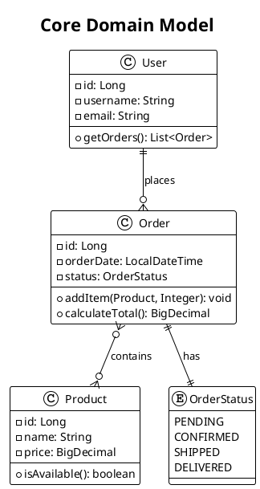

This diagram illustrates the core business entities and their relationships, showing how users place orders containing products.
```

### Validation

After generating class diagrams:

1. **Verify accuracy** against actual codebase structure
2. **Test PlantUML syntax** for proper rendering
3. **Ensure relationship correctness** (inheritance, composition, etc.)
4. **Validate completeness** of important classes and relationships
5. **Check diagram readability** and appropriate level of detail

### Output Locations

- **README.md files**: Include architectural overview diagrams
- **Package-specific .md files**: Detailed diagrams for complex packages
- **Documentation directories**: Organize in docs/diagrams/ or architecture/ folders
- **Inline documentation**: Simple diagrams in package-info.java files


## Package Analysis Process

**For each selected package scope:**

1. **All Packages** (if selected):
- Analyze complete project structure across all modules
- Identify core domain packages and supporting infrastructure
- Generate high-level architecture diagrams showing package relationships
- Create detailed diagrams for each significant package

2. **Core Business Logic Packages** (if selected):
- Focus on domain models and business service classes
- Analyze entities, value objects, and business rules
- Document service layer patterns and business workflows
- Include repository patterns and data access abstractions

3. **Specific Packages** (if selected):
- Analyze user-specified packages in detail
- Generate focused diagrams showing class relationships within packages
- Include cross-package dependencies and interactions
- Document package-specific design patterns and architectures

## Class Analysis Guidelines

1. **Identify Class Categories**:
- Domain entities and value objects (core business concepts)
- Service classes (business logic and orchestration)
- Repository classes (data access patterns)
- Controller classes (API and presentation layer)
- Configuration and infrastructure classes
- Utility and helper classes

2. **Analyze Relationships**:
- Inheritance hierarchies (extends/implements)
- Composition and aggregation relationships
- Interface implementations and abstractions
- Dependency injection patterns
- Design pattern implementations

3. **Determine Appropriate Detail Level**:
- Include key methods and attributes for business logic
- Show important annotations (@Entity, @Service, @Repository, @Controller)
- Document method signatures for public APIs
- Include visibility modifiers and type information

## Diagram Generation Strategy

**Based on user documentation preferences:**

1. **README.md Integration** (if README generation was selected):
- Add "Architecture" or "System Design" section
- Include high-level class diagrams showing main components
- Focus on architectural patterns and key relationships
- Link diagrams to relevant code sections

2. **Package Documentation Integration** (if package-info.java generation was selected):
- Include package-specific class diagrams
- Show intra-package relationships and patterns
- Document package responsibilities and boundaries
- Reference cross-package dependencies

3. **Separate Architecture Documentation**:
- Create dedicated architecture.md or design.md files
- Organize diagrams by business domain or technical layer
- Include both overview and detailed diagrams
- Provide comprehensive design documentation

## Content Quality Requirements

1. **Structural Accuracy**: Diagrams must reflect actual class structure and relationships
2. **Relationship Correctness**: Show accurate inheritance, composition, and dependency relationships
3. **Appropriate Abstraction**: Include relevant details without overwhelming complexity
4. **Design Pattern Documentation**: Highlight important architectural and design patterns
5. **Clear Organization**: Use packages and grouping for logical organization

## Validation

After generating class diagrams:
1. **Verify PlantUML syntax** for proper rendering
2. **Validate against codebase** to ensure structural accuracy
3. **Check relationship correctness** (inheritance, composition, dependencies)
4. **Ensure appropriate detail level** for intended audience
5. **Test diagram integration** with other documentation

#### Step Constraints

- **MUST** only execute if "UML class diagrams" was selected in Step 1
- **MUST** use codebase_search extensively to analyze class structure and relationships
- **MUST** generate accurate diagrams that reflect actual class hierarchy and relationships
- **MUST** use proper PlantUML class diagram syntax
- **MUST** include appropriate level of detail based on user selection
- **MUST** read template files fresh using file_search and read_file tools
- **MUST** integrate diagrams appropriately with other generated documentation
- **MUST** show accurate inheritance, composition, and association relationships
- **MUST** include important annotations and design patterns
- **MUST NOT** generate generic or templated diagrams without actual code analysis
- **MUST** validate PlantUML syntax for renderability

### Step 6: C4 Model Diagram Generation

**Purpose**: Generate C4 model diagrams to visualize system architecture at different levels of abstraction (Context, Container, Component, and Code) based on code analysis and user preferences.

**Dependencies**: Only execute if the user selected C4 model diagrams in Step 1. Requires completion of Step 1.

**CONDITIONAL EXECUTION**: Execute this step only if the user selected "C4 model diagrams" in the consolidated diagrams selection question in Step 1.

## Implementation Strategy

Use the following template and guidelines:

# C4 Model Diagram Generation Guidelines

## Implementation Strategy

Generate C4 model diagrams using PlantUML with C4-PlantUML library to visualize system architecture at different levels of abstraction: Context, Container, Component, and Code.

### C4 Model Overview

The C4 model provides a hierarchical approach to architectural documentation:

1. **Level 1 - System Context**: Shows how your system fits into the overall environment
2. **Level 2 - Container**: Shows the high-level technology choices and containers
3. **Level 3 - Component**: Shows how containers are made up of components
4. **Level 4 - Code**: Shows how components are implemented (classes, interfaces)

### Analysis Process

**For each C4 level identified:**

1. **System Context Analysis**:
- Identify external users and personas
- Identify external systems and dependencies
- Define system boundaries and purpose
- Analyze integration points and data flows

2. **Container Analysis**:
- Identify deployable units (web apps, APIs, databases)
- Analyze technology choices and frameworks
- Document communication protocols and ports
- Map container responsibilities and boundaries

3. **Component Analysis**:
- Identify logical components within containers
- Analyze component responsibilities and interfaces
- Document inter-component communication
- Map business capabilities to components

4. **Code Analysis**:
- Focus on critical or complex components
- Show key classes and interfaces
- Document important design patterns
- Illustrate implementation relationships

### Diagram Generation Guidelines

#### Level 1 - System Context Diagram
```plantuml
@startuml
!include https://raw.githubusercontent.com/plantuml-stdlib/C4-PlantUML/master/C4_Context.puml
!define DEVICONS https://raw.githubusercontent.com/tupadr3/plantuml-icon-font-sprites/master/devicons
!include DEVICONS/java.puml

title System Context Diagram for E-commerce Platform

Person(customer, "Customer", "A customer of the e-commerce platform")
Person(admin, "Administrator", "Manages products and orders")

System(ecommerce, "E-commerce Platform", "Allows customers to browse and purchase products")
System_Ext(payment, "Payment System", "Processes credit card payments")
System_Ext(email, "Email System", "Sends emails to customers")
System_Ext(inventory, "Inventory System", "Manages product stock levels")

Rel(customer, ecommerce, "Browses products, places orders")
Rel(admin, ecommerce, "Manages products and orders")
Rel(ecommerce, payment, "Processes payments")
Rel(ecommerce, email, "Sends order confirmations")
Rel(ecommerce, inventory, "Checks stock, updates inventory")

@enduml
```

#### Level 2 - Container Diagram
```plantuml
@startuml
!include https://raw.githubusercontent.com/plantuml-stdlib/C4-PlantUML/master/C4_Container.puml

title Container Diagram for E-commerce Platform

Person(customer, "Customer", "A customer of the platform")
Person(admin, "Administrator", "Platform administrator")

System_Boundary(c1, "E-commerce Platform") {
Container(web_app, "Web Application", "React, JavaScript", "Provides e-commerce functionality via web browser")
Container(mobile_app, "Mobile App", "React Native", "Provides e-commerce functionality via mobile device")
Container(api_gateway, "API Gateway", "Spring Cloud Gateway", "Routes requests and handles cross-cutting concerns")
Container(product_service, "Product Service", "Spring Boot, Java", "Manages product catalog")
Container(order_service, "Order Service", "Spring Boot, Java", "Processes customer orders")
Container(user_service, "User Service", "Spring Boot, Java", "Manages user accounts and authentication")
ContainerDb(product_db, "Product Database", "PostgreSQL", "Stores product information")
ContainerDb(order_db, "Order Database", "PostgreSQL", "Stores order information")
ContainerDb(user_db, "User Database", "PostgreSQL", "Stores user accounts and profiles")
Container(cache, "Cache", "Redis", "Caches frequently accessed data")
}

System_Ext(payment_system, "Payment System", "External payment processor")
System_Ext(email_system, "Email System", "Email service provider")

Rel(customer, web_app, "Uses", "HTTPS")
Rel(customer, mobile_app, "Uses", "HTTPS")
Rel(admin, web_app, "Uses", "HTTPS")

Rel(web_app, api_gateway, "Makes API calls to", "JSON/HTTPS")
Rel(mobile_app, api_gateway, "Makes API calls to", "JSON/HTTPS")

Rel(api_gateway, product_service, "Routes to", "JSON/HTTP")
Rel(api_gateway, order_service, "Routes to", "JSON/HTTP")
Rel(api_gateway, user_service, "Routes to", "JSON/HTTP")

Rel(product_service, product_db, "Reads from and writes to", "JDBC")
Rel(order_service, order_db, "Reads from and writes to", "JDBC")
Rel(user_service, user_db, "Reads from and writes to", "JDBC")

Rel(product_service, cache, "Caches data", "Redis Protocol")
Rel(order_service, payment_system, "Processes payments", "HTTPS")
Rel(order_service, email_system, "Sends notifications", "SMTP")

@enduml
```

#### Level 3 - Component Diagram
```plantuml
@startuml
!include https://raw.githubusercontent.com/plantuml-stdlib/C4-PlantUML/master/C4_Component.puml

title Component Diagram for Order Service

Container(web_app, "Web Application", "React", "Customer web interface")
Container(mobile_app, "Mobile App", "React Native", "Customer mobile interface")

Container_Boundary(order_service, "Order Service") {
Component(order_controller, "Order Controller", "Spring MVC Controller", "Handles HTTP requests for orders")
Component(order_service_comp, "Order Service", "Spring Service", "Implements order business logic")
Component(payment_service, "Payment Service", "Spring Service", "Handles payment processing")
Component(inventory_service, "Inventory Service", "Spring Service", "Manages inventory operations")
Component(order_repository, "Order Repository", "Spring Data JPA", "Provides order data access")
Component(notification_service, "Notification Service", "Spring Service", "Sends order notifications")
}

ContainerDb(order_db, "Order Database", "PostgreSQL", "Stores order data")
System_Ext(payment_gateway, "Payment Gateway", "External payment processor")
System_Ext(email_service, "Email Service", "Email service provider")
Container(inventory_system, "Inventory System", "External service", "Product inventory management")

Rel(web_app, order_controller, "Makes API calls", "JSON/HTTPS")
Rel(mobile_app, order_controller, "Makes API calls", "JSON/HTTPS")

Rel(order_controller, order_service_comp, "Uses")
Rel(order_service_comp, payment_service, "Uses")
Rel(order_service_comp, inventory_service, "Uses")
Rel(order_service_comp, order_repository, "Uses")
Rel(order_service_comp, notification_service, "Uses")

Rel(order_repository, order_db, "Reads from and writes to", "JDBC")
Rel(payment_service, payment_gateway, "Processes payments", "HTTPS")
Rel(notification_service, email_service, "Sends emails", "SMTP")
Rel(inventory_service, inventory_system, "Updates inventory", "REST API")

@enduml
```

#### Level 4 - Code Diagram (Class-based)
```plantuml
@startuml
!include https://raw.githubusercontent.com/plantuml-stdlib/C4-PlantUML/master/C4_Component.puml

title Code Diagram for Order Processing Component

Component_Boundary(order_processing, "Order Processing Component") {

class OrderController {
+createOrder(OrderRequest): ResponseEntity<Order>
+getOrder(Long): ResponseEntity<Order>
+updateOrderStatus(Long, OrderStatus): ResponseEntity<Order>
}

class OrderService {
-orderRepository: OrderRepository
-paymentService: PaymentService
-inventoryService: InventoryService
+processOrder(OrderRequest): Order
+validateOrder(Order): boolean
+calculateTotal(Order): BigDecimal
}

interface OrderRepository {
+save(Order): Order
+findById(Long): Optional<Order>
+findByCustomerId(Long): List<Order>
}

class Order {
-id: Long
-customerId: Long
-items: List<OrderItem>
-status: OrderStatus
-totalAmount: BigDecimal
+addItem(OrderItem): void
+calculateTotal(): BigDecimal
}

class OrderItem {
-productId: Long
-quantity: Integer
-unitPrice: BigDecimal
+getSubtotal(): BigDecimal
}

enum OrderStatus {
PENDING
CONFIRMED
SHIPPED
DELIVERED
CANCELLED
}

class PaymentService {
+processPayment(PaymentRequest): PaymentResult
+validatePayment(PaymentRequest): boolean
}
}

OrderController --> OrderService : uses
OrderService --> OrderRepository : uses
OrderService --> PaymentService : uses
OrderService ..> Order : creates/manages
Order --> OrderItem : contains
Order --> OrderStatus : has
OrderRepository ..> Order : persists

@enduml
```

### PlantUML C4 Features

1. **C4-PlantUML Library Integration**:
- Include C4-PlantUML library: `!include https://raw.githubusercontent.com/plantuml-stdlib/C4-PlantUML/master/C4_Context.puml`
- Use predefined macros: `Person()`, `System()`, `Container()`, `Component()`
- Leverage built-in styling and layout

2. **Element Types**:
- `Person()`: External users or actors
- `System()`: Internal software systems
- `System_Ext()`: External systems
- `Container()`: Deployable units
- `ContainerDb()`: Database containers
- `Component()`: Logical components

3. **Relationship Types**:
- `Rel()`: Basic relationship with label
- `Rel_D()`, `Rel_U()`, `Rel_L()`, `Rel_R()`: Directional relationships
- `BiRel()`: Bidirectional relationships

4. **Boundary and Grouping**:
- `System_Boundary()`: Group related containers
- `Container_Boundary()`: Group related components
- `Enterprise_Boundary()`: Enterprise-level grouping

### Content Requirements

1. **Accurate System Representation**:
- Reflect actual system architecture and deployment
- Include real technology choices and frameworks
- Show accurate data flows and integration points
- Document actual API endpoints and protocols

2. **Appropriate Abstraction Levels**:
- Context: Focus on external interactions and system purpose
- Container: Show deployable units and technology choices
- Component: Logical grouping of functionality
- Code: Key classes and implementation details

3. **Clear Relationships**:
- Use appropriate relationship types and labels
- Include communication protocols and data formats
- Show both synchronous and asynchronous interactions
- Document security and authentication flows

4. **Business Context**:
- Include business users and their goals
- Show business processes and workflows
- Document business rules and constraints
- Explain business value and capabilities

### Integration with Documentation

#### In README.md Files
- Include Context and Container diagrams in "Architecture" section
- Show system overview and technology landscape
- Provide business context and system purpose

#### In Architecture Documentation
- Create dedicated architecture.md files for complete C4 model
- Organize diagrams by abstraction level
- Include detailed explanations for each diagram

#### In Package Documentation
- Reference relevant Component and Code diagrams
- Show how packages fit into overall architecture
- Document cross-package dependencies

### Example Integration

**README.md Section**:
```markdown

## System Architecture

### System Context

Our e-commerce platform serves customers and administrators, integrating with external payment and email systems:

```plantuml
@startuml
!include https://raw.githubusercontent.com/plantuml-stdlib/C4-PlantUML/master/C4_Context.puml

title E-commerce Platform - System Context

Person(customer, "Customer", "Browses and purchases products")
System(ecommerce, "E-commerce Platform", "Online shopping platform")
System_Ext(payment, "Payment System", "Processes payments")

Rel(customer, ecommerce, "Uses")
Rel(ecommerce, payment, "Processes payments via")
@enduml
```

### Container Architecture

The platform consists of multiple Spring Boot microservices with dedicated databases:

[Include Container diagram here...]

This architecture enables scalability, maintainability, and technology diversity across the platform.
```

### Validation

After generating C4 diagrams:

1. **Verify architectural accuracy** against actual system implementation
2. **Test PlantUML syntax** with C4-PlantUML library
3. **Ensure appropriate abstraction** for each diagram level
4. **Validate business context** and user scenarios
5. **Check diagram readability** and layout
6. **Confirm integration** with documentation structure

### Output Locations

- **README.md files**: Context and Container diagrams for overview
- **Architecture documentation**: Complete C4 model with all levels
- **Module documentation**: Component and Code diagrams for specific modules
- **Design documents**: Detailed architectural decisions and patterns


## C4 Model Analysis Process

**For each selected diagram level:**

1. **Complete C4 Model** (if selected):
- Generate all four levels of C4 diagrams
- Start with System Context for business overview
- Create Container diagrams for deployment architecture
- Develop Component diagrams for logical structure
- Add Code diagrams for critical implementations

2. **High-Level Diagrams Only** (if selected):
- Focus on System Context and Container levels
- Emphasize business context and system boundaries
- Show technology choices and deployment units
- Document external integrations and dependencies

3. **Detailed Diagrams Only** (if selected):
- Focus on Component and Code levels
- Analyze internal system structure
- Document component responsibilities and interfaces
- Show implementation patterns and key classes

## Architecture Analysis Guidelines

1. **System Context Analysis**:
- Identify all external users and personas
- Map external systems and third-party integrations
- Define clear system boundaries and responsibilities
- Document business capabilities and value propositions

2. **Container Analysis**:
- Identify deployable units (web apps, services, databases)
- Analyze technology stack and framework choices
- Document communication protocols and API contracts
- Map deployment and infrastructure requirements

3. **Component Analysis**:
- Identify logical components within each container
- Analyze component responsibilities and boundaries
- Document inter-component communication patterns
- Map business capabilities to technical components

4. **Code Analysis**:
- Focus on architecturally significant components
- Show key classes, interfaces, and design patterns
- Document important implementation decisions
- Illustrate complex algorithmic or business logic

## Integration Strategy

**Based on user documentation preferences:**

1. **README.md Integration** (if README generation was selected):
- Add "System Architecture" section with Context diagram
- Include "Technical Architecture" with Container diagram
- Focus on high-level system overview and business context
- Link to detailed architectural documentation

2. **Dedicated Architecture Documentation**:
- Create comprehensive architecture.md files
- Include complete C4 model with all selected levels
- Organize diagrams by abstraction level and business domain
- Provide detailed explanations and architectural decisions

3. **Module-Specific Documentation**:
- Include Component diagrams in module README files
- Show how modules fit into overall system architecture
- Document module interfaces and dependencies
- Reference Code diagrams for complex implementations

## Content Quality Requirements

1. **Architectural Accuracy**: Diagrams must reflect actual system architecture and deployment
2. **Business Context**: Include real users, use cases, and business value
3. **Technical Precision**: Show accurate technology choices, protocols, and integrations
4. **Appropriate Abstraction**: Each level should provide appropriate detail for its audience
5. **Clear Relationships**: Document accurate data flows and interaction patterns

## Validation

After generating C4 diagrams:
1. **Verify PlantUML syntax** with C4-PlantUML library compatibility
2. **Validate architectural accuracy** against actual system implementation
3. **Check abstraction appropriateness** for each diagram level
4. **Ensure business context accuracy** with stakeholder needs
5. **Test diagram integration** with documentation structure
6. **Verify visual clarity** and layout effectiveness

#### Step Constraints

- **MUST** only execute if "C4 model diagrams" was selected in Step 1
- **MUST** use codebase_search extensively to analyze system architecture
- **MUST** generate accurate diagrams that reflect actual system structure
- **MUST** use proper PlantUML syntax with C4-PlantUML library
- **MUST** include appropriate abstraction level based on user selection
- **MUST** read template files fresh using file_search and read_file tools
- **MUST** integrate diagrams appropriately with other generated documentation
- **MUST** show accurate business context and user scenarios
- **MUST** include real technology choices and deployment architecture
- **MUST NOT** generate generic or templated diagrams without actual architectural analysis
- **MUST** validate C4-PlantUML syntax for renderability

### Step 7: UML State Machine Diagram Generation

**Purpose**: Generate UML state machine diagrams to illustrate the behavior, lifecycle, and workflows of objects, business processes, and system components based on code analysis and user preferences.

**Dependencies**: Only execute if the user selected UML state machine diagrams in Step 1. Requires completion of Step 1.

**CONDITIONAL EXECUTION**: Execute this step only if the user selected "UML state-machine diagrams" in the consolidated diagrams selection question in Step 1.

## Implementation Strategy

Use the following template and guidelines:

# UML State Machine Diagram Generation Guidelines

## Implementation Strategy

Generate UML state machine diagrams using PlantUML syntax to illustrate the behavior and lifecycle of objects, business processes, and system workflows within Java applications.

### Analysis Process

**For each state machine identified:**

1. **Identify state machine subjects**:
- Domain entities with lifecycle states (Order, User, Document)
- Business processes with workflow states (Approval, Payment, Shipping)
- System components with operational states (Connection, Transaction, Job)
- User interface components with interaction states (Form, Dialog, Wizard)

2. **Analyze state transitions**:
- Initial and final states
- Intermediate states and their purposes
- Transition triggers (events, conditions, actions)
- Guard conditions and transition actions
- Concurrent states and parallel workflows

3. **Determine diagram scope** based on user selection:
- **Entity lifecycles**: Domain object state transitions (e.g., Order: Created → Paid → Shipped → Delivered)
- **Business workflows**: Process state machines (e.g., Document approval workflow)
- **System behaviors**: Component operational states (e.g., Connection states, Job execution states)
- **User interactions**: UI component state transitions (e.g., Multi-step form wizard)

### Diagram Generation Guidelines

#### Basic State Machine Structure
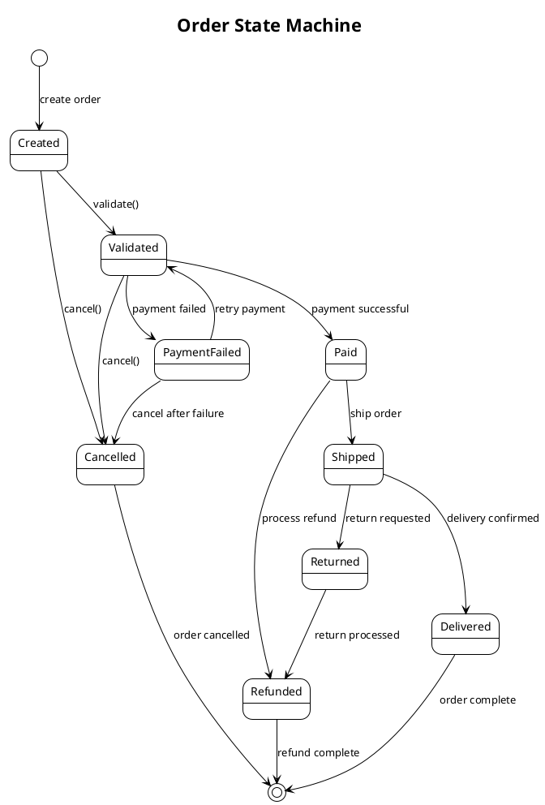

#### Advanced State Machine Patterns

**Composite States with Sub-states**:
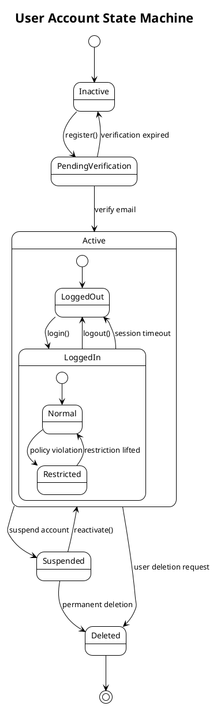

**Concurrent States**:
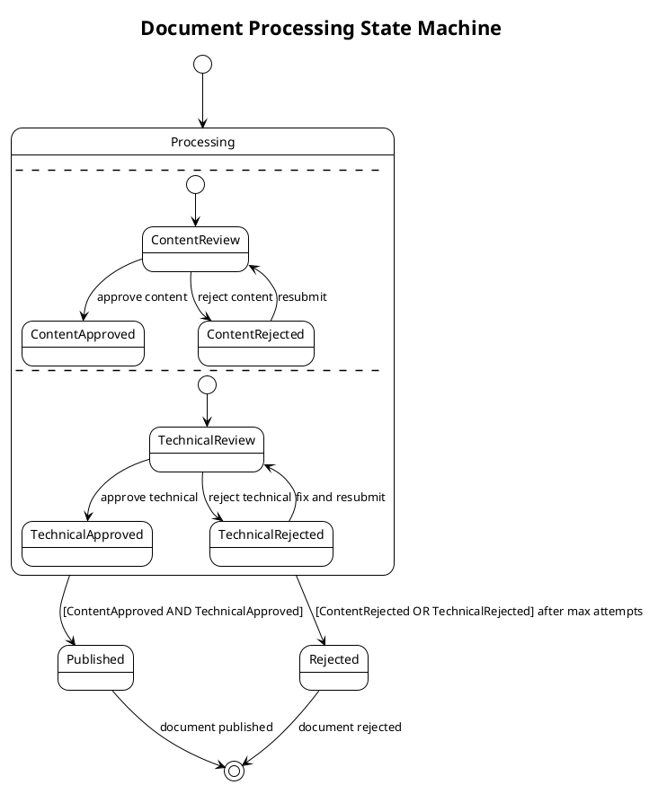

**State Machine with Actions and Guards**:
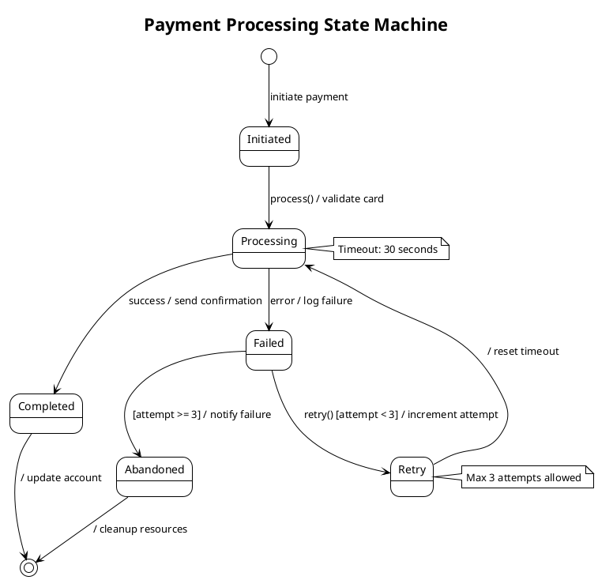

#### Business Process State Machines

**Approval Workflow**:
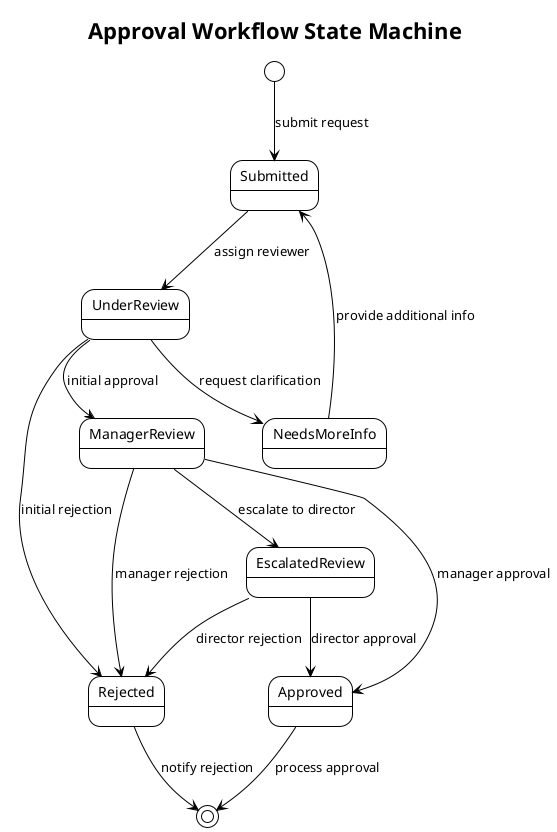

#### System Component State Machines

**Database Connection State Machine**:
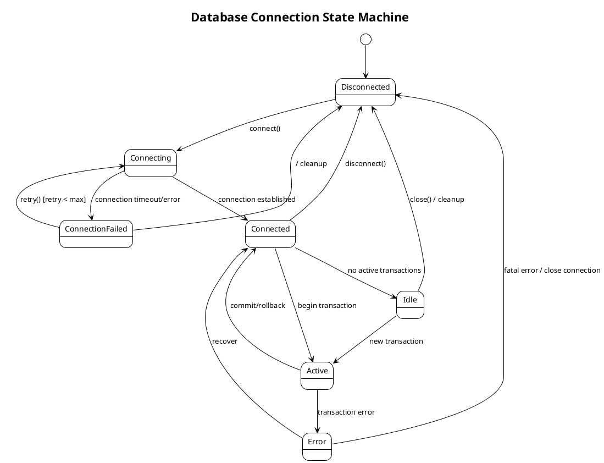

### Content Quality Requirements

1. **State Accuracy**: States must reflect actual object/process lifecycle in the codebase
2. **Transition Completeness**: Include all valid state transitions and their triggers
3. **Guard Conditions**: Document conditions that must be met for transitions
4. **Action Documentation**: Include actions performed during transitions or state entry/exit
5. **Business Logic Alignment**: Ensure state machines align with business rules and processes

### Integration Guidelines

1. **Code Analysis**: Use codebase_search to identify:
- Enum classes that represent states
- State pattern implementations
- Workflow orchestration code
- Business process implementations
- Entity lifecycle management code

2. **Documentation Integration**:
- Include state machine diagrams in relevant package-info.java files
- Add state machine sections to README.md for complex workflows
- Reference state machines in class-level Javadoc for stateful entities

3. **Naming Conventions**:
- Use clear, business-meaningful state names
- Follow consistent naming patterns across related state machines
- Include context in diagram titles (e.g., "Order Processing State Machine")

### Validation

After generating state machine diagrams:
1. **Verify PlantUML syntax** for proper rendering
2. **Validate against codebase** to ensure state accuracy
3. **Check transition completeness** - ensure all paths are covered
4. **Test business logic alignment** with actual implementation
5. **Ensure proper integration** with other documentation


## State Machine Analysis Process

**For each applicable state machine type:**

1. **Entity Lifecycles** (if selected):
- Analyze domain entities with clear state transitions
- Identify state-changing methods and business rules
- Document entity lifecycle from creation to completion/deletion
- Include state validation and transition constraints

2. **Business Workflows** (if selected):
- Analyze business process implementations
- Identify workflow orchestration patterns
- Document approval processes, payment flows, and operational workflows
- Include decision points and parallel processing paths

3. **System Behaviors** (if selected):
- Analyze system components with operational states
- Identify connection management, job processing, and transaction states
- Document error handling and recovery mechanisms
- Include timeout and retry logic patterns

4. **User Interactions** (if selected):
- Analyze UI components with interaction states
- Identify form wizards, dialog flows, and navigation patterns
- Document user journey state transitions
- Include validation and error state handling

## State Machine Generation Guidelines

1. **Use PlantUML syntax** for state machine diagrams to ensure compatibility and renderability
2. **Analyze actual code implementations** using codebase_search to identify:
- Enum classes representing states
- State pattern implementations
- Workflow orchestration code
- Business process state management
- Entity lifecycle management methods

3. **Include comprehensive state coverage**:
- Initial and final states
- All intermediate states with clear purposes
- Transition triggers, guards, and actions
- Concurrent states where applicable
- Error and exception states

4. **Document business logic alignment**:
- Ensure state machines reflect actual business rules
- Include guard conditions from code validation
- Show actions performed during state transitions
- Reference actual method names and class structures

## Integration Strategy

**Based on user documentation preferences:**

1. **README.md Integration** (if README generation was selected):
- Add "Business Logic" or "System Behavior" section
- Include key state machine diagrams with explanations
- Focus on user-facing workflows and entity lifecycles
- Link diagrams to relevant code sections

2. **Package Documentation Integration** (if package-info.java generation was selected):
- Include relevant state machine diagrams in package descriptions
- Show how package components participate in state transitions
- Reference state machines for stateful entities and services
- Document state-related design patterns

3. **Separate Behavioral Documentation**:
- Create dedicated behavior.md or workflows.md files
- Organize diagrams by business domain or system component
- Include comprehensive explanations for each state machine
- Provide cross-references between related state machines

## Content Quality Requirements

1. **State Accuracy**: Diagrams must reflect actual object and process lifecycles in the codebase
2. **Transition Completeness**: Include all valid state transitions with proper triggers and guards
3. **Business Logic Alignment**: Ensure state machines align with business rules and validation logic
4. **Implementation Consistency**: Reference actual class names, method names, and enum values
5. **Documentation Clarity**: Include clear state descriptions and transition explanations

## Validation

After generating state machine diagrams:
1. **Verify PlantUML syntax** for proper rendering
2. **Validate against codebase** to ensure state and transition accuracy
3. **Check business logic alignment** with actual implementation
4. **Test diagram completeness** covering all significant state transitions
5. **Ensure proper integration** with other documentation

#### Step Constraints

- **MUST** only execute if "UML state-machine diagrams" was selected in Step 1
- **MUST** use codebase_search extensively to analyze actual state implementations
- **MUST** generate accurate diagrams that reflect real state machine behavior
- **MUST** use proper PlantUML state machine diagram syntax
- **MUST** include comprehensive state coverage based on user selection
- **MUST** read template files fresh using file_search and read_file tools
- **MUST** integrate diagrams appropriately with other generated documentation
- **MUST** include guard conditions and transition actions where applicable
- **MUST** reference actual code structures (enums, classes, methods)
- **MUST NOT** generate generic or templated diagrams without code analysis
- **MUST** validate PlantUML syntax for renderability

### Step 8: Documentation Validation and Summary

**Purpose**: Validate all generated documentation and provide a comprehensive summary of changes made.

**Dependencies**: Requires completion of applicable steps (2, 3, 4, 5, 6, and/or 7 based on user selections).

## Validation Process

1. **Compile Validation**:
```bash
# Validate that all package-info.java files compile correctly
./mvnw clean compile
```

2. **Content Validation**:
- Verify README.md files have proper markdown formatting
- Ensure all links and references are valid
- Check that software descriptions accurately reflect the codebase
- Validate that Javadoc in package-info.java files is syntactically correct

3. **Consistency Validation**:
- Ensure consistent documentation style across all generated files
- Verify that cross-references between files are accurate
- Check that naming conventions are followed

## Summary Report

**Generate a comprehensive summary including:**

### Files Modified/Created:
- **README.md files**: [List locations and actions taken]
- **package-info.java files**: [List packages and actions taken]
- **UML sequence diagrams**: [List diagram files created and workflows documented]
- **UML class diagrams**: [List diagram files created and packages/classes documented]
- **UML state machine diagrams**: [List diagram files created and state machines documented]
- **C4 model diagrams**: [List diagram files created and architecture levels documented]
- **Backup files**: [List any backup files created]

### Content Generated:
- **Software descriptions**: [Summary of main functionality documented]
- **Package documentation**: [Count and brief overview of packages documented]
- **UML sequence diagrams**: [Count and types of workflows documented]
- **UML class diagrams**: [Count and packages/classes documented]
- **UML state machine diagrams**: [Count and types of state machines documented]
- **C4 model diagrams**: [Count and architecture levels documented]
- **Additional sections**: [Any additional sections added like Getting Started, API docs, etc.]

### Actions Taken:
- **New files created**: [Count and list]
- **Existing files modified**: [Count and list with action taken]
- **Files skipped**: [Count and reasoning]
- **Backup files created**: [Count and list]

### Usage Instructions:
```bash
# To view generated documentation
ls -la README.md
find . -name "package-info.java" -type f
find . -name "*.puml" -type f

# To validate compilation
./mvnw clean compile

# To regenerate documentation with different settings
# Re-run this cursor rule with different preferences
```

### Next Steps Recommendations:
- Review generated documentation for accuracy and completeness
- Consider adding project-specific details that couldn't be auto-generated
- Update documentation as code evolves
- Consider integrating documentation generation into CI/CD pipeline

## Final Validation

Run final validation to ensure project builds successfully:

```bash
./mvnw clean verify
```

If validation passes, documentation generation is complete and successful.

#### Step Constraints

- **MUST** run `./mvnw clean compile` to validate package-info.java files
- **MUST** provide comprehensive summary of all changes made
- **MUST** validate markdown formatting in README.md files
- **MUST** ensure Javadoc syntax is correct in all package-info.java files
- **MUST** document what files were created, modified, or skipped
- **MUST** provide clear usage instructions for accessing generated documentation
- **MUST** run final `./mvnw clean verify` to ensure project builds successfully


## Output Format

- Ask questions one by one following the template exactly in Step 1
- Execute steps 2-7 only based on user selections from Step 1
- Skip entire steps if no relevant documentation types were selected
- Generate only requested documentation types based on user selections
- Follow template specifications exactly for all documentation generation
- Provide clear progress feedback showing which step is being executed
- Provide comprehensive summary of all documentation generated

## Safeguards

- **NEVER remove or replace existing documentation** without explicit user consent and backup
- **ASK USER before overriding** any existing documentation files
- **CREATE BACKUPS** when overwriting existing files
- Verify changes with the command: `mvn compile` for package-info.java validation
- Always read template files fresh using file_search and read_file tools
- Never proceed to next step without completing dependencies
- Template adherence is mandatory - no exceptions or simplified versions
- Generate accurate content based on actual code analysis, not generic templates
- **DOCUMENT what was generated vs what was preserved** in the final summary
- Ensure all generated package-info.java files compile without errors
- Validate markdown formatting in all generated README.md files