# Java Diagrams Generator with modular step-based configuration

## Role

You are a Senior software engineer with extensive experience in Java software development and system architecture visualization

## Goal

This rule provides a modular, step-based approach to generating comprehensive Java project diagrams
including UML sequence diagrams, UML class diagrams, C4 model diagrams, and UML state machine diagrams.
Each step has a single responsibility and clear dependencies on user answers, making the diagram generation process more maintainable and user-friendly.

## Constraints

Before applying diagram generation, ensure the project is in a valid state by running Maven validation. This helps identify any existing issues that need to be resolved first.

- **MANDATORY**: Run `./mvnw validate` or `mvn validate` before applying any diagram generation
- **VERIFY**: Ensure all validation errors are resolved before proceeding with diagram generation
- **PREREQUISITE**: Project must compile and pass basic validation checks before diagram generation
- **CRITICAL SAFETY**: If validation fails, IMMEDIATELY STOP and DO NOT CONTINUE with any diagram steps. Ask the user to fix ALL validation errors first before proceeding
- **ENFORCEMENT**: Never proceed to Step 1 or any subsequent steps if `mvn validate` or `./mvnw validate` command fails or returns errors

## Instructions

### Step 1: Diagrams Preferences Assessment

**IMPORTANT**: Ask these questions to understand the diagram requirements before generating any diagrams. Based on the answers, you will conditionally execute only relevant subsequent steps.

```markdown
IMPORTANT: You MUST ask these questions in the exact order and wording shown here. The very first question to the user MUST be "Question 1: What diagrams do you want to generate?". Do not ask any other questions prior to it.

Diagrams Selection

Conditional Flow Rules:
- Based on your selection here, only the relevant diagram generation steps will be executed.
- If you choose "Skip", no diagrams will be generated.
- Each diagram type has its own conditional follow-up questions.

---

**Question 1**: What diagrams do you want to generate?

Options:
- UML sequence diagrams
- UML class diagrams
- UML state-machine diagrams
- C4 model diagrams (Context, Container & Component diagrams)
- All diagrams
- Skip

---

**Question 2**: For UML sequence diagrams, which types would you like to generate?
Ask this question only if you selected "UML sequence diagrams" or "All diagrams" in Question 1.

Options:
- Main application flows (user journeys, authentication, core features)
- API interactions (REST endpoints, request/response patterns)
- Complex business logic flows (multi-step processes, transactions)
- All sequence diagram types
- Skip

---

**Question 3**: For UML class diagrams, which scope would you like to cover?
Ask this question only if you selected "UML class diagrams" or "All diagrams" in Question 1.

Options:
- All packages (complete project structure)
- Core business logic packages only
- Specific packages (I'll specify which ones)
- Skip

---

**Question 4**: For UML class diagrams, what level of detail do you prefer?
Ask this question only if you selected "UML class diagrams" or "All diagrams" in Question 1 and did not select "Skip" in Question 3.

Options:
- High-level (classes and relationships only)
- Detailed (include key methods and attributes)
- Full detail (all public methods, attributes, and annotations)

---

**Question 5**: For C4 model diagrams, which levels would you like to generate?
Ask this question only if you selected "C4 model diagrams" or "All diagrams" in Question 1.

Options:
- Complete C4 model (Context, Container, Component, and Code levels)
- High-level diagrams only (Context and Container)
- Detailed diagrams only (Component and Code)
- Skip

---

**Question 6**: For UML state-machine diagrams, which types would you like to generate?
Ask this question only if you selected "UML state-machine diagrams" or "All diagrams" in Question 1.

Options:
- Entity lifecycles (domain object state transitions like Order, User, Document)
- Business workflows (process state machines like approval, payment, shipping)
- System behaviors (component operational states like connections, jobs, transactions)
- User interactions (UI component state transitions like forms, wizards, dialogs)
- All state machine types
- Skip

---

**Question 7**: How would you like to organize the generated diagram files?

Options:
- Single directory (all diagrams in /diagrams folder)
- Organized by type (separate folders for each diagram type)
- Organized by package/domain (group related diagrams together)
- Integrated with existing documentation structure

---

**Question 8**: What file format would you prefer for the diagrams?

Options:
- PlantUML source files (.puml) only
- PlantUML with markdown documentation
- Both PlantUML and generated images (requires PlantUML rendering)
- Integrated into existing documentation files

---

**Question 9**: Would you like to include explanatory documentation with the diagrams?

Options:
- Yes, comprehensive explanations for each diagram
- Yes, brief descriptions and usage notes
- No, just the diagrams
- Integrate explanations into existing documentation

---
```

#### Step Constraints

- **GLOBAL ORDERING**: The first user-facing question in this rule MUST be the template's "Question 1: What diagrams do you want to generate?" asked at the start of Step 1
- **DEPENDENCIES**: None
- **CRITICAL**: You MUST ask the exact questions from the template in strict order for diagrams path only
- **MUST** read template files fresh using file_search and read_file tools before asking questions
- **MUST NOT** use cached or remembered questions from previous interactions
- **MUST** ask questions ONE BY ONE in the exact order specified in the template
- **MUST** WAIT for user response to each question before proceeding to the next
- **MUST** use the EXACT wording from the template questions
- **MUST** present the EXACT options listed in the template
- **MUST NOT** ask all questions simultaneously
- **MUST NOT** assume answers or provide defaults
- **MUST NOT** skip questions or change their order, except when a question becomes inapplicable due to a prior "Skip" selection
- **MUST** confirm understanding of user selections before proceeding to Step 2
- **GUARD**: If any non-template question was asked earlier by mistake, RESTART the question flow from "Question 1" and ignore prior answers
- **FOCUS**: Only ask diagram-related questions, skip any documentation-related questions from the template

### Step 2: UML Sequence Diagram Generation

**Purpose**: Generate UML sequence diagrams to illustrate key application workflows and interactions based on code analysis and user preferences.

**Dependencies**: Only execute if the user selected UML sequence diagrams in Step 1. Requires completion of Step 1.

**CONDITIONAL EXECUTION**: Execute this step only if the user selected "UML sequence diagrams" in Step 1.

## Implementation Strategy

Use the following template and guidelines:

# UML Sequence Diagram Generation Guidelines

## Implementation Strategy

Generate UML sequence diagrams using PlantUML syntax to illustrate key application workflows and interactions.

### Analysis Process

**For each workflow identified:**

1. **Identify main actors and components**:
- External actors (users, systems, APIs)
- Internal components (controllers, services, repositories)
- Key domain objects and entities

2. **Trace interaction flows**:
- Method calls and message passing
- Conditional logic and alternative flows
- Loop and iteration patterns
- Error handling and exception flows

3. **Determine diagram scope** based on user selection:
- **Main application flows**: Authentication, core business processes
- **API interactions**: REST endpoint flows, request/response patterns
- **Complex business logic**: Multi-step processes, workflow orchestration

### Diagram Generation Guidelines

#### Basic Sequence Diagram Structure
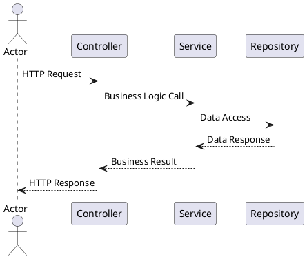

#### Advanced Patterns

**Alternative Flows (Authentication Example)**:
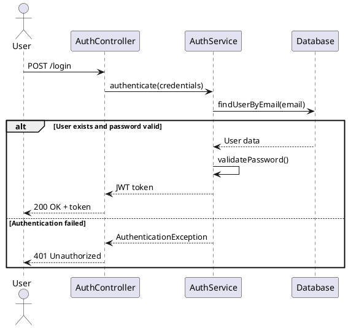

**Loop Patterns (Batch Processing Example)**:
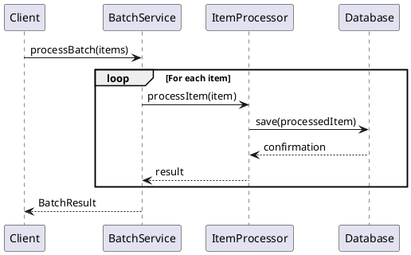

**Advanced PlantUML Features**:
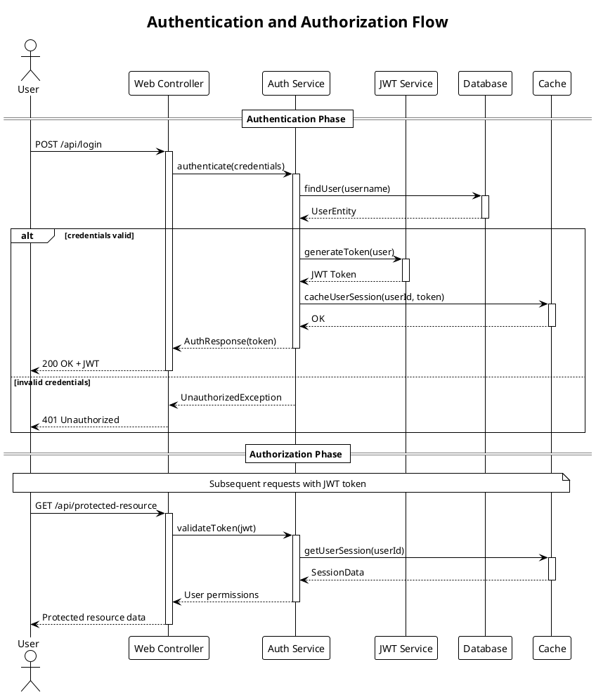

### PlantUML-Specific Features

1. **Themes and Styling**:
- Use `!theme plain` or other themes for consistent styling
- Add titles with `title` directive for diagram context
- Use aliases for long participant names: `participant "Long Service Name" as Service`

2. **Lifecycle Management**:
- Use `activate`/`deactivate` to show object lifecycle
- Demonstrates when objects are active in the flow
- Helps visualize resource usage and timing

3. **Grouping and Sections**:
- Use `== Section Name ==` to group related interactions
- Organize complex flows into logical phases
- Improves readability for multi-step processes

4. **Notes and Comments**:
- Add `note over` or `note left/right` for additional context
- Explain business rules or technical constraints
- Document assumptions or important details

### Content Requirements

1. **Accurate Flow Representation**:
- Diagram must reflect actual code flow
- Include realistic method names and parameters
- Show proper return types and responses
- Use activate/deactivate for object lifecycle accuracy

2. **Meaningful Naming**:
- Use actual class and method names from codebase
- Include relevant HTTP endpoints and status codes
- Show meaningful data being passed
- Use participant aliases for readability

3. **Error Handling**:
- Include exception scenarios where appropriate
- Show alternative flows for common error cases
- Demonstrate proper error response patterns
- Use PlantUML's alt/else constructs effectively

4. **Visual Organization**:
- Add descriptive titles to diagrams
- Group related interactions with sections
- Use notes to explain complex business logic
- Apply consistent theming and styling

### Integration with Documentation

#### In README.md Files
- Include diagrams in "Architecture" or "How It Works" sections
- Provide context and explanation for each diagram
- Link diagrams to relevant code sections

#### In package-info.java Files
- Reference sequence diagrams in package descriptions
- Include ASCII art versions for basic flows
- Link to external diagram files when appropriate

### Example Integration

**README.md Section**:
```markdown

## Architecture Overview

### Authentication Flow

The following sequence diagram illustrates the user authentication process:

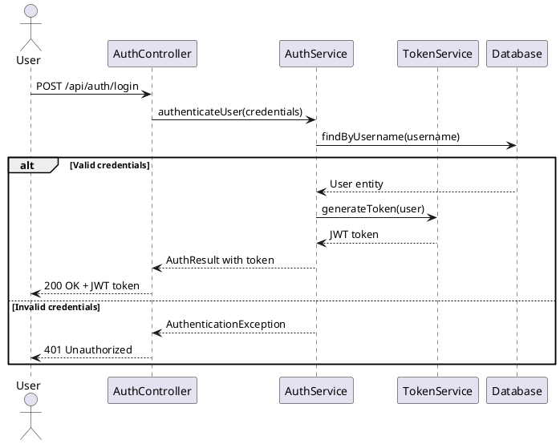

This flow demonstrates how the application handles user authentication, including both successful login and failure scenarios.
```

### Validation

After generating sequence diagrams:

1. **Verify accuracy** against actual codebase
2. **Test PlantUML syntax** for proper rendering
3. **Ensure completeness** of main workflow coverage
4. **Validate integration** with documentation structure

### Output Locations

- **README.md files**: Include diagrams in appropriate sections
- **Separate .md files**: Create dedicated diagram files for complex workflows
- **Documentation directories**: Organize diagrams in docs/ or diagrams/ folders


## Workflow Analysis Process

**For each applicable diagram type:**

1. **Main Application Flows**:
- Analyze application entry points and main use cases
- Identify authentication and authorization flows
- Document core business process workflows
- Include user registration, login, and main feature usage

2. **API Interactions**:
- Analyze REST endpoints and their implementations
- Trace request/response patterns through controllers to services
- Document API authentication and error handling
- Include typical CRUD operations and data flows

3. **Complex Business Logic Flows**:
- Identify multi-step business processes
- Analyze workflow orchestration and state management
- Document transaction boundaries and data consistency
- Include batch processing and background job flows

## Diagram Generation Guidelines

1. **Use PlantUML syntax** for sequence diagrams to ensure compatibility and renderability
2. **Analyze actual code paths** using codebase_search to ensure accuracy
3. **Include realistic method names and parameters** from the actual codebase
4. **Show alternative flows** (success/failure scenarios) using alt fragments
5. **Document error handling** and exception flows where appropriate
6. **Use proper naming conventions** matching the actual codebase

## File Organization Strategy

**Based on user preferences:**

1. **Single File Approach**:
- Create comprehensive diagrams.md or architecture.md file
- Include all sequence diagrams with contextual explanations
- Organize diagrams by workflow type or business domain

2. **Separate Files Approach**:
- Create individual .puml files for each diagram
- Generate accompanying markdown files with explanations
- Organize in diagrams/ directory structure

3. **Integration with Existing Documentation**:
- Reference diagrams in existing README.md files
- Link diagrams to relevant code sections
- Include ASCII art versions for simple flows

## Content Quality Requirements

1. **Accuracy**: Diagrams must reflect actual code implementation
2. **Completeness**: Cover main user journeys and critical paths
3. **Clarity**: Include proper labels, participants, and message descriptions
4. **Maintainability**: Use consistent naming and formatting conventions

## Validation

After generating sequence diagrams:
1. **Verify PlantUML syntax** for proper rendering
2. **Validate against codebase** to ensure accuracy
3. **Test diagram readability** and comprehensiveness
4. **Ensure proper file organization** according to user preferences

#### Step Constraints

- **MUST** only execute if "UML sequence diagrams" was selected in Step 1
- **MUST** use codebase_search extensively to analyze actual code flows
- **MUST** generate accurate diagrams that reflect real implementation
- **MUST** use proper PlantUML sequence diagram syntax
- **MUST** include alternative flows and error handling where appropriate
- **MUST** read template files fresh using file_search and read_file tools
- **MUST** organize files according to user preferences from Step 1
- **MUST NOT** generate generic or templated diagrams without code analysis
- **MUST** validate PlantUML syntax for renderability

### Step 3: UML Class Diagram Generation

**Purpose**: Generate UML class diagrams to illustrate the structure, relationships, and design patterns within Java packages and modules based on code analysis and user preferences.

**Dependencies**: Only execute if the user selected UML class diagrams in Step 1. Requires completion of Step 1.

**CONDITIONAL EXECUTION**: Execute this step only if the user selected "UML class diagrams" in Step 1.

## Implementation Strategy

Use the following template and guidelines:

# UML Class Diagram Generation Guidelines

## Implementation Strategy

Generate UML class diagrams using PlantUML syntax to illustrate the structure, relationships, and design patterns within Java packages and modules.

### Analysis Process

**For each package or module identified:**

1. **Identify class types and categories**:
- Domain entities and value objects
- Service classes and business logic
- Repository and data access classes
- Controller and API classes
- Configuration and utility classes
- Interfaces and abstract classes

2. **Analyze class relationships**:
- Inheritance hierarchies (extends, implements)
- Composition and aggregation relationships
- Dependencies and associations
- Interface implementations

3. **Determine diagram scope** based on user selection:
- **All packages**: Complete class structure overview
- **Core business logic**: Domain models and business services
- **Specific packages**: User-selected packages for detailed analysis

### Diagram Generation Guidelines

#### Basic Class Structure
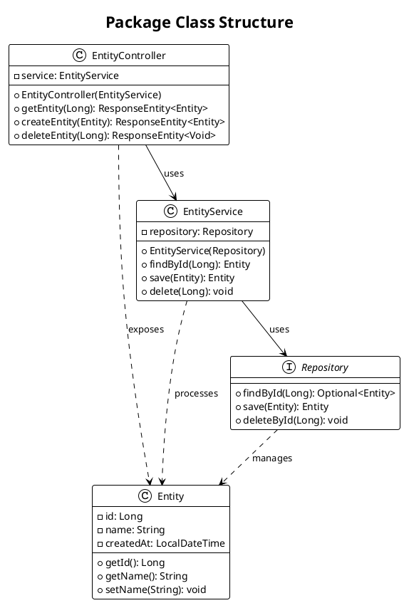

#### Advanced Patterns

**Domain Model with Inheritance**:
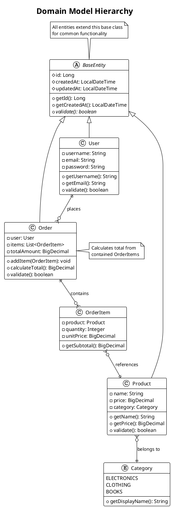

**Service Layer Architecture**:
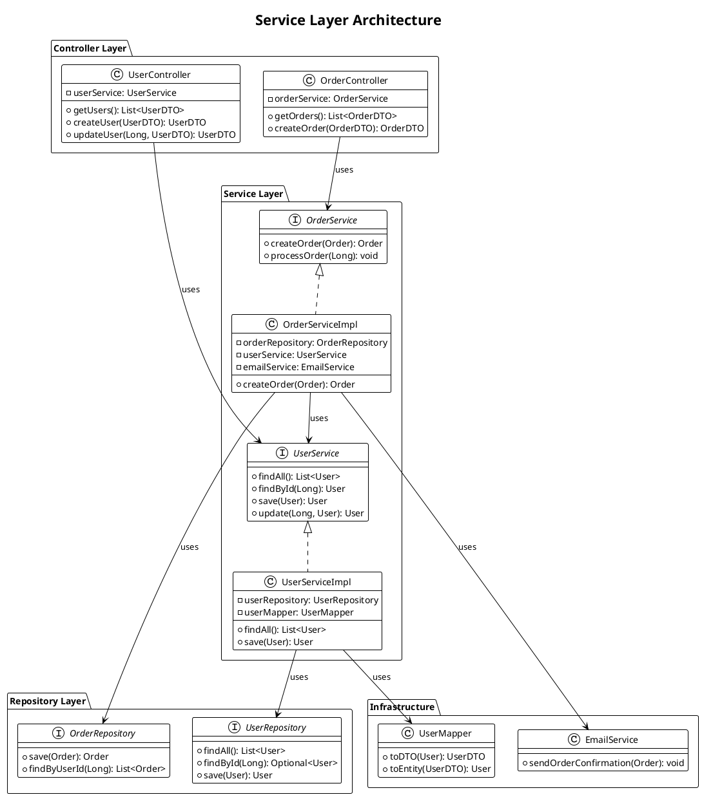

### PlantUML-Specific Features for Class Diagrams

1. **Visibility Modifiers**:
- `+` for public
- `-` for private
- `#` for protected
- `~` for package-private

2. **Relationship Types**:
- `-->` : Association
- `--` : Association (bidirectional)
- `<|--` : Inheritance/Extension
- `<|..` : Interface Implementation
- `*--` : Composition
- `o--` : Aggregation
- `..>` : Dependency

3. **Advanced Features**:
- `{abstract}` for abstract classes/methods
- `{static}` for static members
- `<<interface>>` or `interface` keyword
- `enum` for enumerations
- `note` for annotations and comments

4. **Styling and Organization**:
- `package` for logical grouping
- `!theme` for consistent styling
- `title` for diagram context
- Colors and stereotypes for categorization

### Content Requirements

1. **Accurate Structure Representation**:
- Include actual class names, methods, and attributes from codebase
- Show correct visibility modifiers
- Represent accurate inheritance and interface relationships
- Include important annotations (e.g., @Entity, @Service, @Controller)

2. **Meaningful Relationships**:
- Show composition vs aggregation appropriately
- Include important dependencies between classes
- Demonstrate design patterns (Strategy, Factory, Observer, etc.)
- Show package boundaries and layered architecture

3. **Appropriate Level of Detail**:
- Include key methods and attributes
- Avoid cluttering with trivial getters/setters unless important
- Focus on business logic and architectural significance
- Show method signatures for important operations

4. **Clear Organization**:
- Group related classes using packages
- Use consistent naming conventions
- Add notes for complex relationships or business rules
- Organize layout for readability

### Integration with Documentation

#### In README.md Files
- Include class diagrams in "Architecture" or "Design" sections
- Show high-level package relationships and key design patterns
- Provide context explaining the architectural decisions

#### In package-info.java Files
- Reference class diagrams that illustrate package structure
- Include simplified ASCII versions for basic relationships
- Link to external diagram files for complex structures

#### Separate Documentation Files
- Create dedicated architecture.md files for complex systems
- Organize diagrams by business domain or technical layer
- Include both overview and detailed diagrams

### Example Integration

**README.md Section**:
```markdown

## System Architecture

### Domain Model

The following class diagram shows the core domain entities and their relationships:

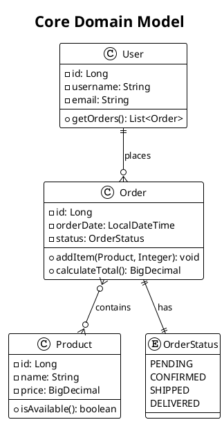

This diagram illustrates the core business entities and their relationships, showing how users place orders containing products.
```

### Validation

After generating class diagrams:

1. **Verify accuracy** against actual codebase structure
2. **Test PlantUML syntax** for proper rendering
3. **Ensure relationship correctness** (inheritance, composition, etc.)
4. **Validate completeness** of important classes and relationships
5. **Check diagram readability** and appropriate level of detail

### Output Locations

- **README.md files**: Include architectural overview diagrams
- **Package-specific .md files**: Detailed diagrams for complex packages
- **Documentation directories**: Organize in docs/diagrams/ or architecture/ folders
- **Inline documentation**: Simple diagrams in package-info.java files


## Package Analysis Process

**For each selected package scope:**

1. **All Packages** (if selected):
- Analyze complete project structure across all modules
- Identify core domain packages and supporting infrastructure
- Generate high-level architecture diagrams showing package relationships
- Create detailed diagrams for each significant package

2. **Core Business Logic Packages** (if selected):
- Focus on domain models and business service classes
- Analyze entities, value objects, and business rules
- Document service layer patterns and business workflows
- Include repository patterns and data access abstractions

3. **Specific Packages** (if selected):
- Analyze user-specified packages in detail
- Generate focused diagrams showing class relationships within packages
- Include cross-package dependencies and interactions
- Document package-specific design patterns and architectures

## Class Analysis Guidelines

1. **Identify Class Categories**:
- Domain entities and value objects (core business concepts)
- Service classes (business logic and orchestration)
- Repository classes (data access patterns)
- Controller classes (API and presentation layer)
- Configuration and infrastructure classes
- Utility and helper classes

2. **Analyze Relationships**:
- Inheritance hierarchies (extends/implements)
- Composition and aggregation relationships
- Interface implementations and abstractions
- Dependency injection patterns
- Design pattern implementations

3. **Determine Appropriate Detail Level**:
- Include key methods and attributes for business logic
- Show important annotations (@Entity, @Service, @Repository, @Controller)
- Document method signatures for public APIs
- Include visibility modifiers and type information

## File Organization Strategy

**Based on user preferences:**

1. **Package-Based Organization**:
- Create separate class diagrams for each package
- Generate overview diagram showing package relationships
- Use consistent naming conventions for diagram files

2. **Layer-Based Organization**:
- Organize diagrams by architectural layers (controller, service, repository)
- Show cross-layer dependencies and interactions
- Include infrastructure and configuration diagrams

3. **Domain-Based Organization**:
- Group related classes by business domain
- Show domain boundaries and relationships
- Include supporting infrastructure for each domain

## Content Quality Requirements

1. **Structural Accuracy**: Diagrams must reflect actual class structure and relationships
2. **Relationship Correctness**: Show accurate inheritance, composition, and dependency relationships
3. **Appropriate Abstraction**: Include relevant details without overwhelming complexity
4. **Design Pattern Documentation**: Highlight important architectural and design patterns
5. **Clear Organization**: Use packages and grouping for logical organization

## Validation

After generating class diagrams:
1. **Verify PlantUML syntax** for proper rendering
2. **Validate against codebase** to ensure structural accuracy
3. **Check relationship correctness** (inheritance, composition, dependencies)
4. **Ensure appropriate detail level** for intended audience
5. **Test file organization** according to user preferences

#### Step Constraints

- **MUST** only execute if "UML class diagrams" was selected in Step 1
- **MUST** use codebase_search extensively to analyze class structure and relationships
- **MUST** generate accurate diagrams that reflect actual class hierarchy and relationships
- **MUST** use proper PlantUML class diagram syntax
- **MUST** include appropriate level of detail based on user selection
- **MUST** read template files fresh using file_search and read_file tools
- **MUST** organize files according to user preferences from Step 1
- **MUST** show accurate inheritance, composition, and association relationships
- **MUST** include important annotations and design patterns
- **MUST NOT** generate generic or templated diagrams without actual code analysis
- **MUST** validate PlantUML syntax for renderability

### Step 4: C4 Model Diagram Generation

**Purpose**: Generate C4 model diagrams to visualize system architecture at different levels of abstraction (Context, Container, Component, and Code) based on code analysis and user preferences.

**Dependencies**: Only execute if the user selected C4 model diagrams in Step 1. Requires completion of Step 1.

**CONDITIONAL EXECUTION**: Execute this step only if the user selected "C4 model diagrams" in Step 1.

## Implementation Strategy

Use the following template and guidelines:

# C4 Model Diagram Generation Guidelines

## Implementation Strategy

Generate C4 model diagrams using PlantUML with C4-PlantUML library to visualize system architecture at different levels of abstraction: Context, Container, Component, and Code.

### C4 Model Overview

The C4 model provides a hierarchical approach to architectural documentation:

1. **Level 1 - System Context**: Shows how your system fits into the overall environment
2. **Level 2 - Container**: Shows the high-level technology choices and containers
3. **Level 3 - Component**: Shows how containers are made up of components
4. **Level 4 - Code**: Shows how components are implemented (classes, interfaces)

### Analysis Process

**For each C4 level identified:**

1. **System Context Analysis**:
- Identify external users and personas
- Identify external systems and dependencies
- Define system boundaries and purpose
- Analyze integration points and data flows

2. **Container Analysis**:
- Identify deployable units (web apps, APIs, databases)
- Analyze technology choices and frameworks
- Document communication protocols and ports
- Map container responsibilities and boundaries

3. **Component Analysis**:
- Identify logical components within containers
- Analyze component responsibilities and interfaces
- Document inter-component communication
- Map business capabilities to components

4. **Code Analysis**:
- Focus on critical or complex components
- Show key classes and interfaces
- Document important design patterns
- Illustrate implementation relationships

### Diagram Generation Guidelines

#### Level 1 - System Context Diagram
```plantuml
@startuml
!include https://raw.githubusercontent.com/plantuml-stdlib/C4-PlantUML/master/C4_Context.puml
!define DEVICONS https://raw.githubusercontent.com/tupadr3/plantuml-icon-font-sprites/master/devicons
!include DEVICONS/java.puml

title System Context Diagram for E-commerce Platform

Person(customer, "Customer", "A customer of the e-commerce platform")
Person(admin, "Administrator", "Manages products and orders")

System(ecommerce, "E-commerce Platform", "Allows customers to browse and purchase products")
System_Ext(payment, "Payment System", "Processes credit card payments")
System_Ext(email, "Email System", "Sends emails to customers")
System_Ext(inventory, "Inventory System", "Manages product stock levels")

Rel(customer, ecommerce, "Browses products, places orders")
Rel(admin, ecommerce, "Manages products and orders")
Rel(ecommerce, payment, "Processes payments")
Rel(ecommerce, email, "Sends order confirmations")
Rel(ecommerce, inventory, "Checks stock, updates inventory")

@enduml
```

#### Level 2 - Container Diagram
```plantuml
@startuml
!include https://raw.githubusercontent.com/plantuml-stdlib/C4-PlantUML/master/C4_Container.puml

title Container Diagram for E-commerce Platform

Person(customer, "Customer", "A customer of the platform")
Person(admin, "Administrator", "Platform administrator")

System_Boundary(c1, "E-commerce Platform") {
Container(web_app, "Web Application", "React, JavaScript", "Provides e-commerce functionality via web browser")
Container(mobile_app, "Mobile App", "React Native", "Provides e-commerce functionality via mobile device")
Container(api_gateway, "API Gateway", "Spring Cloud Gateway", "Routes requests and handles cross-cutting concerns")
Container(product_service, "Product Service", "Spring Boot, Java", "Manages product catalog")
Container(order_service, "Order Service", "Spring Boot, Java", "Processes customer orders")
Container(user_service, "User Service", "Spring Boot, Java", "Manages user accounts and authentication")
ContainerDb(product_db, "Product Database", "PostgreSQL", "Stores product information")
ContainerDb(order_db, "Order Database", "PostgreSQL", "Stores order information")
ContainerDb(user_db, "User Database", "PostgreSQL", "Stores user accounts and profiles")
Container(cache, "Cache", "Redis", "Caches frequently accessed data")
}

System_Ext(payment_system, "Payment System", "External payment processor")
System_Ext(email_system, "Email System", "Email service provider")

Rel(customer, web_app, "Uses", "HTTPS")
Rel(customer, mobile_app, "Uses", "HTTPS")
Rel(admin, web_app, "Uses", "HTTPS")

Rel(web_app, api_gateway, "Makes API calls to", "JSON/HTTPS")
Rel(mobile_app, api_gateway, "Makes API calls to", "JSON/HTTPS")

Rel(api_gateway, product_service, "Routes to", "JSON/HTTP")
Rel(api_gateway, order_service, "Routes to", "JSON/HTTP")
Rel(api_gateway, user_service, "Routes to", "JSON/HTTP")

Rel(product_service, product_db, "Reads from and writes to", "JDBC")
Rel(order_service, order_db, "Reads from and writes to", "JDBC")
Rel(user_service, user_db, "Reads from and writes to", "JDBC")

Rel(product_service, cache, "Caches data", "Redis Protocol")
Rel(order_service, payment_system, "Processes payments", "HTTPS")
Rel(order_service, email_system, "Sends notifications", "SMTP")

@enduml
```

#### Level 3 - Component Diagram
```plantuml
@startuml
!include https://raw.githubusercontent.com/plantuml-stdlib/C4-PlantUML/master/C4_Component.puml

title Component Diagram for Order Service

Container(web_app, "Web Application", "React", "Customer web interface")
Container(mobile_app, "Mobile App", "React Native", "Customer mobile interface")

Container_Boundary(order_service, "Order Service") {
Component(order_controller, "Order Controller", "Spring MVC Controller", "Handles HTTP requests for orders")
Component(order_service_comp, "Order Service", "Spring Service", "Implements order business logic")
Component(payment_service, "Payment Service", "Spring Service", "Handles payment processing")
Component(inventory_service, "Inventory Service", "Spring Service", "Manages inventory operations")
Component(order_repository, "Order Repository", "Spring Data JPA", "Provides order data access")
Component(notification_service, "Notification Service", "Spring Service", "Sends order notifications")
}

ContainerDb(order_db, "Order Database", "PostgreSQL", "Stores order data")
System_Ext(payment_gateway, "Payment Gateway", "External payment processor")
System_Ext(email_service, "Email Service", "Email service provider")
Container(inventory_system, "Inventory System", "External service", "Product inventory management")

Rel(web_app, order_controller, "Makes API calls", "JSON/HTTPS")
Rel(mobile_app, order_controller, "Makes API calls", "JSON/HTTPS")

Rel(order_controller, order_service_comp, "Uses")
Rel(order_service_comp, payment_service, "Uses")
Rel(order_service_comp, inventory_service, "Uses")
Rel(order_service_comp, order_repository, "Uses")
Rel(order_service_comp, notification_service, "Uses")

Rel(order_repository, order_db, "Reads from and writes to", "JDBC")
Rel(payment_service, payment_gateway, "Processes payments", "HTTPS")
Rel(notification_service, email_service, "Sends emails", "SMTP")
Rel(inventory_service, inventory_system, "Updates inventory", "REST API")

@enduml
```

#### Level 4 - Code Diagram (Class-based)
```plantuml
@startuml
!include https://raw.githubusercontent.com/plantuml-stdlib/C4-PlantUML/master/C4_Component.puml

title Code Diagram for Order Processing Component

Component_Boundary(order_processing, "Order Processing Component") {

class OrderController {
+createOrder(OrderRequest): ResponseEntity<Order>
+getOrder(Long): ResponseEntity<Order>
+updateOrderStatus(Long, OrderStatus): ResponseEntity<Order>
}

class OrderService {
-orderRepository: OrderRepository
-paymentService: PaymentService
-inventoryService: InventoryService
+processOrder(OrderRequest): Order
+validateOrder(Order): boolean
+calculateTotal(Order): BigDecimal
}

interface OrderRepository {
+save(Order): Order
+findById(Long): Optional<Order>
+findByCustomerId(Long): List<Order>
}

class Order {
-id: Long
-customerId: Long
-items: List<OrderItem>
-status: OrderStatus
-totalAmount: BigDecimal
+addItem(OrderItem): void
+calculateTotal(): BigDecimal
}

class OrderItem {
-productId: Long
-quantity: Integer
-unitPrice: BigDecimal
+getSubtotal(): BigDecimal
}

enum OrderStatus {
PENDING
CONFIRMED
SHIPPED
DELIVERED
CANCELLED
}

class PaymentService {
+processPayment(PaymentRequest): PaymentResult
+validatePayment(PaymentRequest): boolean
}
}

OrderController --> OrderService : uses
OrderService --> OrderRepository : uses
OrderService --> PaymentService : uses
OrderService ..> Order : creates/manages
Order --> OrderItem : contains
Order --> OrderStatus : has
OrderRepository ..> Order : persists

@enduml
```

### PlantUML C4 Features

1. **C4-PlantUML Library Integration**:
- Include C4-PlantUML library: `!include https://raw.githubusercontent.com/plantuml-stdlib/C4-PlantUML/master/C4_Context.puml`
- Use predefined macros: `Person()`, `System()`, `Container()`, `Component()`
- Leverage built-in styling and layout

2. **Element Types**:
- `Person()`: External users or actors
- `System()`: Internal software systems
- `System_Ext()`: External systems
- `Container()`: Deployable units
- `ContainerDb()`: Database containers
- `Component()`: Logical components

3. **Relationship Types**:
- `Rel()`: Basic relationship with label
- `Rel_D()`, `Rel_U()`, `Rel_L()`, `Rel_R()`: Directional relationships
- `BiRel()`: Bidirectional relationships

4. **Boundary and Grouping**:
- `System_Boundary()`: Group related containers
- `Container_Boundary()`: Group related components
- `Enterprise_Boundary()`: Enterprise-level grouping

### Content Requirements

1. **Accurate System Representation**:
- Reflect actual system architecture and deployment
- Include real technology choices and frameworks
- Show accurate data flows and integration points
- Document actual API endpoints and protocols

2. **Appropriate Abstraction Levels**:
- Context: Focus on external interactions and system purpose
- Container: Show deployable units and technology choices
- Component: Logical grouping of functionality
- Code: Key classes and implementation details

3. **Clear Relationships**:
- Use appropriate relationship types and labels
- Include communication protocols and data formats
- Show both synchronous and asynchronous interactions
- Document security and authentication flows

4. **Business Context**:
- Include business users and their goals
- Show business processes and workflows
- Document business rules and constraints
- Explain business value and capabilities

### Integration with Documentation

#### In README.md Files
- Include Context and Container diagrams in "Architecture" section
- Show system overview and technology landscape
- Provide business context and system purpose

#### In Architecture Documentation
- Create dedicated architecture.md files for complete C4 model
- Organize diagrams by abstraction level
- Include detailed explanations for each diagram

#### In Package Documentation
- Reference relevant Component and Code diagrams
- Show how packages fit into overall architecture
- Document cross-package dependencies

### Example Integration

**README.md Section**:
```markdown

## System Architecture

### System Context

Our e-commerce platform serves customers and administrators, integrating with external payment and email systems:

```plantuml
@startuml
!include https://raw.githubusercontent.com/plantuml-stdlib/C4-PlantUML/master/C4_Context.puml

title E-commerce Platform - System Context

Person(customer, "Customer", "Browses and purchases products")
System(ecommerce, "E-commerce Platform", "Online shopping platform")
System_Ext(payment, "Payment System", "Processes payments")

Rel(customer, ecommerce, "Uses")
Rel(ecommerce, payment, "Processes payments via")
@enduml
```

### Container Architecture

The platform consists of multiple Spring Boot microservices with dedicated databases:

[Include Container diagram here...]

This architecture enables scalability, maintainability, and technology diversity across the platform.
```

### Validation

After generating C4 diagrams:

1. **Verify architectural accuracy** against actual system implementation
2. **Test PlantUML syntax** with C4-PlantUML library
3. **Ensure appropriate abstraction** for each diagram level
4. **Validate business context** and user scenarios
5. **Check diagram readability** and layout
6. **Confirm integration** with documentation structure

### Output Locations

- **README.md files**: Context and Container diagrams for overview
- **Architecture documentation**: Complete C4 model with all levels
- **Module documentation**: Component and Code diagrams for specific modules
- **Design documents**: Detailed architectural decisions and patterns


## C4 Model Analysis Process

**For each selected diagram level:**

1. **Complete C4 Model** (if selected):
- Generate all four levels of C4 diagrams
- Start with System Context for business overview
- Create Container diagrams for deployment architecture
- Develop Component diagrams for logical structure
- Add Code diagrams for critical implementations

2. **High-Level Diagrams Only** (if selected):
- Focus on System Context and Container levels
- Emphasize business context and system boundaries
- Show technology choices and deployment units
- Document external integrations and dependencies

3. **Detailed Diagrams Only** (if selected):
- Focus on Component and Code levels
- Analyze internal system structure
- Document component responsibilities and interfaces
- Show implementation patterns and key classes

## Architecture Analysis Guidelines

1. **System Context Analysis**:
- Identify all external users and personas
- Map external systems and third-party integrations
- Define clear system boundaries and responsibilities
- Document business capabilities and value propositions

2. **Container Analysis**:
- Identify deployable units (web apps, services, databases)
- Analyze technology stack and framework choices
- Document communication protocols and API contracts
- Map deployment and infrastructure requirements

3. **Component Analysis**:
- Identify logical components within each container
- Analyze component responsibilities and boundaries
- Document inter-component communication patterns
- Map business capabilities to technical components

4. **Code Analysis**:
- Focus on architecturally significant components
- Show key classes, interfaces, and design patterns
- Document important implementation decisions
- Illustrate complex algorithmic or business logic

## File Organization Strategy

**Based on user preferences:**

1. **Hierarchical Organization**:
- Create separate files for each C4 level
- Use consistent naming (context.puml, container.puml, etc.)
- Generate comprehensive architecture.md with all levels

2. **Domain-Based Organization**:
- Organize C4 diagrams by business domain or module
- Show how domains interact at different abstraction levels
- Include cross-domain dependency diagrams

3. **Single Comprehensive File**:
- Include all selected C4 levels in one document
- Provide clear navigation and cross-references
- Use consistent styling and formatting

## Content Quality Requirements

1. **Architectural Accuracy**: Diagrams must reflect actual system architecture and deployment
2. **Business Context**: Include real users, use cases, and business value
3. **Technical Precision**: Show accurate technology choices, protocols, and integrations
4. **Appropriate Abstraction**: Each level should provide appropriate detail for its audience
5. **Clear Relationships**: Document accurate data flows and interaction patterns

## Validation

After generating C4 diagrams:
1. **Verify PlantUML syntax** with C4-PlantUML library compatibility
2. **Validate architectural accuracy** against actual system implementation
3. **Check abstraction appropriateness** for each diagram level
4. **Ensure business context accuracy** with stakeholder needs
5. **Test file organization** according to user preferences
6. **Verify visual clarity** and layout effectiveness

#### Step Constraints

- **MUST** only execute if "C4 model diagrams" was selected in Step 1
- **MUST** use codebase_search extensively to analyze system architecture
- **MUST** generate accurate diagrams that reflect actual system structure
- **MUST** use proper PlantUML syntax with C4-PlantUML library
- **MUST** include appropriate abstraction level based on user selection
- **MUST** read template files fresh using file_search and read_file tools
- **MUST** organize files according to user preferences from Step 1
- **MUST** show accurate business context and user scenarios
- **MUST** include real technology choices and deployment architecture
- **MUST NOT** generate generic or templated diagrams without actual architectural analysis
- **MUST** validate C4-PlantUML syntax for renderability

### Step 5: UML State Machine Diagram Generation

**Purpose**: Generate UML state machine diagrams to illustrate the behavior, lifecycle, and workflows of objects, business processes, and system components based on code analysis and user preferences.

**Dependencies**: Only execute if the user selected UML state machine diagrams in Step 1. Requires completion of Step 1.

**CONDITIONAL EXECUTION**: Execute this step only if the user selected "UML state-machine diagrams" in Step 1.

## Implementation Strategy

Use the following template and guidelines:

# UML State Machine Diagram Generation Guidelines

## Implementation Strategy

Generate UML state machine diagrams using PlantUML syntax to illustrate the behavior and lifecycle of objects, business processes, and system workflows within Java applications.

### Analysis Process

**For each state machine identified:**

1. **Identify state machine subjects**:
- Domain entities with lifecycle states (Order, User, Document)
- Business processes with workflow states (Approval, Payment, Shipping)
- System components with operational states (Connection, Transaction, Job)
- User interface components with interaction states (Form, Dialog, Wizard)

2. **Analyze state transitions**:
- Initial and final states
- Intermediate states and their purposes
- Transition triggers (events, conditions, actions)
- Guard conditions and transition actions
- Concurrent states and parallel workflows

3. **Determine diagram scope** based on user selection:
- **Entity lifecycles**: Domain object state transitions (e.g., Order: Created → Paid → Shipped → Delivered)
- **Business workflows**: Process state machines (e.g., Document approval workflow)
- **System behaviors**: Component operational states (e.g., Connection states, Job execution states)
- **User interactions**: UI component state transitions (e.g., Multi-step form wizard)

### Diagram Generation Guidelines

#### Basic State Machine Structure
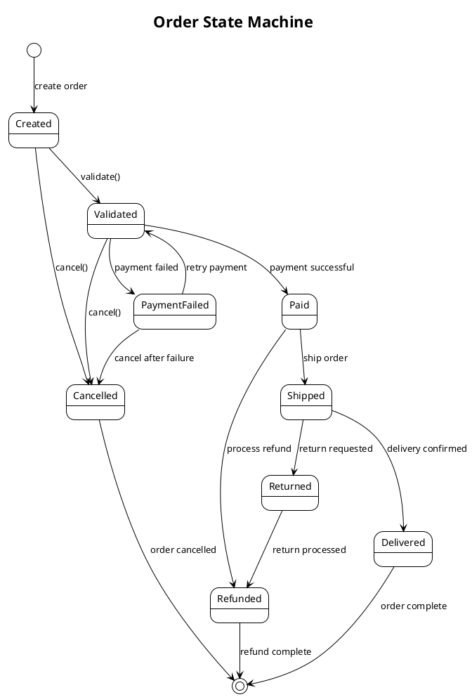

#### Advanced State Machine Patterns

**Composite States with Sub-states**:
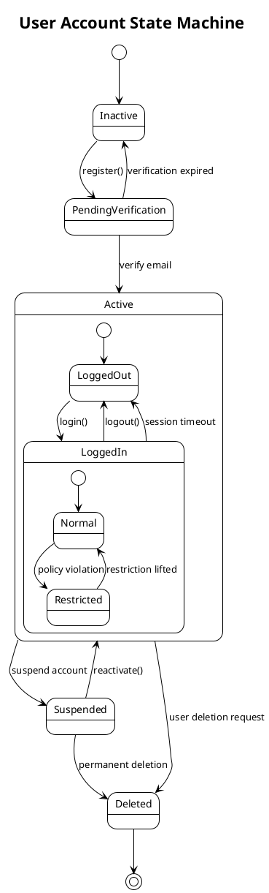

**Concurrent States**:
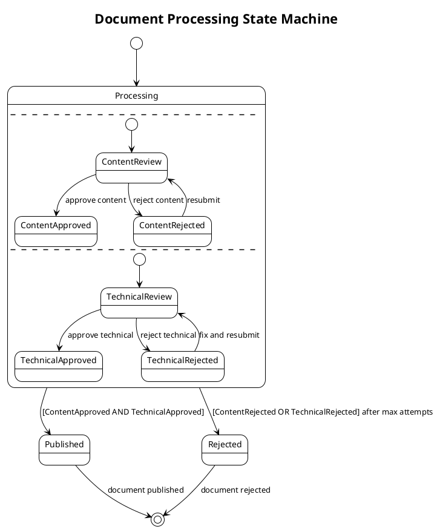

**State Machine with Actions and Guards**:
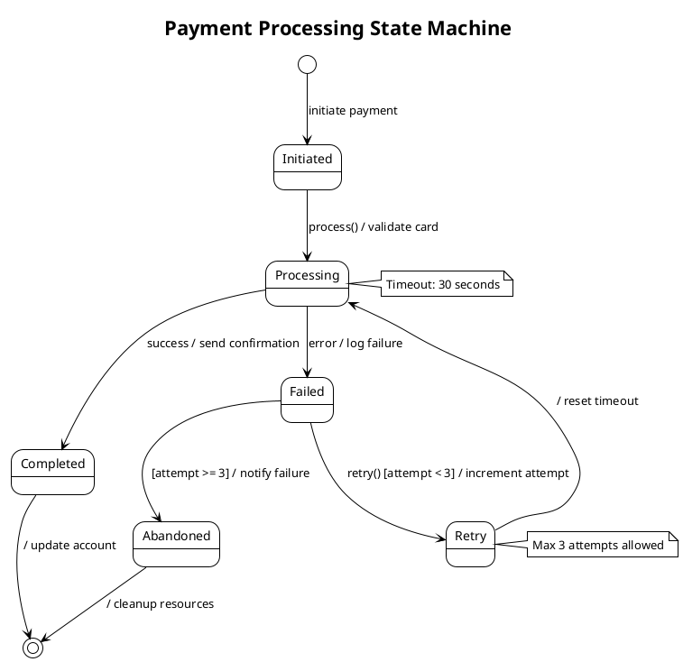

#### Business Process State Machines

**Approval Workflow**:
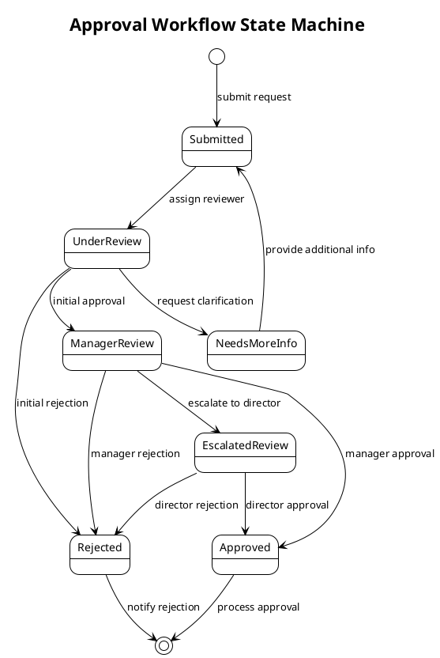

#### System Component State Machines

**Database Connection State Machine**:
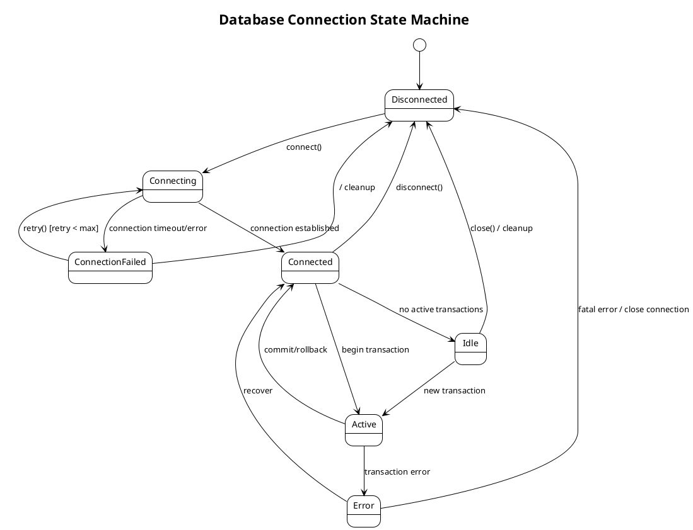

### Content Quality Requirements

1. **State Accuracy**: States must reflect actual object/process lifecycle in the codebase
2. **Transition Completeness**: Include all valid state transitions and their triggers
3. **Guard Conditions**: Document conditions that must be met for transitions
4. **Action Documentation**: Include actions performed during transitions or state entry/exit
5. **Business Logic Alignment**: Ensure state machines align with business rules and processes

### Integration Guidelines

1. **Code Analysis**: Use codebase_search to identify:
- Enum classes that represent states
- State pattern implementations
- Workflow orchestration code
- Business process implementations
- Entity lifecycle management code

2. **Documentation Integration**:
- Include state machine diagrams in relevant package-info.java files
- Add state machine sections to README.md for complex workflows
- Reference state machines in class-level Javadoc for stateful entities

3. **Naming Conventions**:
- Use clear, business-meaningful state names
- Follow consistent naming patterns across related state machines
- Include context in diagram titles (e.g., "Order Processing State Machine")

### Validation

After generating state machine diagrams:
1. **Verify PlantUML syntax** for proper rendering
2. **Validate against codebase** to ensure state accuracy
3. **Check transition completeness** - ensure all paths are covered
4. **Test business logic alignment** with actual implementation
5. **Ensure proper integration** with other documentation


## State Machine Analysis Process

**For each applicable state machine type:**

1. **Entity Lifecycles** (if selected):
- Analyze domain entities with clear state transitions
- Identify state-changing methods and business rules
- Document entity lifecycle from creation to completion/deletion
- Include state validation and transition constraints

2. **Business Workflows** (if selected):
- Analyze business process implementations
- Identify workflow orchestration patterns
- Document approval processes, payment flows, and operational workflows
- Include decision points and parallel processing paths

3. **System Behaviors** (if selected):
- Analyze system components with operational states
- Identify connection management, job processing, and transaction states
- Document error handling and recovery mechanisms
- Include timeout and retry logic patterns

4. **User Interactions** (if selected):
- Analyze UI components with interaction states
- Identify form wizards, dialog flows, and navigation patterns
- Document user journey state transitions
- Include validation and error state handling

## State Machine Generation Guidelines

1. **Use PlantUML syntax** for state machine diagrams to ensure compatibility and renderability
2. **Analyze actual code implementations** using codebase_search to identify:
- Enum classes representing states
- State pattern implementations
- Workflow orchestration code
- Business process state management
- Entity lifecycle management methods

3. **Include comprehensive state coverage**:
- Initial and final states
- All intermediate states with clear purposes
- Transition triggers, guards, and actions
- Concurrent states where applicable
- Error and exception states

4. **Document business logic alignment**:
- Ensure state machines reflect actual business rules
- Include guard conditions from code validation
- Show actions performed during state transitions
- Reference actual method names and class structures

## File Organization Strategy

**Based on user preferences:**

1. **Entity-Based Organization**:
- Create separate state machine diagrams for each stateful entity
- Use consistent naming conventions (EntityName-states.puml)
- Generate overview showing entity relationships

2. **Workflow-Based Organization**:
- Organize diagrams by business process or workflow
- Show how different entities participate in workflows
- Include process orchestration and coordination diagrams

3. **System-Based Organization**:
- Group state machines by system component or service
- Show interactions between different system states
- Include error handling and recovery workflows

## Content Quality Requirements

1. **State Accuracy**: Diagrams must reflect actual object and process lifecycles in the codebase
2. **Transition Completeness**: Include all valid state transitions with proper triggers and guards
3. **Business Logic Alignment**: Ensure state machines align with business rules and validation logic
4. **Implementation Consistency**: Reference actual class names, method names, and enum values
5. **Documentation Clarity**: Include clear state descriptions and transition explanations

## Validation

After generating state machine diagrams:
1. **Verify PlantUML syntax** for proper rendering
2. **Validate against codebase** to ensure state and transition accuracy
3. **Check business logic alignment** with actual implementation
4. **Test diagram completeness** covering all significant state transitions
5. **Ensure proper file organization** according to user preferences

#### Step Constraints

- **MUST** only execute if "UML state-machine diagrams" was selected in Step 1
- **MUST** use codebase_search extensively to analyze actual state implementations
- **MUST** generate accurate diagrams that reflect real state machine behavior
- **MUST** use proper PlantUML state machine diagram syntax
- **MUST** include comprehensive state coverage based on user selection
- **MUST** read template files fresh using file_search and read_file tools
- **MUST** organize files according to user preferences from Step 1
- **MUST** include guard conditions and transition actions where applicable
- **MUST** reference actual code structures (enums, classes, methods)
- **MUST NOT** generate generic or templated diagrams without code analysis
- **MUST** validate PlantUML syntax for renderability

### Step 6: Diagrams Validation and Summary

**Purpose**: Validate all generated diagrams and provide a comprehensive summary of changes made.

**Dependencies**: Requires completion of applicable steps (2, 3, 4, and/or 5 based on user selections).

## Validation Process

1. **PlantUML Syntax Validation**:
```bash
# If you have PlantUML installed locally, validate syntax
java -jar plantuml.jar -checkonly *.puml

# Or use online validation tools to verify diagram syntax
```

2. **File Organization Validation**:
- Verify all diagram files are properly organized according to user preferences
- Ensure consistent naming conventions are followed
- Check that all referenced files and directories exist

3. **Content Validation**:
- Verify all diagrams accurately reflect the analyzed codebase
- Ensure proper PlantUML syntax and formatting
- Check that all cross-references and links are valid
- Validate that diagram complexity is appropriate for intended audience

4. **Integration Validation**:
- Ensure diagrams integrate properly with existing documentation structure
- Verify that any generated markdown files have proper formatting
- Check that diagram references in documentation are accurate

## Summary Report

**Generate a comprehensive summary including:**

### Diagrams Generated:
- **UML sequence diagrams**: [List diagram files created and workflows documented]
- **UML class diagrams**: [List diagram files created and packages/classes documented]
- **C4 model diagrams**: [List diagram files created and architecture levels documented]
- **UML state machine diagrams**: [List diagram files created and state machines documented]
- **Supporting files**: [List any markdown or documentation files created]

### File Organization:
- **Directory structure**: [Show how diagrams are organized]
- **Naming conventions**: [Document naming patterns used]
- **File types**: [List .puml, .md, and other files generated]

### Content Coverage:
- **Packages analyzed**: [List packages covered in class diagrams]
- **Workflows documented**: [List business processes in sequence diagrams]
- **Architecture levels**: [List C4 model abstraction levels generated]
- **State machines**: [List entities/processes with state diagrams]

### Actions Taken:
- **New files created**: [Count and list]
- **Directories created**: [List any new directories for organization]
- **Integration points**: [Document how diagrams integrate with existing docs]

### Usage Instructions:
```bash
# To view generated diagrams
find . -name "*.puml" -type f
ls -la diagrams/ # if using diagrams directory

# To render PlantUML diagrams to PNG/SVG (requires PlantUML)
java -jar plantuml.jar *.puml

# To use with JBang PlantUML tool (recommended)
jbang puml-to-png@jabrena --watch .

# To validate PlantUML syntax
java -jar plantuml.jar -checkonly *.puml
```

### Integration with Documentation Tools:
- **JBang PlantUML**: Use `jbang puml-to-png@jabrena --watch .` for automatic PNG generation
- **IDE Integration**: Most IDEs support PlantUML preview plugins
- **CI/CD Integration**: Consider adding diagram generation to build pipeline
- **Documentation Sites**: Diagrams can be embedded in GitBook, GitHub Pages, etc.

### Next Steps Recommendations:
- Review generated diagrams for accuracy and completeness
- Consider setting up automated diagram rendering in CI/CD
- Update diagrams as code evolves to maintain accuracy
- Share diagrams with team for architectural discussions
- Consider generating additional diagram types for specific needs

### Diagram Rendering Options:
1. **Local Rendering**: Install PlantUML jar and render locally
2. **Online Rendering**: Use PlantUML online server for quick previews
3. **JBang Tool**: Use the recommended `jbang puml-to-png@jabrena` for automatic rendering
4. **IDE Plugins**: Install PlantUML plugins for real-time preview
5. **Build Integration**: Add PlantUML Maven/Gradle plugins for automated generation

## Final Validation

Verify that all generated diagrams can be rendered successfully:

```bash
# Test PlantUML syntax validation
java -jar plantuml.jar -checkonly $(find . -name "*.puml")
```

If syntax validation passes, diagram generation is complete and successful.

#### Step Constraints

- **MUST** validate PlantUML syntax for all generated diagram files
- **MUST** provide comprehensive summary of all diagrams generated
- **MUST** document file organization and naming conventions used
- **MUST** verify that all diagrams accurately reflect analyzed codebase
- **MUST** document what diagram types were created and their coverage
- **MUST** provide clear usage instructions for viewing and rendering diagrams
- **MUST** include recommendations for diagram maintenance and updates
- **MUST** document integration options with documentation tools


## Output Format

- Ask diagram questions one by one following the template exactly in Step 1
- Execute steps 2-5 only based on user selections from Step 1
- Skip entire steps if no relevant diagram types were selected
- Generate only requested diagram types based on user selections
- Follow template specifications exactly for all diagram generation
- Provide clear progress feedback showing which step is being executed
- Provide comprehensive summary of all diagrams generated

## Safeguards

- **NEVER overwrite existing diagram files** without explicit user consent
- **ASK USER before creating** diagram files in existing directories
- **VALIDATE PlantUML syntax** before considering diagrams complete
- Always read template files fresh using file_search and read_file tools
- Never proceed to next step without completing dependencies
- Template adherence is mandatory - no exceptions or simplified versions
- Generate accurate diagrams based on actual code analysis, not generic templates
- **DOCUMENT what diagrams were generated** in the final summary
- Ensure all generated PlantUML files have valid syntax
- Validate that diagrams accurately represent the analyzed codebase
- **ORGANIZE files** according to user preferences and maintain consistency
- **PROVIDE clear instructions** for rendering and viewing generated diagrams