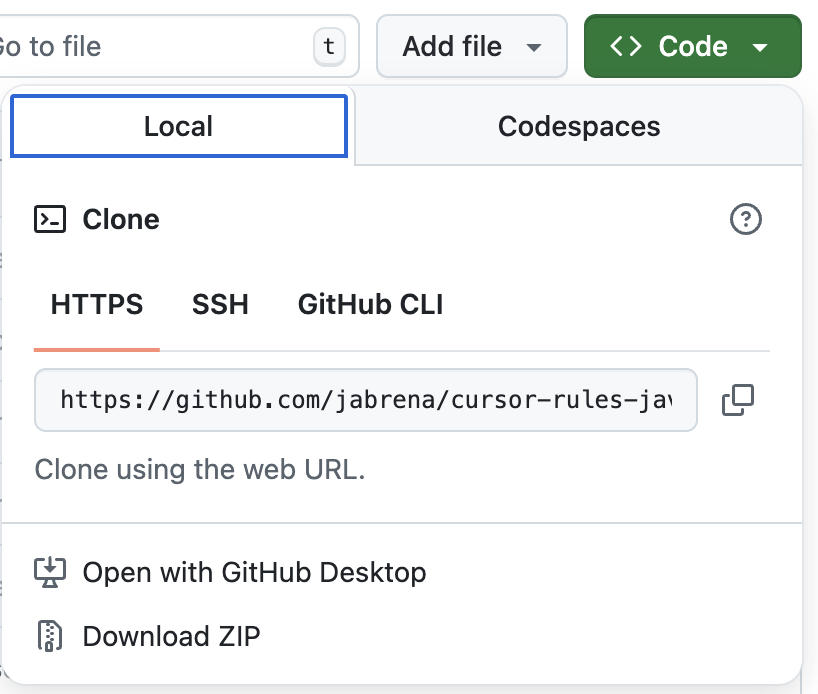
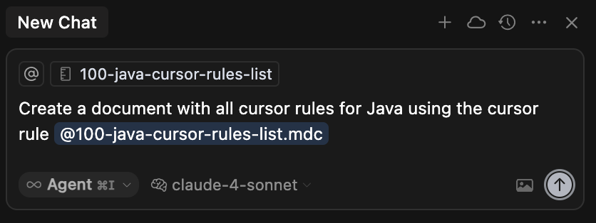

# Getting started

If you are interested in getting the benefits of these cursor rules for Java, you have different alternatives such as: `Using this Git repository`, `Using the zipped rules from the latest release` or using a `JBang CLI` specialized in this task.

## Install the rules

### Using the Git repository

This view has a big green button with the text: `<> Code`. If you click on it, you will see the tab `Local` and you will see the link for: `Download Zip`.



Once you have downloaded it, go to the `Downloads` folder in your system and you should see the zip file: `cursor-rules-java-main.zip`. Unzip it and copy the folder `.cursor` into the Java repository where you want to use these Cursor rules.

**Note:** ⚠️ Using this approach, you are using the main branch which is not released yet.

### Using the latest tagged zipped rules

Downloading the zipped release is the safest approach if you are interested in using the latest well-tested release. Go to [the latest release](https://github.com/jabrena/cursor-rules-java/releases) and download the zip assets included in the latest release. As in the previous case, download the zip, unzip it and copy the folder `.cursor` into the Java repository where you want to use these Cursor rules.

### Using a JBang CLI program specialized in this task

**JBang** is a tool that lets you run Java code as scripts without the need for traditional project setup, compilation, or build tools - just write Java and run it directly.

Using JBang, you can delegate the action to put the `.cursor/rules` from this repository into the Java repository where you want to use these Cursor rules.

Execute the following commands to use it:

```bash
sdk install jbang
# Add cursor rules for Java in .cursor/rules
jbang --fresh setup@jabrena init --cursor https://github.com/jabrena/cursor-rules-java
```

## Using your first Cursor rule in your Java repository

| Cursor Rule | Description | Prompt | Notes |
|-------------|-------------|--------|-------|
| [100-java-cursor-rules-list](.cursor/rules/100-java-cursor-rules-list.md) | Create a comprehensive step-by-step guide for using cursor rules for Java | `Create a Java development guide using the cursor rule @100-java-cursor-rules-list` | This cursor rule is applied automatically without any interaction with the software engineer. |

Once you have installed the cursor rules in the path `.cursor/rules`, type the following prompt in the cursor chat:



```bash
Create a document with all cursor rules for Java using the cursor rule @100-java-cursor-rules-list
```

**Note:** ⚠️ Drag and drop the file @100-java-cursor-rules-list into the chat area to apply the cursor rule.
