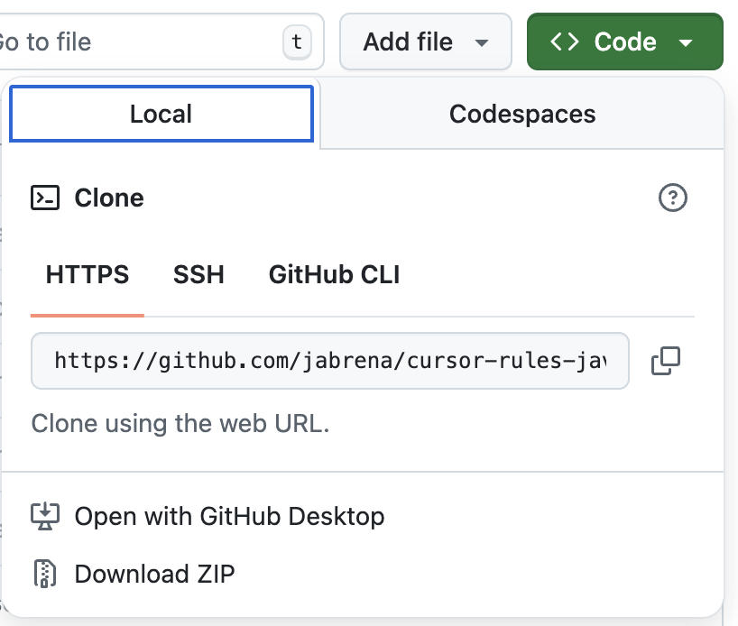

# Getting started

If you are interested in getting the benefits of this cursor rules for Java, you have different alternatives like: `Using this Git repository`, `Using the Zipped rules from latest release` or using a `JBang CLI` specialized in this task.

## Install the rules

### Using the Git repository

This view has big green button with the Text: `<> Code`. If you click on it, you will see the Tab `Local` and you will see the link for: `Download Zip`.



Once you have downloaded it, go for the folder `Downloads` in your system and you should see the Zip file: `cursor-rules-java-main.zip`. Unzip it and copy the folder `./cursor` into the Java repository that you want to use this Cursor rules on it.

**Note:** ⚠️ using this approach, you are using the Main branch which it is not released yet.

### Using the last zipped rules tagged

Download the zipped release is the safest approach if you are interested to use the last release well tested. Go for [the last release](https://github.com/jabrena/cursor-rules-java/releases) and download the Zip assets included in the last release. As the previous case, download the zip, unzip it and and copy the folder `./cursor` into the Java repository that you want to use this Cursor rules on it.

### Using a Jbang CLI program specialized in this task.

**JBang** is a tool that lets you run Java code as scripts without the need for traditional project setup, compilation, or build tools - just write Java and run it directly.

Using JBang, you could delegate the action to put the `./cursor/rules` from this repository into the Java repository that you want to use this Cursor rules on it.

Execute the following commands to use it:

```bash
sdk install jbang
# Add cursor rules for Java in ./cursor/rules
jbang --fresh setup@jabrena init --cursor https://github.com/jabrena/cursor-rules-java
```

## Using your first Cursor rule in your Java repository

| Cursor Rule | Description | Prompt | Notes |
|-------------|-------------|--------|-------|
| [100-java-cursor-rules-list](.cursor/rules/100-java-cursor-rules-list.md) | Create a comprehensive step-by-step guide for using cursor rules for Java | `Create an java development guide using the cursor rule @100-java-cursor-rules-list` | This cursor rule is applied automatically without any interaction with the Software engineer. |

Once you have installed the cursor rules in the path `./cursor/rules`, type the following prompt in the cursor chat:


```bash
Create a document with all cursor rules for Java using the cursor rule @100-java-cursor-rules-list
```

**Note:** ⚠️ Drag and drop the file @100-java-cursor-rules-list into the chat area to add the effect from the cursor rule.
