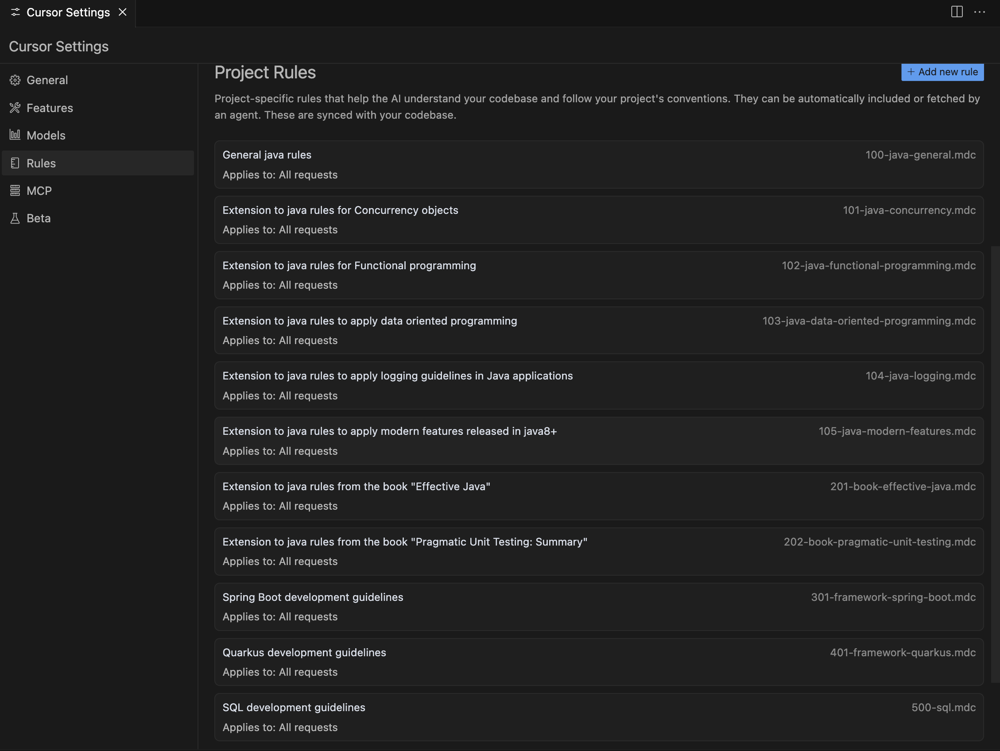

# Cursor AI rules for Java

A collection of Cursor rules for Java space.

## Rules

- [Java](./100-java-general.mdc)
- [Concurrency](./101-java-concurrency.mdc)
- [Functional Programming](./102-java-functional-programming.mdc)
- [Data oriented programming](./103-java-data-oriented-programming.mdc)
- [Logging](./104-java-logging.mdc)
- [Modern Java](./105-java-modern-features.mdc)
- [Effective Java](./201-book-effective-java.mdc)
- [Pragmatic Unit Testing](./202-book-pragmatic-unit-testing.mdc)
- [Refactoring](./203-book-refactoring.mdc)
- [SQL](./500-sql.mdc)

## References

- https://www.cursor.com/
- https://docs.cursor.com/context/rules-for-ai
- https://docs.cursor.com/context/%40-symbols/%40-cursor-rules

### Articles

- https://dev.to/dpaluy/mastering-cursor-rules-a-developers-guide-to-smart-ai-integration-1k65
- https://www.instructa.ai/en/blog/how-to-use-cursor-rules-in-version-0-45
