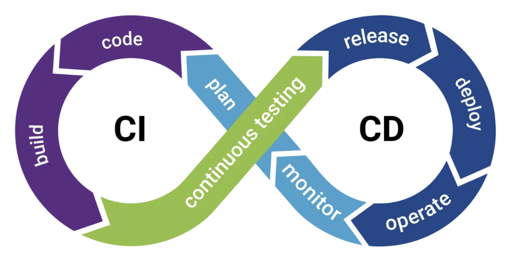

# Cursor AI rules for Java

## Motivation

Modern Java IDEs, such as **Cursor AI**, provide ways to customize how the `Agent model` behaves using reusable and scoped instructions. This repository offers a collection of such Cursor rules specifically for Java development.

This collection of Cursor Rules for Java development, tries to enrich the developer experience when the Software engineer interact with LLMs in some phases in of any CI workflow.



## Cursor Rules

- [Build: Maven Best Practices](.cursor/rules/110-java-maven-best-practices.mdc)
- [Build: Maven Dependencies & Plugins](.cursor/rules/111-java-maven-deps-and-plugins.mdc)
- [Design: Object Oriented Design](.cursor/rules/121-java-object-oriented-design.mdc)
- [Design: Type Design](.cursor/rules/122-java-type-design.mdc)
- [Coding: General Java Guidelines](.cursor/rules/123-java-general-guidelines.mdc)
- [Coding: Secure Java Coding](.cursor/rules/124-java-secure-coding.mdc)
- [Coding: Concurrency](.cursor/rules/125-java-concurrency.mdc)
- [Coding: Logging Guidelines](.cursor/rules/126-java-logging.mdc)
- [Testing: Unit Testing](.cursor/rules/131-java-unit-testing.mdc)
- [Testing: Integration Testing (If required)](.cursor/rules/132-java-integration-testing.mdc)
- [Refactoring: Add Modern Java Features](.cursor/rules/141-java-refactoring-with-modern-features.mdc)
- [Refactoring: Functional Programming](.cursor/rules/142-java-functional-programming.mdc)
- [Refactoring: Data Oriented Programming](.cursor/rules/143-java-data-oriented-programming.mdc)
- [Database: SQL Guidelines](.cursor/rules/500-sql.mdc)

## Getting started

If you are interested in getting the benefits from these cursor rules, you can manually download this repository and copy the './cursor' folder and paste it into your repository, or delegate this task to a specific command-line tool based on **Jbang**:

```bash
sdk install jbang
# Add cursor rules for Java in ./cursor/rules
jbang --fresh setup@jabrena init --cursor https://github.com/jabrena/cursor-rules-java
```

Once you have installed the cursor rules:

| Phase | Role | Cursor Rule | Description |
|-------|------|-------------|-------------|
| Getting Started | All | [Create Java Development Guide](.cursor/rules/100-java-checklist-guide.mdc) | Cursor rule designed to help the user when using the whole set of cursor rules for Java in an easy way |

Type the following prompt in the cursor chat:


```bash
Create an java development guide using the cursor rule @100-java-checklist-guide
```

## Java JEPS from Java 8

Java use JEPS as the vehicle to describe the new features to be added in the language. The repository review in a continuous way what JEPS could be improved any of the cursor rules present in this repository.

- [JEPS List](./docs/All-JEPS.md)

## What is the structure of a Cursor rule?

Review the [template](./docs/000-cursor-rule-template.md) for details.

## Contribute

If you have new ideas to improve any of the current Cursor rules or add a new one, please fork the repo and send a PR.

## References

- https://www.cursor.com/
- https://docs.cursor.com/context/rules
- https://docs.cursor.com/context/@-symbols/@-cursor-rules
- https://openjdk.org/jeps/0
- ...
- https://github.com/jabrena/cursor-rules-methodology
- https://github.com/jabrena/cursor-rules-agile
- https://github.com/jabrena/cursor-rules-tasks
- https://github.com/jabrena/cursor-rules-java
- https://github.com/jabrena/cursor-rules-examples
- https://github.com/jabrena/101-cursor
- https://github.com/jabrena/setup-cli
- https://github.com/jabrena/jbang-catalog
