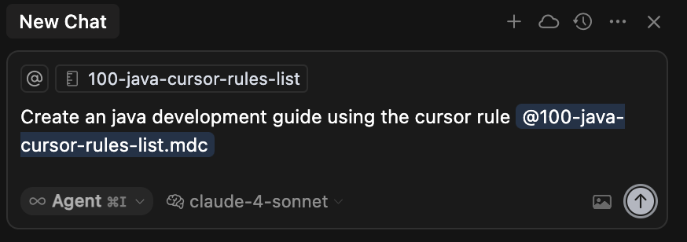

# Cursor AI rules for Java

## Stargazers over time
[](https://starchart.cc/jabrena/cursor-rules-java)

[](https://github.com/jabrena/cursor-rules-java/actions/workflows/maven.yaml)

## Motivation

Modern Java IDEs, such as **Cursor AI**, provide ways to customize how the `Agent model` behaves using reusable and scoped instructions. In cursor, the way to do it is named `Cursor rule` and you could see it as a `System prompt` if you use a generic term. This repository provides a collection of Cursor rules designed for Java development.

## What is a System prompt?

A system prompt is a set of instructions given to an AI model that defines how it should behave, what role it should take on, and what guidelines it should follow when responding to users. Think of it as the "operating manual" that shapes the AI's personality, capabilities, and boundaries.

## How to use the Cursor rules?

Using the Cursor rules is straightforward: simply `drag and drop` the cursor rule that you need into the chat textbox where you are typing your `User prompt`.

⚠️ Currently, the cursor rules are released with the [manual scope](https://docs.cursor.com/context/rules#rule-type) on purpose by design to mitigate potential negative performance impact in communications with **The Cursor platform**.

Review the following [sequence diagram](./docs/cursor-interaction-sequence.png) to understand the technical details.

## What is the structure of a System prompt?

Attending the documentation from [Google Gemini](https://drive.google.com/file/d/1AbaBYbEa_EbPelsT40-vj64L-2IwUJHy/view), [Anthropic Claude](https://docs.anthropic.com/en/docs/build-with-claude/prompt-engineering/overview) & [OpenAI ChatGPT](https://chatgpt.com/share/686d1066-9e40-800b-ac7f-cc8df7e4c7d0), a prompt should be structured in the following way:

- Metadata
- Role
- Context (Optional)
- Goal
- Constraints (Optional)
- Examples (Optional)
- Output format (Optional)
- Safeguards (Optional)

With this structure in mind, the project use a XML Schema to define the way that all System prompts are generated for Cursor AI. If you feel interested, you could review [the Schema](./generator/src/main/resources/pml.xsd). All non interactive Cursor rules are generated by XML to enforce consistency in the output and easy maintenance.

## Cursor Rules

Read the generated list of cursor rules for Java [here](./CURSOR-RULES-JAVA.md). The set of cursor rules cover aspects like, Build system based on Maven, Design, Coding, Testing, Refactoring, Performance with Jmeter & Profiling with Async Profiler.

## Getting started

If you are interested in getting the benefits from these cursor rules for Java, you can manually download this repository and copy the './cursor' folder and paste it into your repository, or delegate this task to a specific command-line tool based on **Jbang**:

```bash
sdk install jbang
# Add cursor rules for Java in ./cursor/rules
jbang --fresh setup@jabrena init --cursor https://github.com/jabrena/cursor-rules-java
```

Once you have installed the cursor rules:

| Phase | Role | Cursor Rule | Description |
|-------|------|-------------|-------------|
| Getting Started | All | [Create Java Development Guide](.cursor/rules/100-java-checklist-guide.mdc) | Cursor rule designed to help the user when using the whole set of cursor rules for Java in an easy way |

Type the following prompt in the cursor chat:



```bash
Create an java development guide using the cursor rule @100-java-checklist-guide
```

## Examples

The rules was tested with the following examples:

- [General: Maven Java project](./examples/maven-demo/README.md)
- [Microservices: Spring Boot application](./examples/spring-boot-demo/implementation/README.md)
- [Microservices: Spring Boot application with Memory leaks](./examples/spring-boot-memory-leak-demo/README.md)
- [Microservices: Spring Boot application with Performance Bottleneck](./examples/spring-boot-performance-bottleneck-demo/README.md)
- [Microservices: Spring Boot application with JMeter Load Testing](./examples/spring-boot-jmeter-demo/README.md)
- [Microservices: Quarkus application](./examples/quarkus-demo/README.md)
- [Serverless: AWS Lambda](./examples/aws-lambda-hello-world/README.md)
- [Serverless: Azure Function](./examples/azure-function-hello-world/README.md)

## Changelog

- Review the [CHANGELOG](./CHANGELOG.md) for further details

## Java JEPS from Java 8

Java use JEPS as the vehicle to describe the new features to be added in the language. The repository review in a continuous way what JEPS could be improved any of the cursor rules present in this repository.

- [JEPS List](./docs/All-JEPS.md)

## Contribute

If you have new ideas to improve any of the current Cursor rules or add a new one, please fork the repo and send a PR.

## References

- https://www.cursor.com/
- https://docs.cursor.com/context/rules
- https://docs.cursor.com/context/@-symbols/@-cursor-rules
- https://openjdk.org/jeps/0

## Cursor rules ecosystem

- https://github.com/jabrena/101-cursor
- https://github.com/jabrena/pml
- https://github.com/jabrena/cursor-rules-methodology
- https://github.com/jabrena/cursor-rules-agile
- https://github.com/jabrena/cursor-rules-java
- https://github.com/jabrena/cursor-rules-spring-boot
- https://github.com/jabrena/cursor-rules-examples
- https://github.com/jabrena/cursor-rules-sandbox
- https://github.com/jabrena/plantuml-to-png-cli
- https://github.com/jabrena/setup-cli
- https://github.com/jabrena/jbang-catalog

Powered by [Cursor](https://www.cursor.com/)
