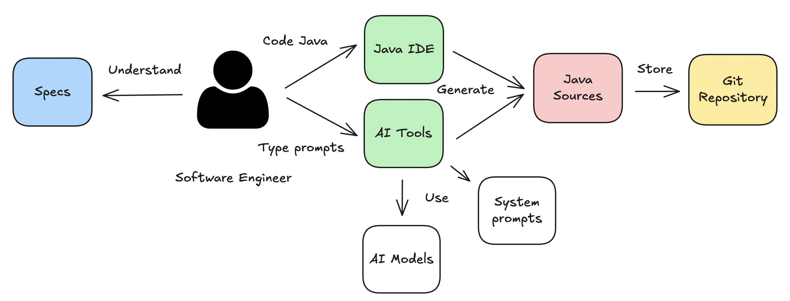

# Cursor AI rules for Java

## Stargazers over time

## Goal

The project provides a collection of `System prompts` for Java Enterprise development that help software engineers in their daily programming work.
The [available System prompts for Java](./CURSOR-RULES-JAVA.md) cover aspects like `Build system based on Maven`, `Design`, `Coding`, `Testing`, `Refactoring & JMH Benchmarking`, `Performance testing with JMeter`, `Profiling with Async profiler/JDK tools` & `Documentation`.

### Compatibility with Modern IDEs, CLI & Others

The repository was designed to offer support for Cursor, but other tools have evolved and now offer better support for System prompts. The repository executes regular regression testing for IDEs like *Cursor*, *Cursor CLI*, *Claude Code*, *GitHub Copilot* & *JetBrains Junie*.

⚠️ **Note:** Currently, the best environments to use this repository are: *Cursor*, *Cursor CLI* & *Claude Code*. If you use *JetBrains IntelliJ IDEA*, you could combine it with *Cursor CLI* or *Claude Code*. Further information about the latest review [here](./docs/reviews/review-20250829.md).

## What is a System prompt?

A system prompt is a set of instructions given to an AI model that defines how it should behave, what role it should take on, and what guidelines it should follow when responding to users. Think of it as the "operating manual" that shapes the AI's personality, capabilities, and boundaries.

### Types of System prompts

The repository provides System prompts that can behave interactively or non-interactively, depending on how the user employs them.

- **Interactive System Prompts:** Prompts that ask questions and have conditional logic. Examples: `Improve the pom.xml using the cursor rule @112-java-maven-plugins` or `Generate technical documentation & diagrams about the project with the cursor rule @170-java-documentation`
- **Consultative System Prompts:** Prompts that suggest alternatives to improve software development. Examples: `Review my code to show several alternatives to apply Java Generics with the cursor rule @128-java-generics` or `Review my testing code for unit testing showing several alternatives thanks to the cursor rule @131-java-unit-testing`
- **System prompts:** `Create a UML class diagram with @170-java-documentation without any question` or `Add Maven Enforcer plugin only from the rule @112-java-maven-plugins without any question`

### Java development workflow

Adding AI tools to the Java development workflow can increase the possibilities of implementing software specifications on time and with quality.

**Note:** Remember that if you use models and ask questions about recent topics like *Java 25*, it is probable that models will not provide accurate answers.

## Getting started

New to this repository? Start with our [comprehensive guide](./GETTING-STARTED.md) for a quick introduction to setting up and using the Cursor rules.

## How to use a System prompt in your development?

Learn [how to integrate System prompts](./HOW-TO-USE.md) into your development workflow and maximize their effectiveness in your daily coding tasks.

## How many System prompts include this repository?

Explore the [complete catalog of available System prompts](./CURSOR-RULES-JAVA.md) to discover the full range of capabilities and find the perfect rules for your specific use cases.

## Constraints, Output format & Safety guards

The cursor rules in this repository follow [The Three-Node Quality Framework for AI Prompts](./docs/articles/prompt-quality-framework.md), which ensures both comprehensive responses and safe execution. This framework consists of three distinct pillars: **constraints**, **output-format** and **safeguards**. Each node operates at different phases of the AI interaction timeline, creating a defense-in-depth strategy.

The **constraints** act as gate-keeping mechanisms that define hard requirements and blocking conditions before any work begins - essentially asking "Can I start?" The **output-format** provides prescriptive guidance during execution, ensuring comprehensive coverage and organized responses by defining "What should I deliver?" Finally, **safeguards** implement protective measures throughout and after execution, continuously asking "Did it work safely?" This temporal flow from pre-execution validation to structured execution to continuous monitoring ensures quality at every stage.

This framework transforms AI from a general assistant into a specialized consultant with built-in quality controls and safety measures, making it particularly suitable for critical applications like Java software development. By embedding domain-specific expertise directly into the prompt structure, the cursor rules provide predictable, comprehensive, and safe interactions while reducing cognitive load for developers and ensuring system integrity throughout the development process.

## Limitations

### Lack of determinism

From the beginning, you need to know that results provided by interactions with the different `Cursor rules` are not deterministic due to the nature of the models, but this fact should not be considered negative. Software engineers do not always have the same idea to solve a problem, and you can find an analogy in this fact.

### Limits of interactions with models

Models are able to generate code but they cannot run code with your local data. To address this limitation, you can observe that a few prompts provide scripts to bridge the gap on the model side.

## Contribute

If you have great ideas, [read the following document](./CONTRIBUTING.md) for contributing.

## Examples

The repository includes [a collection of examples](./examples/) where you can explore the possibilities from this collection of System prompts designed for Java.

## Architectural decision records, ADR

- [ADR-001: Generate Cursor Rules from XML Files](./docs/adr/ADR-001-generate-cursor-rules-from-xml-files.md)
- [ADR-002: Configure Cursor Rules Manual Scope](./docs/adr/ADR-002-configure-cursor-rules-manual-scope.md)

## Changelog

- Review the [CHANGELOG](./CHANGELOG.md) for further details

## Java JEPS from Java 8

Java uses JEPs as the vehicle to describe new features to be added to the language. The repository continuously reviews which JEPs could improve any of the cursor rules present in this repository.

- [JEPS List](./docs/jeps/All-JEPS.md)

## References

- https://agents.md/
- https://www.cursor.com/
- https://cursor.com/cli
- https://docs.cursor.com/context/rules
- https://docs.cursor.com/context/@-symbols/@-cursor-rules
- https://www.anthropic.com/claude-code
- https://github.com/features/copilot
- https://www.jetbrains.com/junie/
- https://openjdk.org/jeps/0

## Cursor rules ecosystem

- https://github.com/jabrena/pml
- https://github.com/jabrena/cursor-rules-agile
- https://github.com/jabrena/cursor-rules-java
- https://github.com/jabrena/cursor-rules-spring-boot
- https://github.com/jabrena/cursor-rules-examples
- https://github.com/jabrena/plantuml-to-png-cli
- https://github.com/jabrena/setup-cli

Powered by [Cursor](https://www.cursor.com/) with ❤️ from [Madrid](https://www.google.com/maps/place/Community+of+Madrid,+Madrid/@40.4983324,-6.3162283,8z/data=!3m1!4b1!4m6!3m5!1s0xd41817a40e033b9:0x10340f3be4bc880!8m2!3d40.4167088!4d-3.5812692!16zL20vMGo0eGc?entry=ttu&g_ep=EgoyMDI1MDgxOC4wIKXMDSoASAFQAw%3D%3D)
