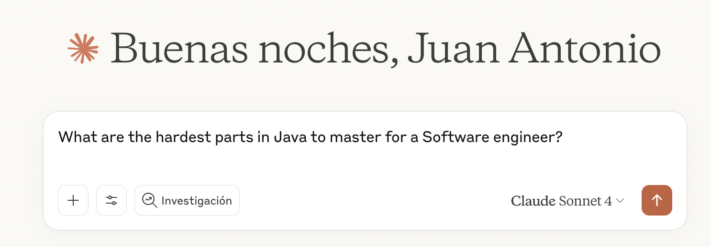

# What's new in Cursor rules for Java 0.10.0?

## What are Cursor rules for Java?

The project provides a collection of System prompts for Java that help software engineers in their daily programming work.
The [available System prompts for Java](../../CURSOR-RULES-JAVA.md) cover aspects like `Build system based on Maven`, `Design`, `Coding`, `Testing`, `Refactoring & JMH Benchmarking`, `Performance testing with JMeter`, `Profiling with Async profiler/JDK tools` & `Documentation`.


## What is new in this release?

In this release, the project has released several features:

- Improvements in System prompts
  - Added support for JMH Benchmarking
  - Added support for project documentation and UML/C4 diagrams
  - Added support for Java Generics
  - Added support for classic Java Exception handling
- Improvements in the project
  - Added product support for Claude Code, Github Copilot & Jetbrains Junie
  - Use the System prompts in a purist way
  - Rules have been renamed from `.mdc` to `.md` format to increase readability

Let's explain one by one the different features released

### Support for JMH Benchmarking

Sometimes you discover in your development that exist different ways to solve the same problem, but how do you select the best implementation? Java provides JMH to solve that scenario. In the repository, the rule `112-java-maven-plugins` was updated to now provide support for adding JMH to repositories without modules in an easy way as a Maven profile.

**Example:**

```bash
Add JMH support using the cursor rule @112-java-maven-plugins and don't ask any questions
```

Once you have JMH support in your Maven build (pom.xml), you can generate JMH benchmarks easily with the following `User prompt`:

```bash
Can you create a JMH benchmark in order to know what is the best implementation?
```

**Note:** Add in the context the class/classes to measure

Once you have the JMH Benchmark, you can generate the JSON report in the following way:

```bash
./mvnw clean package -Pjmh
java -cp target/jmh-benchmarks.jar info.jab.demo.benchmarks.FibonacciBenchmark #Example to understand the command
```

With the report generated in JSON format, you can analyze them with the following `User prompt`:

```bash
Can you explain the JMH results and advise about the best implementation?
```

This kind of analysis can help the team make decisions about which alternative is better to maintain in the repository.


Further information about JMH:

- https://github.com/openjdk/jmh
- https://jmh.morethan.io/

### Support for project documentation and UML/C4 diagrams

Documentation is something that can be automated in some way, and for this reason, the project has added a new rule for it. If you need to generate documentation about your repo, you could use the following `User prompt`:

```bash
Generate technical documentation & diagrams about the project with the cursor rule @170-java-documentation
```

This system prompt supports:

- Documentation at different levels (README.md, package-info.java & javadocs)
- Diagrams (UML Class diagram, UML Sequence diagram & C4 Model diagrams)

**UML class diagram sample:**


Using `UML Class diagrams`, you can understand how is currently the implementation and if you can improve in some way the code from a high level perspective.

**Note:** All diagrams are generated in `PlantUML` format. To convert `.puml` files into `.png` format you could use the following command line tool: `jbang puml-to-png@jabrena --watch .` or generate the images [online](https://www.plantuml.com/plantuml/uml/).

Further information about documentation & diagrams:

- https://docs.oracle.com/javase/specs/jls/se7/html/jls-7.html
- https://en.wikipedia.org/wiki/Class_diagram
- https://c4model.com/
- https://plantuml.com/
- https://www.plantuml.com/plantuml/uml/

### Added support for Java Generics

Java Generics is not an easy feature in Java. Indeed, if you interact with [Claude](https://claude.ai/new) and ask about `What are the hardest parts in Java to master for a Software engineer?`



`Java Generics` always appears. In this release, the project has added a new system prompt to cover this gap. Now, you can create the following interactive user prompt:

```bash
Review my code to show several alternatives to apply Java Generics with the cursor rule @128-java-generics
```

or the non-interactive approach:

```bash
Improve the solution applying the system prompt @128-java-generics without any question
```

The rule covers multiple cases and was tested with popular Java projects like: `Micrometer`, `Kafka` & `azure-sdk-for-java`

Using this new System prompt, you can improve your development and create code like:

```java
package info.jab.generics.examples;

import java.util.function.Consumer;
import java.util.function.Function;

/**
 * Example using Java generics features like PECS wildcards, sealed types,
 * covariance, diamond operator, bounded generics, and modern Java integration.
 */
public class ResultSample {

    public sealed interface Result<T> permits Success, Failure {
        static <T> Result<T> success(T value) { return new Success<>(value); }
        static <T> Result<T> failure(Throwable exception) { return new Failure<>(exception); }
        boolean isSuccess();
        boolean isFailure();
        T getOrNull();
        Throwable exceptionOrNull();
        T getOrElse(Function<? super Throwable, ? extends T> onFailure); // PECS: Consumer Super
        <R> Result<R> map(Function<? super T, ? extends R> transform);    // PECS: Producer Extends
        <R> Result<R> mapCatching(Function<? super T, ? extends R> transform);
        Result<T> onSuccess(Consumer<? super T> action);                 // PECS: Consumer Super
        Result<T> onFailure(Consumer<? super Throwable> action);
        <R> R fold(Function<? super T, ? extends R> onSuccess, Function<? super Throwable, ? extends R> onFailure);
    }

    record Success<T>(T value) implements Result<T> {
        public boolean isSuccess() { return true; }
        public boolean isFailure() { return false; }
        public T getOrNull() { return value; }
        public Throwable exceptionOrNull() { return null; }
        public T getOrElse(Function<? super Throwable, ? extends T> onFailure) { return value; }
        public <R> Result<R> map(Function<? super T, ? extends R> transform) {
            return Result.success(transform.apply(value));
        }
        public <R> Result<R> mapCatching(Function<? super T, ? extends R> transform) {
            try { return Result.success(transform.apply(value)); }
            catch (Exception e) { return Result.failure(e); }
        }
        public Result<T> onSuccess(Consumer<? super T> action) { action.accept(value); return this; }
        public Result<T> onFailure(Consumer<? super Throwable> action) { return this; }
        public <R> R fold(Function<? super T, ? extends R> onSuccess,
                         Function<? super Throwable, ? extends R> onFailure) {
            return onSuccess.apply(value);
        }
    }

    record Failure<T>(Throwable exception) implements Result<T> {
        public boolean isSuccess() { return false; }
        public boolean isFailure() { return true; }
        public T getOrNull() { return null; }
        public Throwable exceptionOrNull() { return exception; }
        public T getOrElse(Function<? super Throwable, ? extends T> onFailure) {
            return onFailure.apply(exception);
        }
        @SuppressWarnings("unchecked")
        public <R> Result<R> map(Function<? super T, ? extends R> transform) { return (Result<R>) this; }
        @SuppressWarnings("unchecked")
        public <R> Result<R> mapCatching(Function<? super T, ? extends R> transform) { return (Result<R>) this; }
        public Result<T> onSuccess(Consumer<? super T> action) { return this; }
        public Result<T> onFailure(Consumer<? super Throwable> action) { action.accept(exception); return this; }
        public <R> R fold(Function<? super T, ? extends R> onSuccess,
                         Function<? super Throwable, ? extends R> onFailure) {
            return onFailure.apply(exception);
        }
    }

    public static Result<Integer> divide(int a, int b) {
        return b != 0
            ? Result.success(a / b)
            : Result.failure(new ArithmeticException("Division by zero is not allowed"));
    }

    public static void main(String[] args) {

        // Safe division - handles division by zero gracefully
        String safeResult = divide(10, 2)
            .map(result -> result * 3)            // PECS: Transform success value
            .onSuccess(n -> System.out.println("✅ Division result: " + n))
            .fold(n -> "SUCCESS: " + n,
                  e -> "ERROR: " + e.getMessage());
        System.out.println("✅ Safe division: " + safeResult);

        // Chain multiple operations safely
        String chainResult = divide(20, 4)
            .mapCatching(n -> divide(n, 2).getOrElse(throwable -> 0))  // Nested safe operations
            .map(n -> "Final: " + n)
            .getOrElse(throwable -> "Failed");
        System.out.println("✅ Chained: " + chainResult);

        String errorResult = divide(10, 0)
            .fold(n -> "SUCCESS: " + n,
                  e -> "HANDLED: " + e.getMessage());
        System.out.println("❌ " + errorResult);
    }
}
```

Further information about Java Generics:

- https://docs.oracle.com/javase/tutorial/java/generics/index.html
- https://dev.java/learn/generics/
- https://kotlinlang.org/api/core/kotlin-stdlib/kotlin/-result/
- https://docs.oracle.com/en/java/javase/24/docs/api/java.base/java/util/package-summary.html

### Added support for classic Java Exception handling

In the previous [release 0.9.0](./0.9.0.md), the project added the rule: `@143-java-functional-exception-handling`, but what about projects that don't use functional programming? To solve this gap, this release added the rule: `@127-java-exception-handling`

Now you can review the current implementation and refactor the code to improve exception handling in the classic way with:

```bash
Review my code to show several alternatives to apply Java Exception handling with the cursor rule @127-java-exception-handling
```

Further information about Java Exceptions:

- https://docs.oracle.com/javase/tutorial/essential/exceptions/index.html
- https://dev.java/learn/exceptions/
- https://docs.oracle.com/javase/specs/jls/se11/html/jls-11.html

### Added product support for Claude Code, Github Copilot & Jetbrains Junie

This project was originally designed for Cursor (SOTA in the niche of AI tools), but the Java market is broader. After conducting tests in other environments, I discovered that this project could be used in other environments such as:

- Cursor
- Cursor CLI
- JetBrains IntelliJ IDEA + Cursor CLI
- Claude Code CLI
- JetBrains IntelliJ IDEA + Claude Code CLI
- GitHub Copilot (Free tier)
- JetBrains IntelliJ IDEA + JetBrains Junie

If you are interested, you can take a look at the [latest review](https://github.com/jabrena/cursor-rules-java/blob/main/docs/reviews/review-20250829.md).

**Summary:** Currently the best environments to use this repository are: `Cursor`, `Cursor CLI` & `Claude Code CLI`. If you use `JetBrains IntelliJ IDEA`, you could combine it with `Cursor CLI` or `Claude Code`.

### Use the System prompts in a purist way

Normally, when you try to solve a software problem, the solution can be implemented in different ways. This is the reason that several cursor rules have an interactive approach (the system prompts show different alternatives to improve the code), but in some scenarios, the software engineer might prefer to delegate the action directly to the model at the risk that the implemented solution doesn't match their programming style.

Starting from this release, the rules provide examples of using Cursor rules and system prompts in a purist way.

**Example 1:**

```bash
Add VAVR dependency with the help of @111-java-maven-dependencies and don't ask any questions
```

**Example 2:**

```bash
Add Maven Enforcer plugin only from the rule @112-java-maven-plugins without any question
Apply Java Generics in the class with @128-java-generics without any question
```

**Example 3:**

```bash
Add tests for the following classes with  @131-java-unit-testing
Create a UML class diagram with @170-java-documentation without any question
```

Additional examples in the [documentation](https://github.com/jabrena/cursor-rules-java/blob/main/CURSOR-RULES-JAVA.md).

### Improve readability in system prompts

The project has renamed all system prompts from the `.mdc` file extension to the classic Markdown extension `.md`. Now, everyone can read the files easily on `GitHub`:
https://github.com/jabrena/cursor-rules-java/tree/main/.cursor/rules

## Do you still have doubts about the project?

If you feel stuck using this project or have any doubts, you could attend the following talk at Devoxx BE: https://devoxx.be/app/talk/4715/the-power-of-cursor-rules-in-java-enterprise-development

[](https://devoxx.be/)

## Previous articles

- [What's new in Cursor rules for Java 0.9.0?](0.9.0.md)
