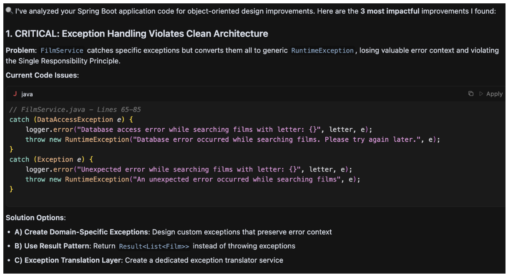
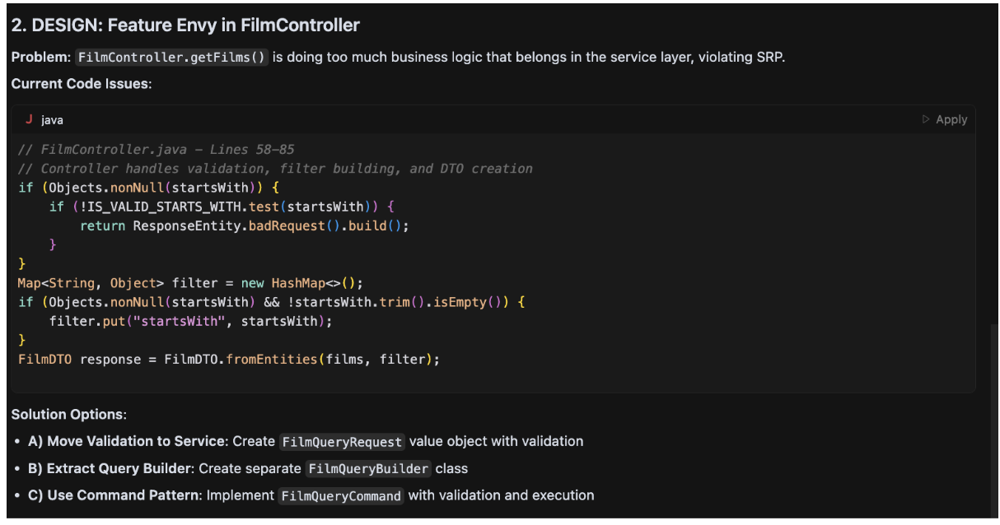
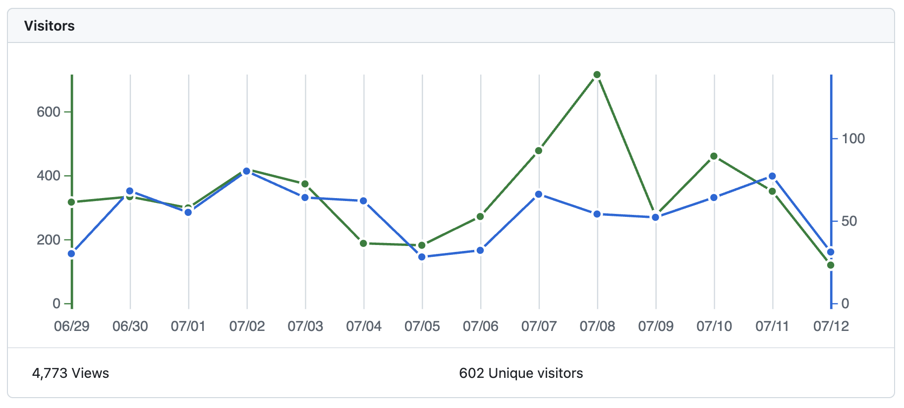

# What's new in Cursor rules for Java 0.8.0?

## New interactive behaviors in the Cursor rules

In the previous release, the project added interactive behavior to a few complex rules to improve the developer experience, but in this release, new rules have evolved to add more interactive behavior regardless of complexity. The motivation behind this change: now the rules suggest alternatives to the software engineer to improve development at the package/class/method level. Maybe you could ask the question: why that change? Every software engineer has a unique way to solve software problems, so why force a suggestion in the code without a preliminary review? Let's explain the idea with an example to show the evolution in the cursor rule. The repository cursor-rules-java has different working examples that can be improved with the rules. Let's use an example based on Spring Boot: https://github.com/jabrena/cursor-rules-java/tree/main/examples/spring-boot-demo/implementation
Over this example, add the following user prompt:

> "Review my code for object-oriented design using the cursor rule @121-java-object-oriented-design.md @src/"





Now, the software engineer has full control over the suggestion and later refactoring because they are able to interact with the Cursor rule and guide how the solution could be improved. If you like this feature, you can try the following cursor rules included in the release:

- 110-java-maven-best-practices
- 112-java-maven-documentation
- 121-java-object-oriented-design
- 122-java-type-design
- 123-java-general-guidelines
- 124-java-secure-coding
- 125-java-concurrency
- 126-java-logging
- 131-java-unit-testing
- 141-java-refactoring-with-modern-features
- 142-java-functional-programming
- 143-java-data-oriented-programming

Remember that models don't answer in a deterministic way, in the same way that in your team, not all software engineers solve problems in the same way.

## Consistency in the syntax

When the repository is growing and there are 18 rules and counting, consistency is something important to take into account to improve maintenance and accuracy in the way software engineers use natural language to interact with models. With this purpose, in release 0.8.0 I invested effort to convert all Cursor rules from Markdown to XML in order to have the flexibility of this format to have strict rules about the design of the language and the flexibility to convert XML into Markdown with front matter. With this goal, there now exists a new XML Schema dedicated to prompts: https://github.com/jabrena/cursor-rules-java/blob/main/generator/src/main/resources/pml.xsd which was designed with ideas from the main players in the models market (Anthropic, OpenAI, Google) in order to structure a prompt:

```xml
    <xs:element name="prompt">
        <xs:complexType>
            <xs:sequence>
                <xs:element ref="metadata"/>
                <xs:element ref="role"/>
                <xs:element ref="context" minOccurs="0"/>
                <xs:element ref="goal"/>
                <xs:element ref="constraints" minOccurs="0"/>
                <xs:element ref="examples" minOccurs="0"/>
                <xs:element ref="output-format" minOccurs="0"/>
                <xs:element ref="safeguards" minOccurs="0"/>
            </xs:sequence>
            <xs:attribute name="id" type="xs:string" use="required"/>
            <xs:attribute name="version" type="xs:string" use="optional"/>
        </xs:complexType>
    </xs:element>
```

Once all cursor rules are modeled in XML format, it is easy to convert them into the format used by Cursor AI, Markdown with front matter: https://github.com/jabrena/cursor-rules-java/blob/main/generator/src/main/resources/cursor-rules.xsl

Using a schema and transformation, it is possible to guarantee consistency in the sources and the output format.

## Safeguards in the system prompts

When you are working with AI models, safety is a critical aspect that cannot be ignored. In release 0.8.0, safeguards have been introduced to ensure that the cursor rules provide responsible validation of the changes introduced in the code.

```xml
    <safeguards>
        <safeguards-list>
            <safeguards-item>Verify code changes compile and pass tests: `mvn clean verify` or `./mvnw clean verify`</safeguards-item>
        </safeguards-list>
    </safeguards>
```

It's not only that the model changes the code; the model needs to finish the prompt execution with a formal validation of the changes.

## My 20 Cents
Using models & system prompts like this project: https://github.com/jabrena/cursor-rules-java could increase your squad velocity and increase squad satisfaction as part of the [SPACE framework](https://queue.acm.org/detail.cfm?id=3454124).

Join us with more than 600+ users in the last 14 days.



Enjoy

Juan Antonio
