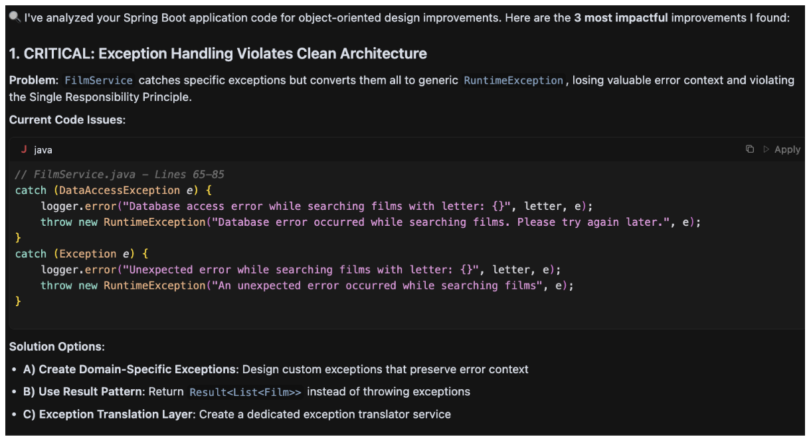
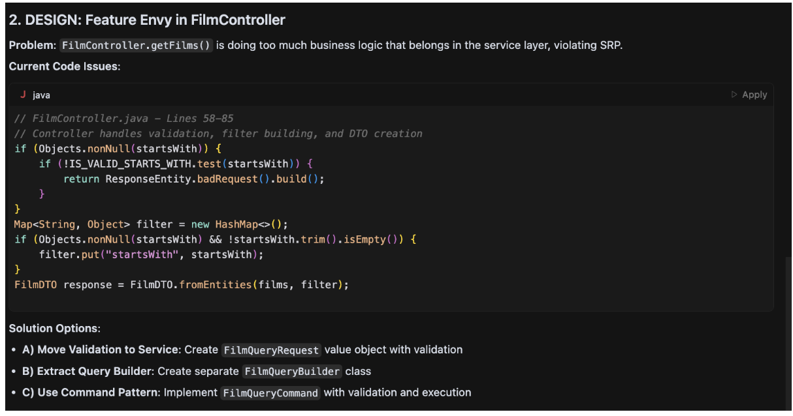
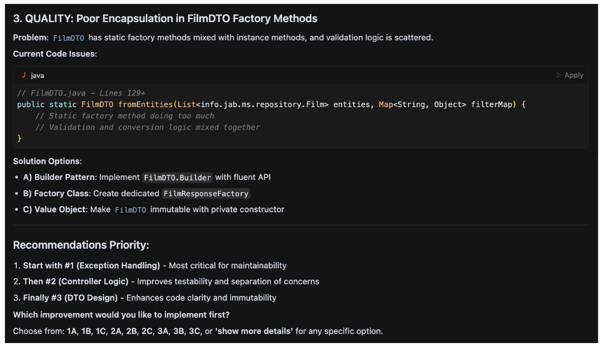

# What is new in Cursor rules for Java 0.8.0?

## New interactive behaviours in the Cursor Rules

In the previous release, the project added the interactive behaviour in a few complex rules to improve the Developer Experience but in this release, new rules have evolved to add more interactive behaviour with independence of the complexity. The motivation behind this change: now the rules suggest the software engineer alternatives to improve the development at package/class/method level. Maybe you could ask the question: why that change? Every software engineer has a unique way to solve software problems so why force a suggestion in the code without a preliminary review? Let's explain the idea with an example to show the evolution in the cursor rule. The repository cursor-rules-java has different working examples which can be improved with the rules, let's use an example based on Spring Boot: https://github.com/jabrena/cursor-rules-java/tree/main/examples/spring-boot-demo/implementation
Over this example add the following user prompt:

> "Review my code for object-oriented design using the cursor rule @121-java-object-oriented-design.mdc @src/"





Now, the software engineer has full control over the suggestion and later refactoring because it is able to interact with the Cursor rule and guide how the solution could be improved. If you like this feature, you could try for the following cursor rules included the releases:

- 110-java-maven-best-practices
- 112-java-maven-documentation
- 121-java-object-oriented-design
- 122-java-type-design
- 123-java-general-guidelines
- 124-java-secure-coding
- 125-java-concurrency
- 126-java-logging
- 131-java-unit-testing
- 141-java-refactoring-with-modern-features
- 142-java-functional-programming
- 143-java-data-oriented-programming

Remember that Models don't answer in a deterministic way, in the same way that in your team, not all software engineers solve problems in the same way.

## Consistency in the syntax

When the repository is growing and exists 18 rules and growing, consistency is something important to take into account to improve the maintenance and the accuracy in the way the software engineer is using natural language to interact with Models. With this purpose, in the release 0.8.0 I invested effort to convert all Cursor rules from Markdown to XML in order to have the flexibility for this format to have strict rules about the design of the language and the flexibility to convert XML into Markdown with Front Matter. With this goal, now exists a new XML Schema dedicated for Prompts: https://github.com/jabrena/cursor-rules-java/blob/main/generator/src/main/resources/pml.xsd which was designed with ideas from the main players in the Models market (Anthropic, OpenAI, Google) in order to structure a Prompt:

```xml
    <xs:element name="prompt">
        <xs:complexType>
            <xs:sequence>
                <xs:element ref="metadata"/>
                <xs:element ref="role"/>
                <xs:element ref="context" minOccurs="0"/>
                <xs:element ref="goal"/>
                <xs:element ref="constraints" minOccurs="0"/>
                <xs:element ref="examples" minOccurs="0"/>
                <xs:element ref="output-format" minOccurs="0"/>
                <xs:element ref="safeguards" minOccurs="0"/>
            </xs:sequence>
            <xs:attribute name="id" type="xs:string" use="required"/>
            <xs:attribute name="version" type="xs:string" use="optional"/>
        </xs:complexType>
    </xs:element>
```

Once all cursor rules are modeled in XML format, it is easy to convert into the format used by Cursor AI, Markdown with Front Matter: https://github.com/jabrena/cursor-rules-java/blob/main/generator/src/main/resources/cursor-rules.xsl

Using a Schema and Transformation, it is possible to guarantee the consistency in the sources and the output format.

## Safeguards in the System prompts

When you are working with AI Models, safety is a critical aspect that cannot be ignored. In the release 0.8.0, safeguards have been introduced to ensure that the cursor rules provide responsible validation of the changes introduced in the code.

```xml
    <safeguards>
        <safeguards-list>
            <safeguards-item>Verify code changes compile and pass tests: `mvn clean verify` or `./mvnw clean verify`</safeguards-item>
        </safeguards-list>
    </safeguards>
```

It is not only that the model changes the code, the model needs to finish the prompt execution with a formal validation of the changes.

Enjoy

Juan Antonio
