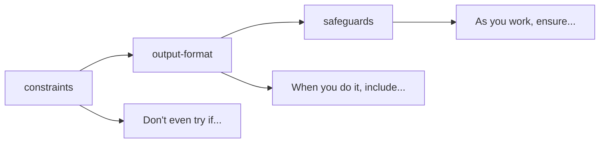

# The Three-Node Quality Framework for AI Prompts

## Overview

When designing AI prompts for complex tasks like code generation and software development, a structured quality framework ensures both comprehensive responses and safe execution. This document outlines the **three-node quality framework** that combines prerequisites, content structure, and ongoing safety measures.

## The Three Pillars

### 1. `constraints` - Prerequisites & Blocking Conditions

**Purpose**: Defines hard requirements that must be met BEFORE starting any work.

**Philosophy**: *"Don't even try if..."*

**Characteristics**:
- **Focus**: Entry conditions and show-stoppers
- **Nature**: Gate-keeping (what blocks execution entirely)
- **Timing**: **Pre-execution** validation
- **Failure Impact**: **BLOCKS ALL WORK**

**Example Implementation**:
```xml
<constraint>**MANDATORY**: Run `./mvnw compile` or `mvn compile` before applying any change</constraint>
<constraint>**CRITICAL SAFETY**: If compilation fails, IMMEDIATELY STOP and DO NOT CONTINUE</constraint>
<constraint>**BLOCKING CONDITION**: Compilation errors must be resolved by the user before proceeding</constraint>
```

**Key Benefits**:
- Prevents wasted effort on infeasible tasks
- Provides immediate feedback on project state
- Protects against futile work
- Establishes clear entry criteria

### 2. `output-format` - Response Structure & Deliverables

**Purpose**: Defines what to deliver and how to organize the AI response.

**Philosophy**: *"When you do it, include..."*

**Characteristics**:
- **Focus**: Content structure and completeness
- **Nature**: Prescriptive guidance (what TO include)
- **Timing**: **During execution** - response creation
- **Failure Impact**: **INCOMPLETE RESPONSE**

**Example Implementation**:
```xml
<output-format-item>Apply type design principles to improve code quality and maintainability</output-format-item>
<output-format-item>Create type-safe wrappers for domain-specific types</output-format-item>
<output-format-item>Use generics to create flexible and reusable components</output-format-item>
<output-format-item>Establish clear type hierarchies and consistent naming conventions</output-format-item>
<output-format-item>Use BigDecimal for precision-sensitive calculations</output-format-item>
<output-format-item>Verify code changes compile and pass tests</output-format-item>
```

**Key Benefits**:
- Ensures comprehensive coverage of the topic
- Creates predictable, organized responses
- Acts as a completion checklist
- Reduces cognitive load for users
- Transforms AI into domain-specific consultant

### 3. `safeguards` - Ongoing Safety & Validation

**Purpose**: Defines safety protocols and validation requirements throughout the process.

**Philosophy**: *"As you work, ensure..."*

**Characteristics**:
- **Focus**: Risk mitigation and continuous validation
- **Nature**: Protective measures (ongoing safety checks)
- **Timing**: **During & post-execution** - throughout the work
- **Failure Impact**: **BROKEN SYSTEM**

**Example Implementation**:
```xml
<safeguards-item>**BLOCKING SAFETY CHECK**: ALWAYS run `./mvnw compile` before ANY recommendations</safeguards-item>
<safeguards-item>**CRITICAL VALIDATION**: Execute `./mvnw clean verify` to ensure all tests pass</safeguards-item>
<safeguards-item>**MANDATORY VERIFICATION**: Confirm all existing functionality remains intact</safeguards-item>
<safeguards-item>**ROLLBACK REQUIREMENT**: Ensure all changes can be easily reverted</safeguards-item>
<safeguards-item>**INCREMENTAL SAFETY**: Apply improvements incrementally, validating after each modification</safeguards-item>
```

**Key Benefits**:
- Continuous quality assurance
- Rollback capabilities
- Post-change validation
- Risk mitigation throughout the process

## Framework Comparison

| Aspect | Constraints | Output Format | Safeguards |
|--------|-------------|---------------|------------|
| **Intent** | Block bad starts | Structure deliverables | Prevent failures |
| **Timing** | Pre-execution | During execution | During/Post-execution |
| **Tone** | Restrictive | Prescriptive | Protective |
| **Focus** | Entry conditions | Content quality | Process safety |
| **Failure Mode** | Blocked execution | Incomplete response | Broken code/system |
| **Question Asked** | "Can I start?" | "What should I deliver?" | "Did it work safely?" |

## The Temporal Flow



### Sequential Application

1. **Constraints Check**: Validate prerequisites before starting
2. **Structured Execution**: Follow output format during work
3. **Continuous Validation**: Apply safeguards throughout and after

## Benefits of the Three-Node Framework

### Defense-in-Depth Strategy
- **Pre-flight checks** prevent wasted effort
- **Structured execution** ensures comprehensive solutions
- **Continuous monitoring** maintains system integrity

### Quality Assurance
- Embeds quality gates directly into the process
- Ensures responses aren't just theoretical but include practical validation
- Creates accountability for both content and safety

### Cognitive Load Management
- Clear expectations at each phase
- Predictable structure reduces uncertainty
- Actionable guidance rather than abstract advice

### Domain Specialization
- Transforms general AI into domain-specific consultant
- Tailored safety measures for specific contexts
- Built-in expertise validation

## Implementation Guidelines

### For Prompt Designers

1. **Define Clear Constraints**
   - Identify blocking conditions specific to your domain
   - Make requirements explicit and testable
   - Use strong language (`MANDATORY`, `CRITICAL`, `BLOCKING`)

2. **Structure Comprehensive Output Formats**
   - Cover all aspects of the domain systematically
   - Include validation steps as deliverable items
   - Make items actionable and specific

3. **Embed Continuous Safeguards**
   - Include rollback mechanisms
   - Require incremental validation
   - Address both immediate and downstream risks

### For AI Systems

1. **Respect the Hierarchy**
   - Never proceed if constraints aren't met
   - Address all output format items
   - Apply safeguards continuously

2. **Communicate Clearly**
   - Explain which constraints are being checked
   - Show progress through output format items
   - Report safeguard validation results

## Real-World Applications

### Software Development
- **Constraints**: Code must compile, dependencies must be available
- **Output Format**: Include code, tests, documentation, migration steps
- **Safeguards**: Validate compilation, run tests, ensure rollback capability

### Infrastructure Changes
- **Constraints**: Backup must exist, maintenance window must be scheduled
- **Output Format**: Include implementation plan, rollback plan, monitoring
- **Safeguards**: Health checks, gradual rollout, immediate rollback triggers

### Data Processing
- **Constraints**: Data validation, resource availability
- **Output Format**: Processing steps, error handling, result validation
- **Safeguards**: Data integrity checks, resource monitoring, recovery procedures

## Conclusion

The three-node quality framework provides a comprehensive approach to AI prompt design that ensures both high-quality responses and safe execution. By separating concerns into prerequisites (constraints), content structure (output-format), and ongoing safety (safeguards), we create a robust foundation for AI-assisted complex tasks.

This approach transforms AI from a general assistant into a specialized consultant with built-in quality controls and safety measures, making it suitable for critical applications like software development, infrastructure management, and data processing.
