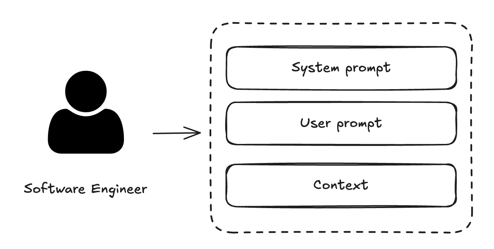

# How to use a system prompt in your development




Using a system prompt in your development is straightforward. If you are using a modern IDE that includes AI features, such as Cursor, open the chat:


and type your own **user prompt**, such as the following example:

```
Improve the pom.xml using the cursor rule @112-java-maven-plugins
```

and drag and drop the system prompt that you need into the chat along with the pom.xml file.

The result should be:


---

Another way to interact with models has recently emerged: using CLI tools. The approach is exactly the same.

Starting from a clean session in [Cursor CLI](https://cursor.com/cli):


Type your user prompt in the text area:

```
Improve the pom.xml using the cursor rule @112-java-maven-plugins
```


and finally select the file to which you want to apply the process:


