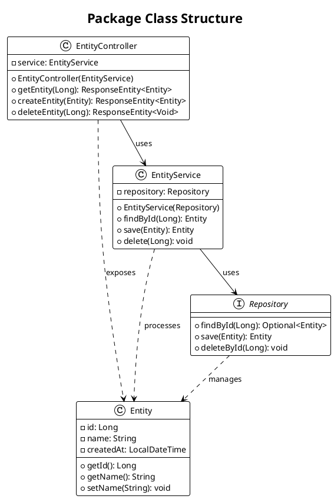
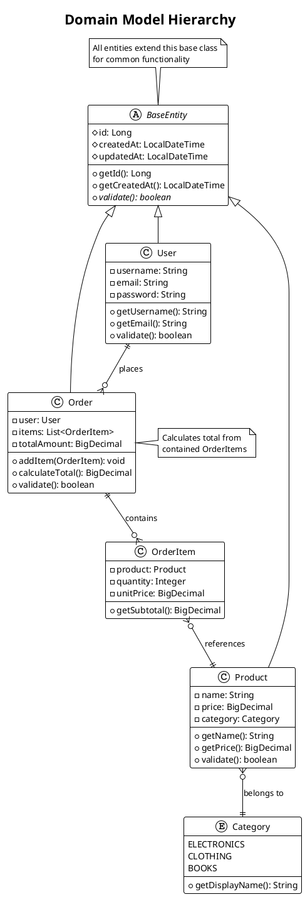
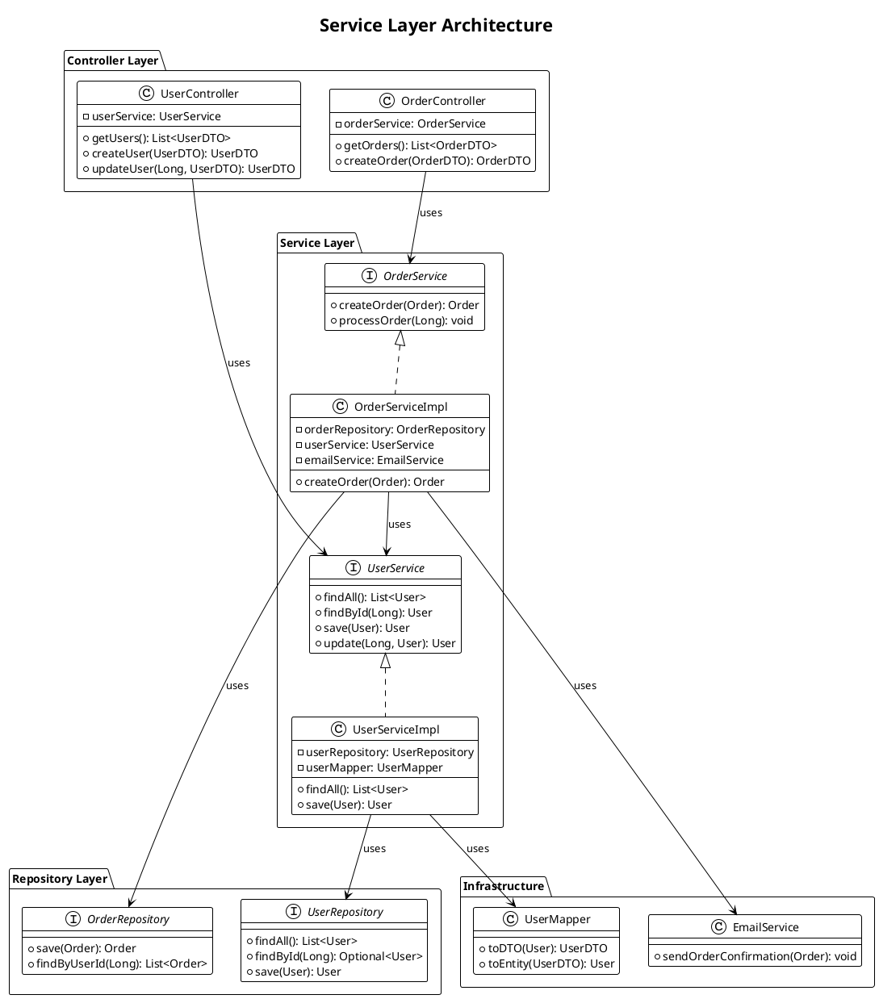
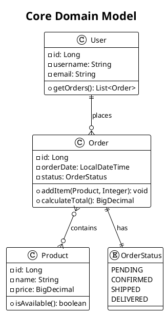

# UML Class Diagram Generation Guidelines

## Implementation Strategy

Generate UML class diagrams using PlantUML syntax to illustrate the structure, relationships, and design patterns within Java packages and modules.

### Analysis Process

**For each package or module identified:**

1. **Identify class types and categories**:
   - Domain entities and value objects
   - Service classes and business logic
   - Repository and data access classes
   - Controller and API classes
   - Configuration and utility classes
   - Interfaces and abstract classes

2. **Analyze class relationships**:
   - Inheritance hierarchies (extends, implements)
   - Composition and aggregation relationships
   - Dependencies and associations
   - Interface implementations

3. **Determine diagram scope** based on user selection:
   - **All packages**: Complete class structure overview
   - **Core business logic**: Domain models and business services
   - **Specific packages**: User-selected packages for detailed analysis

### Diagram Generation Guidelines

#### Basic Class Structure


#### Advanced Patterns

**Domain Model with Inheritance**:


**Service Layer Architecture**:


### PlantUML-Specific Features for Class Diagrams

1. **Visibility Modifiers**:
   - `+` for public
   - `-` for private
   - `#` for protected
   - `~` for package-private

2. **Relationship Types**:
   - `-->` : Association
   - `--` : Association (bidirectional)
   - `<|--` : Inheritance/Extension
   - `<|..` : Interface Implementation
   - `*--` : Composition
   - `o--` : Aggregation
   - `..>` : Dependency

3. **Advanced Features**:
   - `{abstract}` for abstract classes/methods
   - `{static}` for static members
   - `<<interface>>` or `interface` keyword
   - `enum` for enumerations
   - `note` for annotations and comments

4. **Styling and Organization**:
   - `package` for logical grouping
   - `!theme` for consistent styling
   - `title` for diagram context
   - Colors and stereotypes for categorization

### Content Requirements

1. **Accurate Structure Representation**:
   - Include actual class names, methods, and attributes from codebase
   - Show correct visibility modifiers
   - Represent accurate inheritance and interface relationships
   - Include important annotations (e.g., @Entity, @Service, @Controller)

2. **Meaningful Relationships**:
   - Show composition vs aggregation appropriately
   - Include important dependencies between classes
   - Demonstrate design patterns (Strategy, Factory, Observer, etc.)
   - Show package boundaries and layered architecture

3. **Appropriate Level of Detail**:
   - Include key methods and attributes
   - Avoid cluttering with trivial getters/setters unless important
   - Focus on business logic and architectural significance
   - Show method signatures for important operations

4. **Clear Organization**:
   - Group related classes using packages
   - Use consistent naming conventions
   - Add notes for complex relationships or business rules
   - Organize layout for readability

### Integration with Documentation

#### In README.md Files
- Include class diagrams in "Architecture" or "Design" sections
- Show high-level package relationships and key design patterns
- Provide context explaining the architectural decisions

#### In package-info.java Files
- Reference class diagrams that illustrate package structure
- Include simplified ASCII versions for basic relationships
- Link to external diagram files for complex structures

#### Separate Documentation Files
- Create dedicated architecture.md files for complex systems
- Organize diagrams by business domain or technical layer
- Include both overview and detailed diagrams

### Example Integration

**README.md Section**:
```markdown

## System Architecture

### Domain Model

The following class diagram shows the core domain entities and their relationships:



This diagram illustrates the core business entities and their relationships, showing how users place orders containing products.
```

### Validation

After generating class diagrams:

1. **Verify accuracy** against actual codebase structure
2. **Test PlantUML syntax** for proper rendering
3. **Ensure relationship correctness** (inheritance, composition, etc.)
4. **Validate completeness** of important classes and relationships
5. **Check diagram readability** and appropriate level of detail

### Output Locations

- **README.md files**: Include architectural overview diagrams
- **Package-specific .md files**: Detailed diagrams for complex packages
- **Documentation directories**: Organize in docs/diagrams/ or architecture/ folders
- **Inline documentation**: Simple diagrams in package-info.java files
