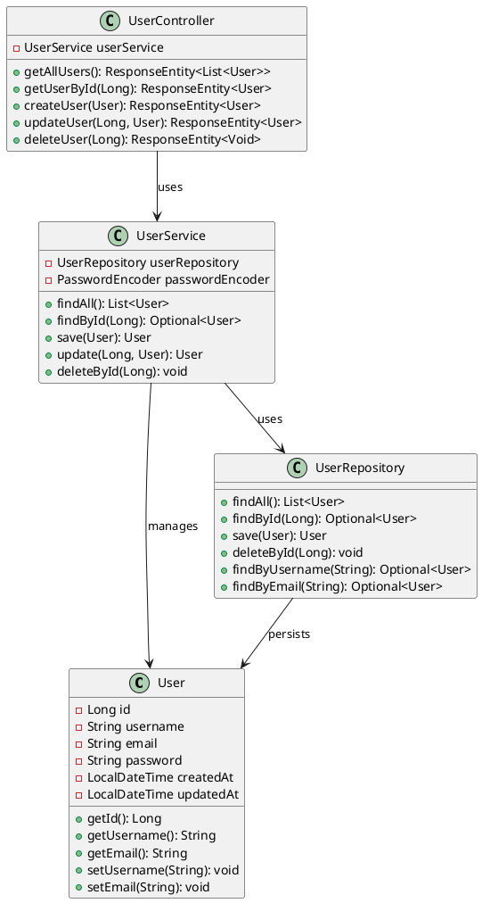
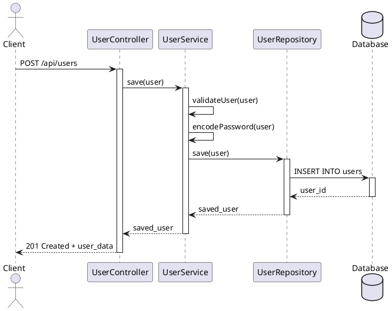

title=Module 6: Documentation - Professional Documentation & Diagrams
type=course
status=published
date=2025-09-17
author=Juan Antonio Breña Moral
version=0.11.0-SNAPSHOT
tags=java, documentation, uml-diagrams, javadoc, plantuml, technical-writing, system-prompts
~~~~~~

## 🎯 Learning Objectives

By the end of this module, you will:

- **Generate comprehensive project documentation** using `@170-java-documentation`
- **Create professional UML diagrams** using `@171-java-diagrams`
- **Master documentation-driven development** practices
- **Apply modular, step-based documentation** approaches
- **Create maintainable, professional documentation** that scales with projects

## 📚 Module Overview

**Duration:** 3 hours
**Difficulty:** Intermediate
**Prerequisites:** Module 5 completed, basic documentation awareness

This module focuses on creating professional, comprehensive documentation that enhances project maintainability and team collaboration. You'll learn to use AI-powered tools that generate documentation and diagrams automatically while following industry best practices.

## 🗺️ Learning Path

### **Lesson 6.1: Technical Documentation Generation** (105 minutes)

#### 🎯 **Learning Objectives:**
- Generate complete project documentation using `@170-java-documentation`
- Create README.md, package-info.java, and Javadoc
- Apply modular documentation strategies

#### 📖 **Core Concepts:**

**Professional Documentation Components:**

1. **README.md**: Project overview and quick start
2. **README-DEV.md**: Developer-focused documentation
3. **package-info.java**: Package-level documentation
4. **Javadoc**: API documentation
5. **Architecture Documentation**: High-level system design

#### 💡 **Knowledge Check:**
*What's the difference between user documentation and developer documentation?*

**Answer:** User documentation focuses on how to use the software (features, workflows), while developer documentation focuses on how to build, modify, and maintain the software (APIs, architecture, setup).

#### 🔧 **Hands-on Exercise 6.1:**

**Scenario:** Generate comprehensive documentation for a Spring Boot project.

**Step 1: Analyze Existing Project**
```bash
cd examples/spring-boot-demo
```

**Step 2: Interactive Documentation Generation**
Use: `Generate technical documentation about the project with the cursor rule @170-java-documentation`

**Step 3: Specific Documentation Type**
Try: `Generate README.md with @170-java-documentation without any question`

**Expected Generated Documentation Structure:**

**README.md:**
```markdown
# Spring Boot Demo Application

## Overview
A comprehensive Spring Boot demonstration application showcasing enterprise-grade development practices including REST APIs, data persistence, security, and testing.

## Features
- RESTful API endpoints for user management
- JPA-based data persistence with H2 database
- Spring Security integration
- Comprehensive test coverage
- Docker support for containerization

## Quick Start

### Prerequisites
- Java 21 or higher
- Maven 3.8+
- Docker (optional)

### Running the Application
```bash
# Clone the repository
git clone <repository-url>
cd spring-boot-demo

# Run with Maven
./mvnw spring-boot:run

# Or build and run JAR
./mvnw clean package
java -jar target/spring-boot-demo-*.jar
```

### API Documentation
The application exposes REST endpoints at `http://localhost:8080`:

- `GET /api/users` - List all users
- `POST /api/users` - Create new user
- `GET /api/users/{id}` - Get user by ID
- `PUT /api/users/{id}` - Update user
- `DELETE /api/users/{id}` - Delete user

## Configuration
Key configuration properties in `application.yml`:

```yaml
server:
  port: 8080
spring:
  datasource:
    url: jdbc:h2:mem:testdb
  jpa:
    hibernate:
      ddl-auto: create-drop
```

## Testing
```bash
# Run all tests
./mvnw test

# Run integration tests
./mvnw verify

# Generate test coverage report
./mvnw jacoco:report
```

## Contributing
See [CONTRIBUTING.md](CONTRIBUTING.md) for development guidelines.
```

**README-DEV.md:**
```markdown
# Developer Documentation - Spring Boot Demo

## Development Environment Setup

### Required Tools
- **Java**: OpenJDK 21+ (recommended: Eclipse Temurin)
- **Maven**: 3.8+ (wrapper included)
- **IDE**: IntelliJ IDEA or Eclipse with Spring Boot plugin
- **Database**: H2 (embedded) or PostgreSQL for production

### Project Structure
```
spring-boot-demo/
├── src/main/java/com/example/demo/
│   ├── DemoApplication.java          # Main application class
│   ├── controller/                   # REST controllers
│   ├── service/                      # Business logic
│   ├── repository/                   # Data access layer
│   ├── model/                        # Domain entities
│   └── config/                       # Configuration classes
├── src/main/resources/
│   ├── application.yml               # Main configuration
│   └── db/migration/                 # Database migrations
└── src/test/java/                    # Test classes
```

## Build Commands

### Essential Maven Commands
```bash
# Clean and compile
./mvnw clean compile

# Run tests with coverage
./mvnw clean test jacoco:report

# Package application
./mvnw clean package

# Run application locally
./mvnw spring-boot:run

# Run with specific profile
./mvnw spring-boot:run -Dspring-boot.run.profiles=dev
```

### Quality Checks
```bash
# Run static analysis
./mvnw spotbugs:check

# Check code style
./mvnw checkstyle:check

# Dependency vulnerability check
./mvnw dependency-check:check
```

## Database Management

### H2 Console (Development)
- URL: http://localhost:8080/h2-console
- JDBC URL: jdbc:h2:mem:testdb
- Username: sa
- Password: (empty)

### Migration Scripts
Database migrations are located in `src/main/resources/db/migration/`:
- `V1__Create_users_table.sql`
- `V2__Add_user_roles.sql`

## Testing Strategy

### Test Categories
1. **Unit Tests**: `*Test.java` - Fast, isolated tests
2. **Integration Tests**: `*IT.java` - Component integration
3. **End-to-End Tests**: `*E2ETest.java` - Full application flow

### Test Data
- Test fixtures in `src/test/resources/fixtures/`
- TestContainers for integration testing
- MockMvc for web layer testing

## Deployment

### Docker
```bash
# Build image
docker build -t spring-boot-demo .

# Run container
docker run -p 8080:8080 spring-boot-demo
```

### Production Considerations
- Use PostgreSQL instead of H2
- Configure proper logging levels
- Set up health checks and metrics
- Configure SSL/TLS certificates
```

**package-info.java Files:**
```java
/**
 * Spring Boot Demo Application - Controller Layer
 *
 * <p>This package contains REST controllers that handle HTTP requests
 * and provide JSON responses. All controllers follow RESTful conventions
 * and include comprehensive error handling.
 *
 * <h2>Key Controllers:</h2>
 * <ul>
 *   <li>{@link com.example.demo.controller.UserController} - User management operations</li>
 *   <li>{@link com.example.demo.controller.HealthController} - Health check endpoints</li>
 * </ul>
 *
 * <h2>Error Handling:</h2>
 * Global exception handling is provided by {@link com.example.demo.controller.GlobalExceptionHandler}
 * which ensures consistent error response format across all endpoints.
 *
 * @author Development Team
 * @version 1.0
 * @since 1.0
 */
package com.example.demo.controller;
```

#### 🔍 **Documentation Benefits:**
- **Consistency**: Standardized format across projects
- **Completeness**: Covers all essential aspects
- **Maintainability**: Easy to update and extend
- **Onboarding**: New team members can start quickly
- **Professional**: Industry-standard documentation quality

---

### **Lesson 6.2: UML Diagram Generation** (75 minutes)

#### 🎯 **Learning Objectives:**
- Create comprehensive UML diagrams using `@171-java-diagrams`
- Generate class, sequence, and state diagrams
- Apply C4 model for architecture documentation

#### 📖 **Core Concepts:**

**Diagram Types:**

1. **UML Class Diagrams**: Static structure relationships
2. **UML Sequence Diagrams**: Interaction flows
3. **UML State Machine Diagrams**: State transitions
4. **C4 Model Diagrams**: Architecture at different levels

#### 🔧 **Hands-on Exercise 6.2:**

**Step 1: Interactive Diagram Generation**
Use: `Generate diagrams about the project with the cursor rule @171-java-diagrams`

**Step 2: Specific Diagram Type**
Try: `Create UML class diagrams with @171-java-diagrams without any question`

**Expected Generated Diagrams:**

**1. UML Class Diagram (PlantUML):**


**2. UML Sequence Diagram:**


**3. C4 Context Diagram:**
```plantuml
@startuml
!include https://raw.githubusercontent.com/plantuml-stdlib/C4-PlantUML/master/C4_Context.puml

Person(user, "User", "Application user")
System(demo_app, "Spring Boot Demo", "Manages users and provides REST API")
System_Ext(database, "Database", "Stores user data")
System_Ext(email_service, "Email Service", "Sends notifications")

Rel(user, demo_app, "Uses", "HTTPS")
Rel(demo_app, database, "Reads/Writes", "JPA/Hibernate")
Rel(demo_app, email_service, "Sends emails", "SMTP")

@enduml
```

#### 💡 **Diagram Generation Workflow:**

**Step 1: Generate PlantUML Files**
The system prompt creates `.puml` files in `docs/diagrams/`

**Step 2: Convert to Images (Optional)**
```bash
# Install PlantUML to PNG converter
jbang puml-to-png@jabrena --watch .

# Or use online converter
# Copy .puml content to http://www.plantuml.com/plantuml/
```

**Step 3: Include in Documentation**
```markdown
## Architecture Overview

### System Context


### Class Structure


### User Creation Flow

```

---

## 🏆 Module Assessment

### **Knowledge Validation Checkpoint**

**Question 1:** What are the key components of professional project documentation?

**Question 2:** When should you use sequence diagrams vs. class diagrams?

**Question 3:** How does the C4 model help with architecture documentation?

**Question 4:** What's the purpose of package-info.java files?

### **Practical Assessment Project**

**Project: "Complete Documentation Suite"**

**Scenario:** Create comprehensive documentation for a Java microservice project.

**Requirements:**
1. Generate complete project documentation using system prompts
2. Create UML diagrams covering all architectural aspects
3. Ensure documentation follows professional standards
4. Include both user and developer documentation
5. Validate documentation completeness and accuracy

**Deliverables:**
- Complete README.md and README-DEV.md files
- Package-level documentation with package-info.java
- Comprehensive Javadoc for all public APIs
- UML class, sequence, and architecture diagrams
- Documentation maintenance guidelines

**Success Criteria:**
- Documentation covers all project aspects
- Diagrams accurately represent system architecture
- Professional formatting and structure
- Easy onboarding for new team members
- Maintainable and updatable documentation

### **Time Investment:**
- **Documentation Generation**: 1.5 hours
- **Diagram Creation**: 1 hour
- **Review and Refinement**: 1 hour
- **Validation**: 30 minutes
- **Total**: 4 hours

---

## 🚀 Next Steps

**Excellent Work!** You've mastered professional documentation and diagram generation.

**What You've Accomplished:**
- ✅ Generated comprehensive project documentation
- ✅ Created professional UML diagrams
- ✅ Applied modular documentation strategies
- ✅ Established maintainable documentation practices

**Ready for the final advanced module?**

👉 **[Continue to Module 7: Advanced Patterns →](module-7-advanced-patterns.html)**

**In Module 7, you'll learn to:**
- Create custom system prompts
- Apply progressive learning behaviors
- Design educational content from technical prompts
- Master advanced AI-powered development workflows

---

## 📚 Additional Resources

- **[PlantUML Documentation](https://plantuml.com/)**
- **[C4 Model Guide](https://c4model.com/)**
- **[Javadoc Guidelines](https://www.oracle.com/technical-resources/articles/java/javadoc-tool.html)**
- **[Documentation Best Practices](https://documentation.divio.com/)**

---

*Complete your journey with advanced system prompt creation and educational content generation.*
