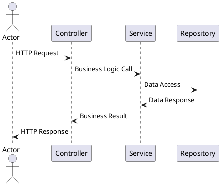
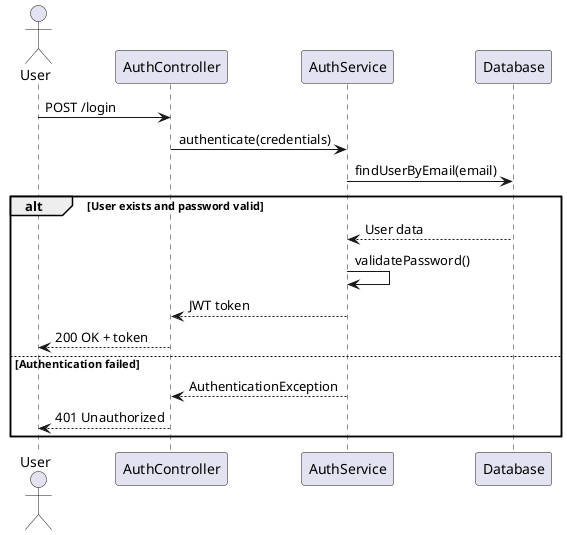
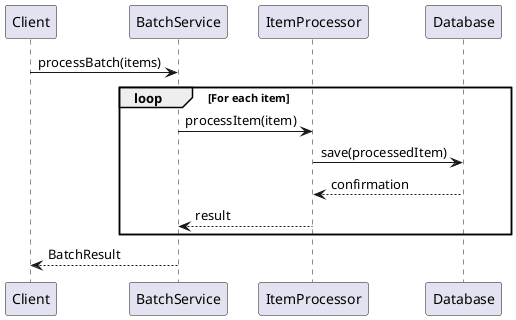
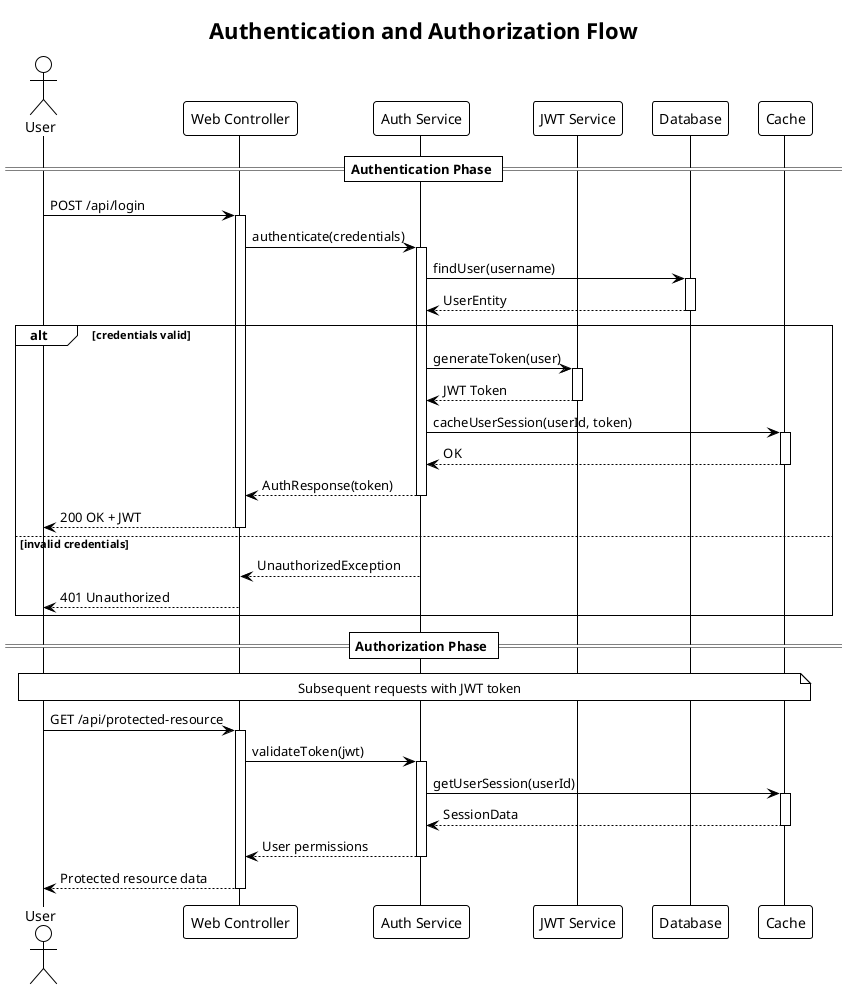
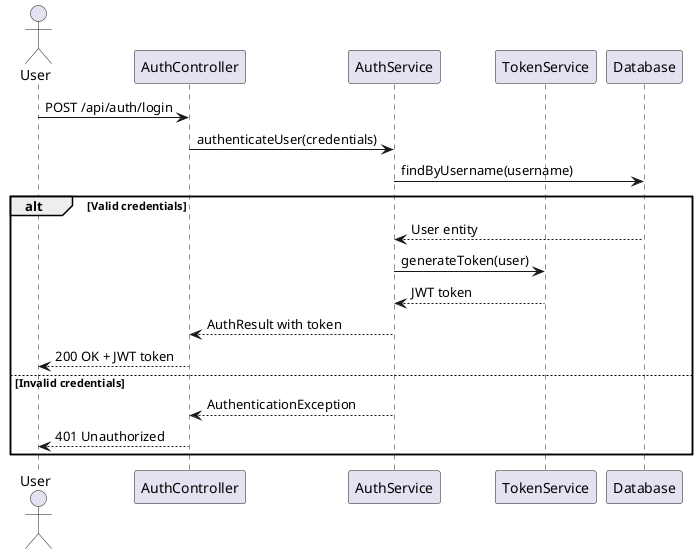

# UML Sequence Diagram Generation Guidelines

## Implementation Strategy

Generate UML sequence diagrams using PlantUML syntax to illustrate key application workflows and interactions.

### Analysis Process

**For each workflow identified:**

1. **Identify main actors and components**:
   - External actors (users, systems, APIs)
   - Internal components (controllers, services, repositories)
   - Key domain objects and entities

2. **Trace interaction flows**:
   - Method calls and message passing
   - Conditional logic and alternative flows
   - Loop and iteration patterns
   - Error handling and exception flows

3. **Determine diagram scope** based on user selection:
   - **Main application flows**: Authentication, core business processes
   - **API interactions**: REST endpoint flows, request/response patterns
   - **Complex business logic**: Multi-step processes, workflow orchestration

### Diagram Generation Guidelines

#### Basic Sequence Diagram Structure


#### Advanced Patterns

**Alternative Flows (Authentication Example)**:


**Loop Patterns (Batch Processing Example)**:


**Advanced PlantUML Features**:


### PlantUML-Specific Features

1. **Themes and Styling**:
   - Use `!theme plain` or other themes for consistent styling
   - Add titles with `title` directive for diagram context
   - Use aliases for long participant names: `participant "Long Service Name" as Service`

2. **Lifecycle Management**:
   - Use `activate`/`deactivate` to show object lifecycle
   - Demonstrates when objects are active in the flow
   - Helps visualize resource usage and timing

3. **Grouping and Sections**:
   - Use `== Section Name ==` to group related interactions
   - Organize complex flows into logical phases
   - Improves readability for multi-step processes

4. **Notes and Comments**:
   - Add `note over` or `note left/right` for additional context
   - Explain business rules or technical constraints
   - Document assumptions or important details

### Content Requirements

1. **Accurate Flow Representation**:
   - Diagram must reflect actual code flow
   - Include realistic method names and parameters
   - Show proper return types and responses
   - Use activate/deactivate for object lifecycle accuracy

2. **Meaningful Naming**:
   - Use actual class and method names from codebase
   - Include relevant HTTP endpoints and status codes
   - Show meaningful data being passed
   - Use participant aliases for readability

3. **Error Handling**:
   - Include exception scenarios where appropriate
   - Show alternative flows for common error cases
   - Demonstrate proper error response patterns
   - Use PlantUML's alt/else constructs effectively

4. **Visual Organization**:
   - Add descriptive titles to diagrams
   - Group related interactions with sections
   - Use notes to explain complex business logic
   - Apply consistent theming and styling

### Integration with Documentation

#### In README.md Files
- Include diagrams in "Architecture" or "How It Works" sections
- Provide context and explanation for each diagram
- Link diagrams to relevant code sections

#### In package-info.java Files
- Reference sequence diagrams in package descriptions
- Include ASCII art versions for basic flows
- Link to external diagram files when appropriate

### Example Integration

**README.md Section**:
```markdown

## Architecture Overview

### Authentication Flow

The following sequence diagram illustrates the user authentication process:



This flow demonstrates how the application handles user authentication, including both successful login and failure scenarios.
```

### Validation

After generating sequence diagrams:

1. **Verify accuracy** against actual codebase
2. **Test PlantUML syntax** for proper rendering
3. **Ensure completeness** of main workflow coverage
4. **Validate integration** with documentation structure

### Output Locations

- **README.md files**: Include diagrams in appropriate sections
- **Separate .md files**: Create dedicated diagram files for complex workflows
- **Documentation directories**: Organize diagrams in docs/ or diagrams/ folders
