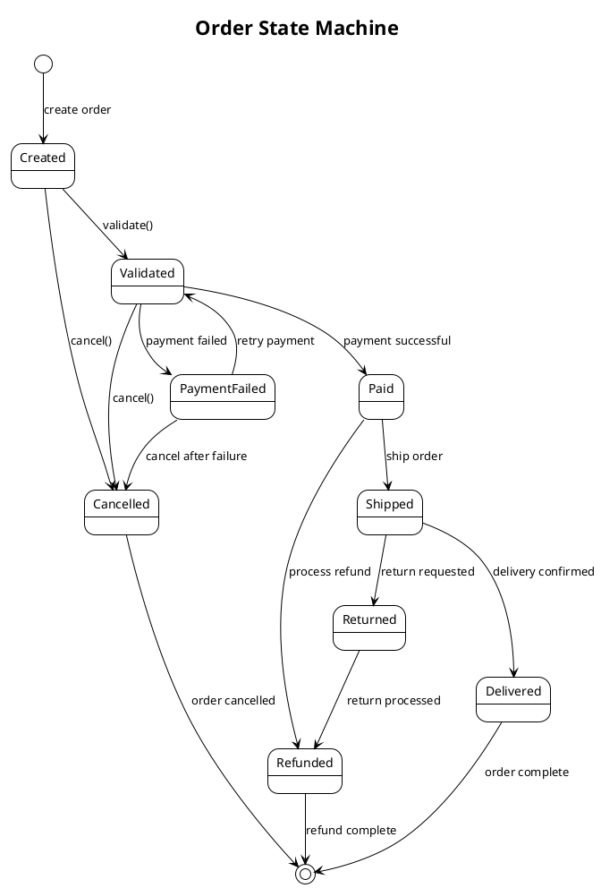
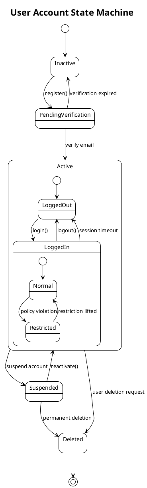
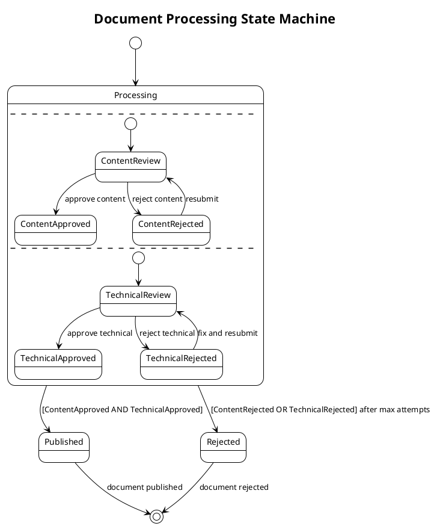
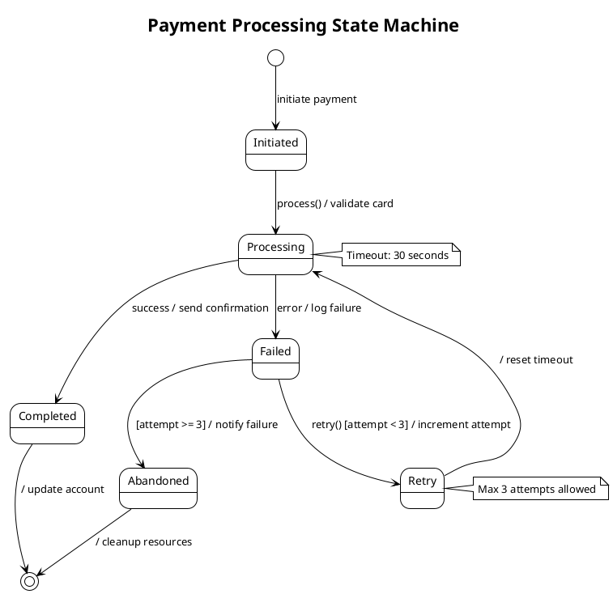
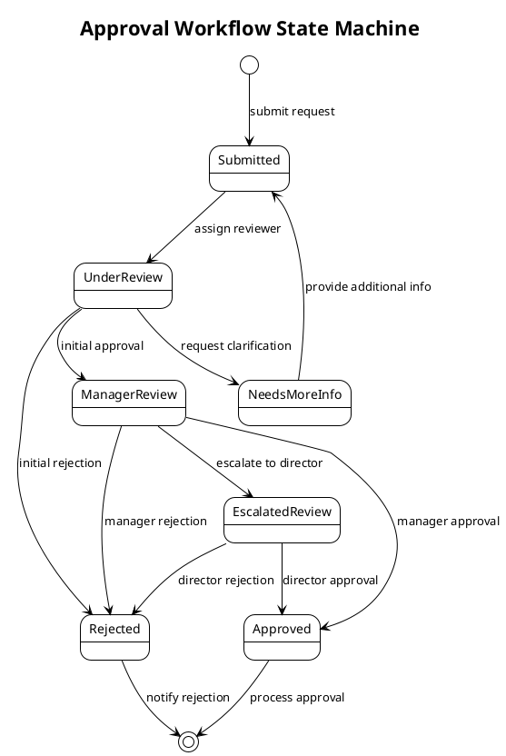
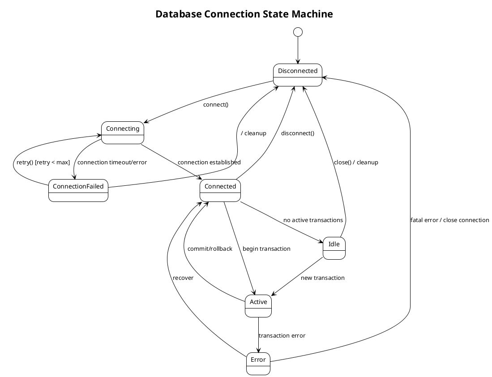

# UML State Machine Diagram Generation Guidelines

## Implementation Strategy

Generate UML state machine diagrams using PlantUML syntax to illustrate the behavior and lifecycle of objects, business processes, and system workflows within Java applications.

### Analysis Process

**For each state machine identified:**

1. **Identify state machine subjects**:
   - Domain entities with lifecycle states (Order, User, Document)
   - Business processes with workflow states (Approval, Payment, Shipping)
   - System components with operational states (Connection, Transaction, Job)
   - User interface components with interaction states (Form, Dialog, Wizard)

2. **Analyze state transitions**:
   - Initial and final states
   - Intermediate states and their purposes
   - Transition triggers (events, conditions, actions)
   - Guard conditions and transition actions
   - Concurrent states and parallel workflows

3. **Determine diagram scope** based on user selection:
   - **Entity lifecycles**: Domain object state transitions (e.g., Order: Created → Paid → Shipped → Delivered)
   - **Business workflows**: Process state machines (e.g., Document approval workflow)
   - **System behaviors**: Component operational states (e.g., Connection states, Job execution states)
   - **User interactions**: UI component state transitions (e.g., Multi-step form wizard)

### Diagram Generation Guidelines

#### Basic State Machine Structure

#### Advanced State Machine Patterns

**Composite States with Sub-states**:

**Concurrent States**:

**State Machine with Actions and Guards**:

#### Business Process State Machines

**Approval Workflow**:

#### System Component State Machines

**Database Connection State Machine**:

### Content Quality Requirements

1. **State Accuracy**: States must reflect actual object/process lifecycle in the codebase
2. **Transition Completeness**: Include all valid state transitions and their triggers
3. **Guard Conditions**: Document conditions that must be met for transitions
4. **Action Documentation**: Include actions performed during transitions or state entry/exit
5. **Business Logic Alignment**: Ensure state machines align with business rules and processes

### Integration Guidelines

1. **Code Analysis**: Use codebase_search to identify:
   - Enum classes that represent states
   - State pattern implementations
   - Workflow orchestration code
   - Business process implementations
   - Entity lifecycle management code

2. **Documentation Integration**:
   - Include state machine diagrams in relevant package-info.java files
   - Add state machine sections to README.md for complex workflows
   - Reference state machines in class-level Javadoc for stateful entities

3. **Naming Conventions**:
   - Use clear, business-meaningful state names
   - Follow consistent naming patterns across related state machines
   - Include context in diagram titles (e.g., "Order Processing State Machine")

### Validation

After generating state machine diagrams:
1. **Verify PlantUML syntax** for proper rendering
2. **Validate against codebase** to ensure state accuracy
3. **Check transition completeness** - ensure all paths are covered
4. **Test business logic alignment** with actual implementation
5. **Ensure proper integration** with other documentation
